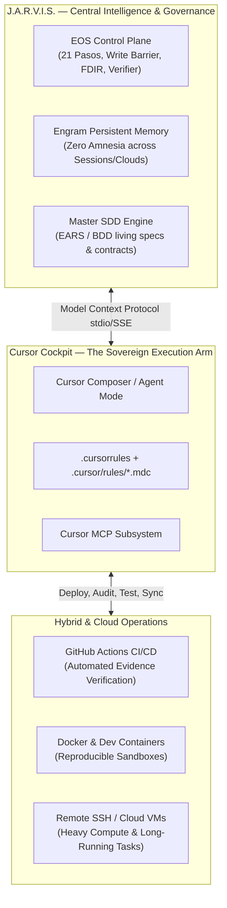

# EOS & Cursor: The Sovereign J.A.R.V.I.S. Cloud Architecture

## 1. Executive Vision: The Autonomous Engineering Butler

> **"J.A.R.V.I.S. no es un simple chatbot de preguntas y respuestas; es un sistema de control autónomo, proactivo, omnipresente y con memoria infinita que opera tu entorno digital local y en la nube."**

En nuestro ecosistema:
* **J.A.R.V.I.S. (La Mente Orquestadora)** = **EOS Control Plane** + **Engram Memory** + **Gentle AI Multi-Agent**.
* **La Armadura & Manos Ejecutoras** = **Cursor IDE** (Composer, Agent Mode, MCP Bridges, Cloud Workspaces).
* **El Terreno Operativo** = Tu máquina local, contenedores Docker y entornos de nube (GitHub, Cloud Compute, CI/CD).



---

## 2. Los Cuatro Motores de la Arquitectura J.A.R.V.I.S.

### I. Omnipresencia y Cero Amnesia (Engram + EOS MCP)
Un asistente tradicional olvida todo cuando cerrás la ventana de chat. J.A.R.V.I.S. en EOS opera con **memoria persistente de tres capas**:
1. **Memoria Inmediata (Context Window)**: Gestionada quirúrgicamente con símbolos `@spec.md`, `@files` para no quemar tokens.
2. **Memoria de Sesión y Proyecto (Engram MCP)**: Guarda automáticamente decisiones (`mem_save`), bugs resueltos, patrones de diseño y preferencias del usuario.
3. **Memoria Criptográfica de Evidencia (EOS Ledger)**: Guarda cada resultado de test, hash SHA-256 de build y dictamen de auditoría en `docs/evidence/EVD-XXXX.json`.

### II. Proactividad y Autonomía Supervisada (FDIR + Self-Evolution)
A diferencia de un asistente pasivo, EOS en Cursor:
* **Monitorea Derivas (Drift)**: Detecta cambios en esquemas JSON o APIs antes de que rompan producción (`eos.drift.check`).
* **Protege las Fronteras**: Activa automáticamente la *Write Barrier* para evitar que agentes toquen repositorios sin autorización (`eos.workspace.barrier_check`).
* **Aísla Fallos (FDIR)**: Si un test falla, detiene la mutación, entra en modo seguro (`eos.fdir.trip`) y propone un plan de remediación.

### III. Orquestación Híbrida Local + Nube (Cloud & Remote Mastery)
Para proyectos que requieren alta potencia o ejecución desatendida:
1. **Cursor Remote SSH / Dev Containers**:
   * EOS se ejecuta con la misma precisión dentro de un contenedor Linux en la nube (AWS EC2, Google Cloud, Azure o GitHub Codespaces).
   * La configuración `.cursorrules` y `.agents/AGENTS.md` viaja con el repositorio, manteniendo el gobierno idéntico.
2. **Pipelines de Verificación Autónoma (GitHub Actions / Cloud CI)**:
   * Al hacer push, GitHub Actions ejecuta `npm run verify:strict`, corre los tests de los 7 auditores y valida que ningún invariante se haya roto.
3. **Agentes de Navegación y Pruebas Web (Browser QA)**:
   * Integración con Chrome DevTools y agentes de browser para hacer clics autónomos, capturas de pantalla, auditorías de accesibilidad (WCAG) y Core Web Vitals en la nube.

### IV. Adaptabilidad a la Evolución de Modelos (Future-Proof Model Agnostic)
Cuando salgan nuevas generaciones de modelos (Claude 3.8, GPT-5, Gemini 2.5, DeepSeek R2):
* **Cero Acoplamiento**: Las especificaciones EARS y la arquitectura Clean/Hexagonal no dependen de ningún LLM.
* **Router de Habilidades**: `eos.skill.route` y `eos.provider.route` seleccionan la mejor herramienta y modelo para cada fase (ej. modelos de razonamiento profundo para arquitectura, modelos ultrarrápidos para código atómico).

---

## 3. Configuración del Servidor MCP J.A.R.V.I.S. en Cursor

Para que Cursor tenga acceso total a las herramientas de EOS, el archivo `.cursor/mcp.json` conecta directamente con el servidor JSON-RPC 2.0:

```json
{
  "mcpServers": {
    "eos-local": {
      "command": "node",
      "args": ["C:/Users/valen/Documents/Eos system/src/mcp-server.js"],
      "cwd": "C:/Users/valen/Documents/Eos system",
      "env": {
        "EOS_MODE": "read-write",
        "EOS_AUTONOMY_LEVEL": "LEVEL_2",
        "EOS_ALLOW_EXTERNAL_SIDE_EFFECTS": "false",
        "EOS_SCOPE": "LOCAL_GOVERNED_MVP"
      }
    }
  }
}
```

### Herramientas Nativas de J.A.R.V.I.S. Disponibles en Cursor:
* `eos.mission.start` / `eos.mission.status`: Iniciar y supervisar misiones de desarrollo.
* `eos.context.compile`: Compilar el contexto exacto de tokens sin desperdiciar créditos.
* `eos.scaffolder.generate`: Generar arquitectura limpia con tests TDD automáticos.
* `eos.verifier.run`: Ejecutar la auditoría estricta de 480 reglas en 2 segundos.
* `eos.hud.dashboard`: Ver el panel visual de control de la misión.
* `eos.skill.route`: Activar dinámicamente auditores de seguridad, accesibilidad, performance y SEO.
