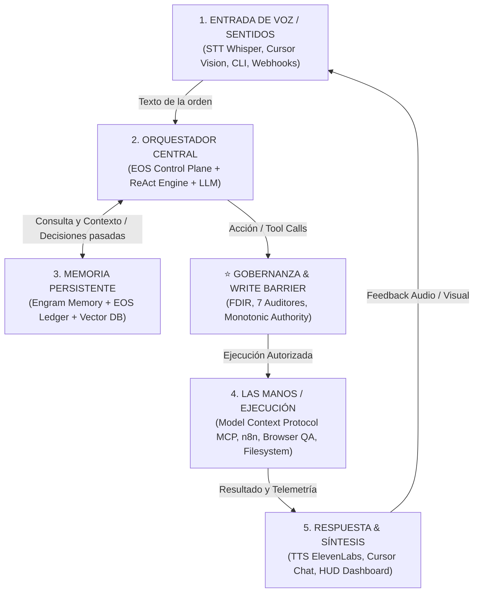

# The 5-Layer Autonomous J.A.R.V.I.S. Architecture: From Theory to EOS Engineering

## 1. El Pentágono Arquitectónico de J.A.R.V.I.S.

El diagrama maestro representa el **ciclo cerrado de percepción, razonamiento, memoria, acción y respuesta** que distingue a un verdadero agente autónomo de un chatbot conversacional pasivo.



---

## 2. Mapeo Exhaustivo: De la Teoría a la Realidad en EOS

| Componente | Qué hace en la teoría | Cómo se implementa en **EOS + Cursor** |
|---|---|---|
| **1. El Cerebro (LLM Multimodal)** | Razonamiento profundo, descomposición lógica y visión. | **Claude 3.7 / GPT-4o / Gemini 2.5 Pro** orquestados por Cursor y adaptables vía abstracción de proveedores. |
| **2. El Esqueleto (Orquestación & ReAct)** | Bucle de Pensamiento ➔ Acción ➔ Observación y manejo de estados. | **EOS State Machine** (`docs/orchestration/`) con DAG de 21 pasos y `sdd-orchestrator` de Gentle AI. |
| **3. La Memoria (RAG & Vectorial)** | Cero amnesia, almacenamiento de patrones, gustos e historial. | **Engram MCP** (`mem_save`, `mem_context`) + **Ledger Criptográfico** (`docs/evidence/EVD-XXXX.json`). |
| **4. Las Manos (MCP & Herramientas)** | Modificar el entorno digital, escribir código, clics web, APIs. | **Servidor MCP de EOS** (`src/mcp-server.js` con 23 herramientas), Browser QA (Puppeteer/DevTools) y GitHub MCP. |
| **5. La Salida & Voz (TTS & Feedback)** | Respuestas en tiempo real, dashboards y síntesis audible. | **Cursor UI**, Dashboard ANSI en vivo (`eos.hud.dashboard`), reportes estructurados de auditoría y soporte TTS. |

---

## 3. La Diferencia Crítica: El Anillo de Gobernanza de EOS

Un Jarvis sin frenos que ejecuta código a ciegas es un **peligro catastrófico** (puede borrar bases de datos, filtrar claves de API o romper arquitecturas en producción).

Por eso, EOS introduce entre el **Orquestador (2)** y **Las Manos (4)** el **Anillo de Gobernanza y Seguridad**:

```text
┌─────────────────────────────────────────────────────────────────────────────┐
│                 ANILLO DE GOBERNANZA Y SEGURIDAD EOS                        │
│                                                                             │
│  1. EXTERNAL WRITE BARRIER ➔ Nadie escribe en un repo sin 6 autorizaciones.│
│  2. FDIR & SAFE-MODE       ➔ Si algo falla, el sistema se frena en seco.   │
│  3. LOS 7 AUDITORES        ➔ Calidad, Seguridad, A11y, Perf, SEO, QA, Arch.│
│  4. SPEC MANDATORIA (EARS) ➔ Cero alucinaciones; solo se ejecuta el contrato.│
└─────────────────────────────────────────────────────────────────────────────┘
```

---

## 4. El Ciclo de Vida de una Orden en J.A.R.V.I.S. (Paso a Paso)

1. **Voz / Prompt de Entrada**: El humano dice: *"Jarvis, implementá el módulo de autenticación para el proyecto Fundación con login por huella y contraseña."*
2. **Consulta a Memoria (Engram)**: El Orquestador consulta `mem_context`: recupera qué base de datos se eligió ayer, qué convenciones de TypeScript se fijaron y qué políticas de seguridad aplican.
3. **Generación del Contrato (SDD EARS)**: En vez de programar a lo loco, redacta los requerimientos funcionales en notación EARS (`CUANDO el usuario envíe credenciales válidas, EL SISTEMA...`).
4. **Activación de Manos (MCP Tools)**:
   * Llama a `eos.scaffolder.generate` para crear la estructura Hexagonal.
   * Llama al agente de Cursor para escribir los tests TDD (RED) y la implementación (GREEN).
   * Llama a `browser-qa` para hacer clic autónomo en el formulario en el navegador real.
5. **Auditoría y Evidencia**: Los 7 auditores verifican que no haya secretos expuestos, que el score Lighthouse sea > 90 y que pase `npm run verify:strict`.
6. **Respuesta al Humano**: J.A.R.V.I.S. responde con el reporte de evidencia criptográfica `EVD-0005.json` y el link a la demo funcional.
