# EOS Architecture Audit & System Inventory
**Document ID:** AUD-ARCH-2026-08-26  
**Status:** COMPLETED (Phase A Read-Only Audit)  
**Author:** Chief Architect / Repository Steward  
**Classification:** CANONICAL_AUDIT_REPORT  

---

## 1. Executive Summary

This audit establishes the definitive baseline of the **EOS (Engineering Operating System)** workspace. EOS is designed as an autonomous, reproducible, and auditable engineering control plane. Over its development across Phases 0 through 4, the repository has accumulated:
- **Total Files Scanned:** 2,309 files
- **Canonical Core Modules:** 29 files in `src/`
- **Engine Scripts:** 99 files in `scripts/engine/` (predominantly historical simulation harnesses and pre-refactor bridges)
- **Test Suite:** 150 test files (896 individual test assertions)
- **Documentation & Evidence:** 1,079 markdown/JSON artifacts
- **Active Mission Control & State:** `EOS-MISSION-CONTROL/` (9 files) and `.missions/` (96 files)
- **Protected External Projects:** `Fundacion/` (strictly isolated read-only reference)

### Core Verdict
The canonical **Phase 3/4 Mission OS core** located in `src/core/` is mathematically sound, highly coherent, and thoroughly tested (895/896 passing tests). However, the repository suffers from **four critical architectural defects**:
1. **Split-Brain CLI:** `bin/eos.js` (MissionCLI) vs `scripts/cli/eos.js` (legacy script calling simulation engines).
2. **Split-Brain MCP Server:** `src/mcp-server.js` historically coupled to `scripts/engine/mission-ledger.js` and `authority-adapter.js` instead of exclusively consuming `src/core/mcp/mcp-mission-bridge.js`.
3. **Duplicated Engine Modules:** Pre-refactor duplicates of `epistemic-evidence-engine.js`, `hitl-gatekeeper.js`, and `sdd-fsm-engine.js` lingering in `scripts/engine/`.
4. **Historical Simulation Farm:** 84+ simulation and canary scripts in `scripts/engine/` tested by 103 test files, completely disconnected from active runtime execution paths.
5. **Git Tracking Drift:** Over 100 essential files (including `.agents/`, `.cursor/`, `.windsurf/`, `docs/specs/EOS-P3-*.md`, and `docs/schemas/`) currently untracked in Git, preventing clean-clone reproducibility.

---

## 2. Full Workspace Layer Inventory

| Layer | Path | File Count | Canonical Status | Primary Responsibility |
|---|---|---|---|---|
| **Binary Entrypoint** | `bin/` | 1 | CANONICAL | Executable wrapper `bin/eos.js` delegating to `src/cli/mission-cli.js` |
| **Mission OS Core** | `src/core/` | 27 | CANONICAL | FSM, ATS Authority, HITL, Cryptographic Evidence, Gatekeeper, Discovery, Return Ingestion |
| **CLI Implementation** | `src/cli/` | 1 | CANONICAL | Unified interactive/non-interactive MissionCLI |
| **MCP Server** | `src/mcp-server.js` | 1 | CANONICAL (Requires Consolidate) | JSON-RPC 2.0 stdio MCP bridge for AI IDEs |
| **Legacy Engine Farm** | `scripts/engine/` | 99 | MIXED (11 Active Bridges, 84 Simulations, 3 Duplicates) | Historical canary simulations, pre-refactor bridges, experimental algorithms |
| **Legacy CLI** | `scripts/cli/` | 1 | LEGACY (Deprecate) | Monolithic CLI with simulation engine imports |
| **Verification Scripts**| `scripts/` root | 7 | ACTIVE / SUPPORTING | `verify-eos.js`, schema validators, and manifest analyzers |
| **Test Suite** | `tests/` | 150 | ACTIVE (32 Core, 103 Simulation, 15 Fixtures) | Comprehensive test harnesses across all phases |
| **Mission Control** | `EOS-MISSION-CONTROL/` | 9 | ACTIVE | Telemetry, active tools, budget, and live mission status snapshot |
| **Laboratory Projects** | `EOS-Lab/` | 102 | LAB_ONLY | FlowDesk sandbox, Canary pilots, Polyglot fixtures |
| **Protected Target** | `Fundacion/` | 96 | FROZEN / READ_ONLY | External project repository for write-barrier verification |
| **Documentation** | `docs/` | 1,079 | DOCUMENTATION_ONLY / SCHEMAS / EVIDENCE | Specs, schemas, ADRs, policies, audits, and cryptographic receipts |
| **Agent Ecosystem** | `.agents/`, `.cursor/`, `.windsurf/` | 53 | ACTIVE / CANONICAL | Skills, MDC rules, hooks, and IDE-specific configurations |
| **Runtime Storage** | `.missions/`, `.eos/` | 159 | ACTIVE | Hash-chained mission logs, return packages, and learning records |

---

## 3. Real Dependency & Consumer Graph Analysis

```mermaid
graph TD
    subgraph "Canonical Runtime Path"
        BIN["bin/eos.js"] --> CLI["src/cli/mission-cli.js"]
        MCP["src/mcp-server.js"] --> BRIDGE["src/core/mcp/mcp-mission-bridge.js"]
        CLI --> RUNTIME["src/core/runtime/mission-runtime.js"]
        BRIDGE --> RUNTIME
        
        RUNTIME --> ATS["src/core/authority/authority-truth-source.js"]
        RUNTIME --> FSM["src/core/sdd/sdd-fsm-engine.js"]
        RUNTIME --> HITL["src/core/sdd/hitl-gatekeeper.js"]
        RUNTIME --> EVD["src/core/sdd/epistemic-evidence-engine.js"]
        RUNTIME --> GATE["src/core/governance/integration-gatekeeper.js"]
        RUNTIME --> RET["src/core/adapters/cursor-return-ingestion-engine.js"]
        RUNTIME --> PKG["src/core/adapters/cursor-mission-package.js"]
        RUNTIME --> DOC["src/core/runtime/operator-doctor.js"]
        RUNTIME --> NEXT["src/core/runtime/operator-next.js"]
        RUNTIME --> LEARN["src/core/runtime/mission-learning.js"]
    end

    subgraph "Legacy / Split-Brain Path"
        LEG_CLI["scripts/cli/eos.js"] --> ENG_SIM["scripts/engine/* (84 simulation engines)"]
        MCP -.->|Legacy coupling| ENG_LEDGER["scripts/engine/mission-ledger.js"]
        MCP -.->|Legacy coupling| ENG_AUTH["scripts/engine/authority-adapter.js"]
        MCP -.->|Legacy coupling| ENG_CTX["scripts/engine/context-compiler.js"]
    end
```

---

## 4. Split-Brain Analysis & Contradictions

### 4.1. Split-Brain 1: CLI Entrypoint Conflict
- **Path A (Canonical):** `bin/eos.js` -> `src/cli/mission-cli.js` -> `MissionRuntime` (ATS + FSM + HashChainedLedger).
- **Path B (Legacy):** `scripts/cli/eos.js` -> calls legacy `cursor-command-center-engine.js`, `autonomy-graduation-engine.js`, `polyglot-language-harness.js`.
- **Contradiction in `package.json`:**
  - `"eos": "node scripts/cli/eos.js"` (points to legacy)
  - `"eos:mission": "node bin/eos.js"` (points to canonical)
- **Resolution:** Retarget `"eos"` in `package.json` to `bin/eos.js`, deprecate `scripts/cli/eos.js`.

### 4.2. Split-Brain 2: MCP Server Bridge Coupling
- **Observed:** `src/mcp-server.js` imports `MissionLedger`, `AuthorityAdapter`, and `ContextCompiler` from `scripts/engine/`, while also importing `McpMissionBridge` from `src/core/mcp/`.
- **Resolution:** Consolidate `src/mcp-server.js` so all tool calls route exclusively through `McpMissionBridge` and `MissionRuntime`.

### 4.3. Split-Brain 3: SDD Engine Duplication
- **Duplicate Set:**
  - `scripts/engine/epistemic-evidence-engine.js` == `src/core/sdd/epistemic-evidence-engine.js`
  - `scripts/engine/hitl-gatekeeper.js` == `src/core/sdd/hitl-gatekeeper.js`
  - `scripts/engine/sdd-fsm-engine.js` == `src/core/sdd/sdd-fsm-engine.js`
- **Resolution:** Retire duplicates in `scripts/engine/`, establishing `src/core/sdd/` as the sole canonical owner.
