# EOS Canonical Architecture & Target Operating Model
**Document ID:** ARCH-SPEC-CANONICAL-001  
**Status:** PROPOSED (Target Architecture)  
**Author:** Chief Architect / Repository Steward  

---

## 1. Architectural Philosophy & Principles

$$
\boxed{
\text{MAXIMUM CLARITY} + \text{MAXIMUM COHERENCE} + \text{MINIMUM UNNECESSARY COMPLEXITY}
}
$$

1. **One Responsibility $\rightarrow$ One Canonical Owner:** Zero split-brain systems.
2. **Evidence Over Claims:** Epistemic validation states enforced cryptographically by SHA-256 hash chains.
3. **Monotonic Authority:** Zero unauthorized state transitions; every transition bounded by authority rank.
4. **Deny-by-Default Isolation:** Write barriers protect the host workspace and external targets (e.g. `Fundacion`).
5. **Reproducible Release Boundary:** A clean clone installs and verifies seamlessly without untracked ghosts.

---

## 2. Canonical Layer Breakdown

```mermaid
graph TD
    subgraph "Layer 1: Entrypoints"
        CLI["bin/eos.js (MissionCLI)"]
        MCP["src/mcp-server.js (JSON-RPC stdio)"]
    end

    subgraph "Layer 2: Adapters & Bridge"
        MB["src/core/mcp/mcp-mission-bridge.js"]
        CMP["src/core/adapters/cursor-mission-package.js"]
        CRI["src/core/adapters/cursor-return-ingestion-engine.js"]
    end

    subgraph "Layer 3: Mission OS Kernel"
        MR["src/core/runtime/mission-runtime.js"]
        ATS["src/core/authority/authority-truth-source.js"]
        FSM["src/core/sdd/sdd-fsm-engine.js"]
        HITL["src/core/sdd/hitl-gatekeeper.js"]
        EEE["src/core/sdd/epistemic-evidence-engine.js"]
        IG["src/core/governance/integration-gatekeeper.js"]
    end

    subgraph "Layer 4: Intelligence, Roles & Diagnostics"
        UTD["src/core/discovery/universal-technical-discovery-engine.js"]
        GTS["src/core/discovery/governed-technical-selection-engine.js"]
        OCR["src/core/discovery/operational-capability-receipt-engine.js"]
        RSR["src/core/roles/role-skill-registry-engine.js"]
        TEA["src/core/economics/token-economics-audit-engine.js"]
        EMR["src/core/observability/executive-mission-reporter.js"]
        OD["src/core/runtime/operator-doctor.js"]
        ON["src/core/runtime/operator-next.js"]
        ML["src/core/runtime/mission-learning.js"]
        GK["src/core/runtime/global-knowledge.js"]
    end

    subgraph "Layer 5: Persistent State & Storage"
        DIR_MIS[".missions/{MISSION_ID}/"]
        DIR_LOG[".eos/learning/lessons.jsonl"]
        DIR_CTL["EOS-MISSION-CONTROL/"]
    end

    CLI --> MR
    MCP --> MB
    MB --> MR
    MR --> ATS
    MR --> FSM
    MR --> HITL
    MR --> EEE
    MR --> IG
    MR --> CMP
    MR --> CRI
    MR --> EMR
    MR --> ML
    MR --> GK
    CLI --> OD
    CLI --> ON
    MR --> DIR_MIS
    ML --> DIR_LOG
    MR --> DIR_CTL
```

---

## 3. The 10 Canonical Operational Lifecycles

### Lifecycle 1: Bootstrap & Operator Doctor
- Invocation: `eos doctor` or `runOperatorDoctor()`
- Verifies: Control plane root integrity, homedir leak absence, required schemas, and MCP pinning.

### Lifecycle 2: Mission Creation & Intent Resolution
- Invocation: `eos mission create "<goal>" --project <path>`
- Allocates: Unique ID (`MIS-...`), initializes `AuthorityTruthSource` at Level 0, creates `.missions/{ID}/` directory, and initializes genesis ledger block.

### Lifecycle 3: Governed FSM Progression
- Transitions: `INTAKE` $\rightarrow$ `RECONNAISSANCE` $\rightarrow$ `SPECIFICATION` $\rightarrow$ `ARCHITECTURE` $\rightarrow$ `IMPLEMENTATION` $\rightarrow$ `VERIFICATION` $\rightarrow$ `CONVERGENCE` $\rightarrow$ `ARCHIVE`.
- Enforced by: `TransitionEnforcer` in `src/core/sdd/sdd-fsm-engine.js`.

### Lifecycle 4: Authority & HITL Governance
- Autonomy Modes: `AUTONOMOUS` (Level 2+), `HUMAN_APPROVAL_REQUIRED` (Level 1), `HUMAN_ONLY` (Level 0).
- Gatekeeper checks every intent before side-effects are committed.

### Lifecycle 5: Discovery & Capability Auditing
- Engines: Universal Technical Discovery, Governed Technical Selection, Operational Capability Receipts.
- Assesses workspace stack, dependencies, and produces immutable receipts.

### Lifecycle 6: Cursor / IDE Mission Package Generation
- Invocation: `eos mission package <ID>`
- Generates: `mission-package.json` and `CURSOR_MISSION_PROMPT.md` containing context, DoD, schemas, and return envelope instructions.

### Lifecycle 7: Return Ingestion & Verification
- Invocation: `eos mission ingest <ID> <return.json>`
- Validates: Anti-replay nonces, secret absence, protected surface immutability, test pass verification.

### Lifecycle 8: Cryptographic Evidence Recording
- Epistemic Evidence Engine computes SHA-256 hashes, chains ledger events, and issues immutable receipts.

### Lifecycle 9: Executive Reporting & Closure
- Generates markdown & JSON executive summaries and seals the hash-chained ledger.

### Lifecycle 10: Continuous Learning & Knowledge Accumulation
- Appends structured lessons to `docs/knowledge/CONTINUOUS_LEARNING_LOOP.md` and `.eos/learning/lessons.jsonl`.
