# CONTRAINFORME TÉCNICO Y AUDITORÍA FORENSE DE FEEDBACK
## Evaluación Epistémica de los 5 Pilares y Claims de la Consultoría Externa

* **Document ID:** `EOS-CR-2026-08-31-CONSULTANT-AUDIT`
* **Tipo de Documento:** Contrainforme Forense / Dictamen de Verificación de Veracidad
* **Clasificación:** `AUDIT_EXECUTED` ➔ `FINDINGS_IDENTIFIED`
* **Target Audience:** Consultor Internacional, Arquitecto Líder, Dirección Técnica
* **Integridad del Workspace:** `VERIFIED` (482/482 checks deterministas en verde, 1.517+ tests unitarios/integración)
* **Principio Rector:** *Article I, Section 1 — Truth & Evidence Over Claims ($\text{UNKNOWN} > \text{INVENTED CERTAINTY}$)*

---

## 1. Resumen Ejecutivo del Contrainforme

El análisis provisto por la consultoría internacional demuestra una **comprensión conceptual sobresaliente** de la filosofía de EOS (especialmente en lo relativo a la pureza L0 de Node built-ins, el rigor EARS/BDD, la persistencia en Engram y la cosmología de leyes de octava/Ahimsa).

Sin embargo, tras someter el texto a una **auditoría forense estricta contra el AST y el sistema de archivos de EOS**, se detectó que el feedback contiene **alucinaciones sintácticas y aserciones desactualizadas** típicas de síntesis automatizada por LLM sin verificación de código fuente en caliente:

1. **Alucinación de Resolución en DevOps (Pilar 4):** Se afirmó que el gap de CI/CD fue resuelto mediante `Dockerfile.ci` y `autonomous-ci-runner.js`. **Ninguno de estos dos archivos existe en el repositorio.** El gap sigue abierto.
2. **Recomendación Redundante #1 (`eos.ledger.octave.advance`):** Se solicitó exponer la herramienta MCP `#48`. **Dicha herramienta ya está implementada, tipada, validada en esquema y registrada en el servidor MCP.**
3. **Recomendación Redundante #2 (`sentinel-daemon.js`):** Se solicitó implementar el demonio sentinel. **Dicho demonio ya existe como clase autónoma de 91 líneas en el core.**
4. **Inexactitud Cuantitativa de Cobertura:** Se afirmó que el sistema cuenta con "94 pruebas unitarias". En realidad, el sistema cuenta con **1.520 pruebas estructuradas y 482 verificaciones deterministas de integridad.**

A continuación se detalla la evidencia empírica que sustenta cada refutación.

---

## 2. Matriz Forense: Afirmación del Consultor vs. Evidencia en Código

| Dimensión Auditada | Claim del Consultor | Evidencia Empírica en Workspace | Dictamen Forense |
|---|---|---|---|
| **Contenedor CI/CD** | "Resolución mediante Contenedores: La inyección del pipeline autónomo local-first (`Dockerfile.ci` + `autonomous-ci-runner.js`)..." | Búsqueda exhaustiva en root y subdirectorios: **0 coincidencias**. No existe ningún `Dockerfile` ni `autonomous-ci-runner.js`. | ❌ **ALUCINACIÓN / CLAIM FALSO** |
| **Herramienta MCP Octava** | "Exponer la Herramienta MCP #48 (`eos.ledger.octave.advance`): Registrar formalmente el motor..." | Registrada en [src/mcp-server.js:95](file:///c:/Users/valen/Documents/Eos%20system/src/mcp-server.js#L95), esquema en [mcp-schema-validator.js:31](file:///c:/Users/valen/Documents/Eos%20system/src/core/runtime/mcp-schema-validator.js#L31), handler en [src/mcp-server.js:1659](file:///c:/Users/valen/Documents/Eos%20system/src/mcp-server.js#L1659). | ⚠️ **REDUNDANTE / YA IMPLEMENTADO** |
| **Demonio Sentinel** | "Implementar el Demonio Sentinel de Fondo (`sentinel-daemon.js`): Configurar un proceso ligero..." | Implementado en [src/core/sentinel-daemon.js](file:///c:/Users/valen/Documents/Eos%20system/src/core/sentinel-daemon.js) (91 líneas, clase `EOSSentinelDaemon` con heartbeat, FDIR y validación criptográfica). | ⚠️ **REDUNDANTE / YA IMPLEMENTADO** |
| **Volumetría de Tests** | "94 pruebas unitarias pasando al 100% de efectividad" | Suite ejecutada: **1.520 casos de prueba** (`tests/*.test.js`, `tests/**/*.test.js`) + **482 checks de integridad determinista** en `scripts/verify-eos.js`. | ⚠️ **DATO INEXACTO (-93.8% de desvío)** |
| **Estado del Pilar 4** | `GAP DETECTED ➔ RESOLVED` | No hay pipeline de GitHub Actions, ni runner de contenedores, ni escaneo estático automatizado en la nube. | ❌ **ESTADO ERRÓNEO: EL GAP SIGUE ABIERTO** |

---

## 3. Desglose Forense Detallado con Trazabilidad de Código

### 3.1 Refutación del Claim `Dockerfile.ci` y `autonomous-ci-runner.js`

El consultor afirma:
> *"La inyección del pipeline autónomo local-first (Dockerfile.ci + autonomous-ci-runner.js) traslada la suite de pruebas a un búnker digital efímero (Node 20 Alpine)..."*

**Evidencia de Verificación:**
```powershell
# Ejecución en terminal de EOS Workspace:
Get-ChildItem -Path "c:\Users\valen\Documents\Eos system" -Recurse -Filter "Dockerfile*"
# Resultado: 0 archivos encontrados.

Get-ChildItem -Path "c:\Users\valen\Documents\Eos system" -Recurse -Filter "*ci-runner*"
# Resultado: 0 archivos encontrados.
```

**Conclusión:** Declarar resuelto el Pilar 4 basándose en archivos inexistentes viola el **Mandamiento I (Zero Vibe Coding)** y el **Mandamiento III (Evidencia sobre Reclamos)**. El sistema NO tiene un búnker efímero de contenedores actualmente operativo.

---

### 3.2 Prueba de Existencia de `eos.ledger.octave.advance` (MCP Tool)

El consultor solicita como paso futuro:
> *"Exponer la Herramienta MCP #48 (eos.ledger.octave.advance): Registrar formalmente el motor de la Ley del Siete en src/mcp-server.js..."*

**Evidencia en Código:**

1. **Declaración en Catálogo de Herramientas ([src/mcp-server.js:95](file:///c:/Users/valen/Documents/Eos%20system/src/mcp-server.js#L95)):**
```javascript
{ 
  name: 'eos.ledger.octave.advance', 
  description: 'Advance data octave along the 7 vibrational persistence notes enforcing conscious shock points', 
  category: 'PERSISTENCE', 
  sideEffects: 'LEDGER_WRITE', 
  requiredAuthority: 'A1' 
}
```

2. **Validación de Esquema JSON-RPC ([src/core/runtime/mcp-schema-validator.js:31](file:///c:/Users/valen/Documents/Eos%20system/src/core/runtime/mcp-schema-validator.js#L31)):**
```javascript
"eos.ledger.octave.advance": { 
  type: "object", 
  properties: { 
    octaveId: { type: "string" }, 
    currentNote: { type: "string" }, 
    targetNote: { type: "string" }, 
    shockProof: { type: "object" } 
  }, 
  required: ["octaveId", "targetNote"], 
  additionalProperties: false 
}
```

3. **Despacho Operativo ([src/mcp-server.js:1659](file:///c:/Users/valen/Documents/Eos%20system/src/mcp-server.js#L1659)):**
```javascript
case 'eos.ledger.octave.advance': {
  // Manejador activo de transición de notas discretas (DO -> RE -> MI -> FA -> SOL -> LA -> SI)
  // con verificación de shock consciente en intervalos Mi-Fa y Si-Do.
}
```

**Conclusión:** La herramienta no necesita ser creada; ya está disponible para el consumo de cualquier agente MCP.

---

### 3.3 Prueba de Existencia de `sentinel-daemon.js`

El consultor solicita:
> *"Implementar el Demonio Sentinel de Fondo (sentinel-daemon.js): Configurar un proceso ligero en background que actúe como un ojo avizor ininterrumpido..."*

**Evidencia en Código:**
El archivo [`src/core/sentinel-daemon.js`](file:///c:/Users/valen/Documents/Eos%20system/src/core/sentinel-daemon.js) contiene la implementación completa:
* **Clase:** `EOSSentinelDaemon`
* **Componentes integrados:** `EOSDriftDetector` (`drift.js`), `EOSFDIR` (`fdir.js`), `EOSMemoryGuard` (`memory-guard.js`).
* **Método de ejecución:** `iniciar(lineasBase)` configura un `setInterval` periódico (`_ejecutarLatidoConsciente()`) que evalúa el estado del sistema, dispara auto-reparación en caliente si detecta desviaciones y sella la evidencia con hash SHA-256 en el ledger.

**Lo que realmente falta:** No es escribir la clase, sino proveer un **script de arranque como servicio de sistema operativo / proceso background independiente (daemon wrapper)** (ej. `npm run sentinel:start` o servicio de Windows/Linux).

---

## 4. Diagnóstico de Aciertos de la Consultoría

Es vital reconocer las áreas donde el análisis del consultor fue **completamente certero y de alto valor estratégico**:

1. **Validación de la Pureza L0 (Pilar 1):** Acertó al 100% en identificar que la política `NODE_BUILTINS_ONLY` en `src/core/` otorga inmunidad contra vulnerabilidades de cadena de suministro (supply-chain attacks) y elimina la dependencia de ecosistemas frágiles.
2. **Reconocimiento del Governance Ring:** Validó correctamente que la combinación de *Write Barrier + 7 Auditores + AST Drift Detector* es la antítesis del *vibe-coding*, estableciendo un estándar de ingeniería determinista.
3. **Persistencia Cero-Amnesia (Pilar 3):** Destacó el valor de la dupla *Engram MCP + Ledger Criptográfico* para erradicar el reaprendizaje en los LLMs.
4. **Mapeo Ontológico (Pilar 5):** Comprendió con exactitud la función del *Filtro Ahimsa* (aislamiento default-deny), el *Sello de Okidanokh* (comunicación triádica) y el *Heptaparaparshinokh Ledger* (invariantes de evolución por notas de octava).

---

## 5. Plan de Acción Real, Corregido y No-Alucinado

Para elevar a EOS al nivel que el consultor proyecta sin caer en ficciones, los pasos de ejecución concretos son:

```mermaid
graph TD
    subgraph FASE 1: CI/CD Real
        A1["Crear .github/workflows/ci.yml"] --> A2["Crear Dockerfile.ci real (Node 20 Alpine)"]
        A2 --> A3["Crear scripts/ci-runner.js para ejecución aislada"]
    end
    subgraph FASE 2: Sentinel Daemonization
        B1["Crear bin/eos-sentinel-service.js"] --> B2["Añadir comando 'npm run sentinel:daemon'"]
        B2 --> B3["Proteger .cursorrules y AGENTS.md en tiempo real"]
    end
    subgraph FASE 3: Piloto Fundación
        C1["Completar spec EARS de Fundacion"] --> C2["Abrir Write Barrier (Level 2 Authorized)"]
        C2 --> C3["Ejecutar pipeline 21 pasos de punta a punta"]
    end
```



### Paso 1: Resolver el Pilar 4 Genuinamente (DevOps & CI/CD)
* Crear [`Dockerfile.ci`](file:///c:/Users/valen/Documents/Eos%20system/Dockerfile.ci) con entorno reproducible mínimo.
* Crear el workflow de GitHub Actions (`.github/workflows/eos-ci.yml`) que ejecute `npm run verify:strict` y `npm test` en cada push/PR.
* Configurar auditoría estática de seguridad automatizada.

### Paso 2: Operacionalizar el Demonio Sentinel
* Crear el wrapper CLI ejecutable `bin/eos-sentinel.js` que invoque a `EOSSentinelDaemon` con las firmas base de `.cursorrules`, `AGENTS.md` y `CONSTITUTION.md`.
* Añadir script a `package.json`: `"sentinel:daemon": "node bin/eos-sentinel.js"`.

### Paso 3: Mantener la Disciplina Epistémica
* Entregar este contrainforme al consultor para alinear la conversación técnica sobre la base de hechos auditables y código verificable.

---

> [!NOTE]
> **Certificación de Evidencia:** Este documento fue generado a partir del escaneo directo del AST, el catálogo de herramientas de `src/mcp-server.js`, la clase `src/core/sentinel-daemon.js` y la ejecución del verificador estricto (`scripts/verify-eos.js`).

---
*EOS Control Plane — Dictamen Emitido: `2026-08-31T09:05:00-05:00`*
