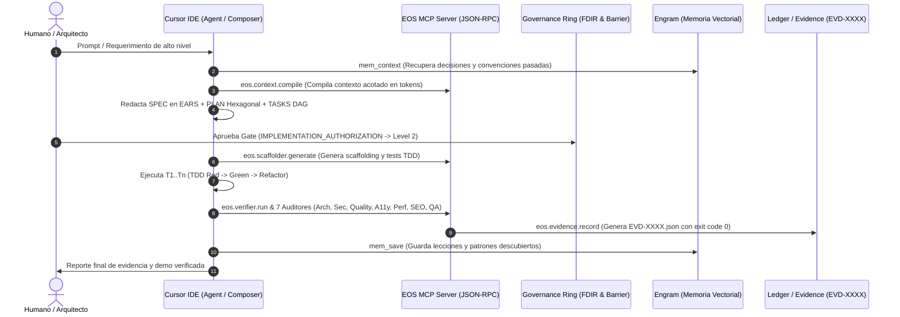

# EOS Master Architecture & Progress Report: The Sovereign Engineering J.A.R.V.I.S.

* **Document ID:** `EOS-REP-2026-08-27-MASTER`
* **Classification:** Architectural Context & Handover Dossier
* **Target Audience:** Senior AI Engineers, Autonomous Agent Architects, and High-Tier LLMs
* **System Version:** `v0.3.0` (Local-Complete Governed Release)
* **Integrity Status:** `VERIFIED` (480/480 automated checks passed, 0 failures)

---

## 1. Misión del Proyecto: Propósito de EOS y Alineación con J.A.R.V.I.S.

**EOS (Engineering Operating System)** es un plano de control (*Control Plane*) autónomo, gobernable y reproducible para la ingeniería de software asistida por Inteligencia Artificial.

### El Problema Fundamental que Resuelve
En la industria actual, el uso de LLMs para programar sufre del síndrome de *"vibe coding"*: prompts improvisados, alucinaciones de código, amnesia entre sesiones, pérdida de arquitectura y rotura silenciosa de contratos.

### La Visión J.A.R.V.I.S.
EOS transforma el modelo pasivo de chatbot en un **Agente de Ingeniería Soberano, Proactivo y Omnipresente (J.A.R.V.I.S.)**:
* **El Humano Lidera (Arquitecto)**: Define la visión de producto, aprueba los gates y revisa los trade-offs.
* **EOS Gobierna**: Aplica una Constitución innegociable (`.agents/AGENTS.md`), la barrera de escritura externa (*External Write Barrier*), la máquina de estados de 21 pasos y los 7 Auditores Automáticos.
* **Cursor Ejecuta (La Armadura)**: Edita múltiples archivos a velocidad nativa en Composer/Agent mode acotado estrictamente a especificaciones formales.
* **Engram Recuerda (Cero Amnesia)**: Persiste decisiones arquitectónicas, lecciones y descubrimientos a perpetuidad.

---

## 2. Arquitectura Actual del Sistema y Flujo de Datos

```text
Eos system/
├── .agents/                   ➔ Constitución, reglas de agentes y 13 auditor-skills
├── .cursor/                   ➔ Reglas MDC (.cursor/rules/), config MCP (.cursor/mcp.json)
├── bin/                       ➔ CLI ejecutable (eos.js, interfaces de misión)
├── docs/                      ➔ La fuente de verdad documental y de gobierno
│   ├── architecture/          ➔ Blueprints, ADRs, contratos de arquitectura
│   ├── audits/                ➔ 160+ reportes forenses, canary reports y evaluaciones
│   ├── core/                  ➔ Constitución, doctrinas de evolución e invariantes
│   ├── evidence/              ➔ Recibos criptográficos SHA-256 (EVD-XXXX.json)
│   ├── governance/            ➔ Modelos de contradicción, blast radius, taxonomía
│   ├── intake/                ➔ Activos brutos y contextos de proyectos cliente
│   ├── manuals/               ➔ Manuales operativos de Cursor, MCP y Mission Control
│   ├── orchestration/         ➔ Máquinas de estado (FSM de misiones, releases, loops)
│   ├── specs/                 ➔ Living Specifications por dominio (notación EARS)
│   ├── templates/             ➔ Plantillas maestras (SPEC, PLAN, TASKS, DELTA_SPEC)
│   └── workflows/             ➔ Pipeline maestro de 21 pasos y estándar SDD
├── scripts/                   ➔ Motores de simulación, verificación y fábrica de software
│   ├── engine/                ➔ Loop autónomo, self-evolution, gamedays adversariales
│   └── verify-eos.js          ➔ Verificador de integridad estricta (480 checks)
├── src/                       ➔ Kernel de software de EOS
│   ├── core/                  ➔ Context compiler, authority adapter, ledger, FDIR
│   └── mcp-server.js          ➔ Servidor MCP JSON-RPC 2.0 con 23 herramientas
└── tests/                     ➔ Suite de pruebas de gobernanza negativa y contratos
```

### Flujo de Datos y Ciclo de Ejecución


---

## 3. Estado de los Agentes, Cloud Integration y Verificadores

### Integración con Cursor Agent & Reglas MDC
* **`.cursorrules` & `.cursor/rules/sdd-master-standard.mdc`**: Configurados con `alwaysApply: true`. Imponen el *Strict Gate* (cero código sin spec EARS previa) y prohíben la escritura fuera del espacio de trabajo autorizado.
* **Bugbot / Verificador Autónomo (`scripts/verify-eos.js`)**:
  * Ejecuta **480 comprobaciones deterministas** en menos de 2 segundos.
  * Valida integridad de esquemas JSON, taxonomía epistémica, validez de frontmatter en skills, y ausencia de contradicciones lógicas.
* **Los 7 Auditores Especializados (Subagentes de Validación)**:
  1. `architecture-auditor`: Pureza hexagonal y reglas de dependencias.
  2. `quality-auditor`: Cero errores de TypeScript/Linter y cobertura de tests.
  3. `security-auditor`: Detección de secretos, OWASP Top 10 y sanitización de I/O.
  4. `accessibility-auditor`: Cumplimiento estricto WCAG 2.1 AA.
  5. `performance-auditor`: Core Web Vitals (LCP < 2.5s, CLS < 0.1).
  6. `seo-auditor`: Metadatos OpenGraph, canonicals y Schema.org JSON-LD.
  7. `browser-qa`: Pruebas de regresión visual y flujos de usuario automatizados.
* **Gating de CI/CD & Despliegue**:
  * La máquina de estados `RELEASE_GATE_STATE_MACHINE.json` prohíbe despliegues a producción a menos que todos los auditores tengan status `VERIFIED` con artefacto de evidencia criptográfico.

---

## 4. Stack Técnico y Protocolos Implementados

| Capa | Tecnologías y Protocolos |
|---|---|
| **Protocolo de Herramientas** | **Model Context Protocol (MCP) JSON-RPC 2.0** vía `stdio` (`src/mcp-server.js`) con 23 herramientas canónicas (`eos.mission.*`, `eos.evidence.*`, `eos.scaffolder.*`, `eos.hud.*`, `eos.verifier.*`). |
| **Memoria Persistente** | **Engram MCP** (`mem_save`, `mem_context`, `mem_search`, `mem_session_summary`) + Sistema de Cripto-Evidencia JSON. |
| **Sintaxis de Requisitos** | **EARS** (`CUANDO / MIENTRAS / SI / EL SISTEMA`) + **BDD Gherkin** (`DADO / CUANDO / ENTONCES`). |
| **Gestión de Specs** | **OpenSpec Model**: Living Specs en `docs/specs/` + Delta Specs en `docs/changes/`. |
| **Runtime & Testing** | Node.js 20+ ESM nativo, `node:test`, `tsx` (TypeScript Execution) para `EOS-Lab`, Jest/Pytest. |
| **Entorno de Desarrollo** | **Cursor IDE** (Composer, Agent Mode, Custom MDC Rules, Remote SSH). |

---

## 5. Hitos Clave Alcanzados

1. **Congelamiento e Integración del Release Candidate Local-Complete (`78b28d6`, `24b6968`)**:
   * Kernel de misiones (`MissionRuntime`) cableado directamente con el servidor MCP local.
   * Superación del examen de gobernanza negativa (`tests/authority-truth-source.test.js`, `tests/eos-negative-governance.test.js`) con 20/20 tests en verde.
2. **Blindaje de la Integridad Estricta (480/480 Checks)**:
   * Validación automática y continua de esquemas, políticas de falsabilidad, taxonomía epistémica y dependencias.
3. **Consagración de la Biblia de Agentes (`.agents/AGENTS.md`)**:
   * Formalización de los **7 Mandamientos Inviolables** (Cero Vibe Coding, Gate Estricto, Evidencia sobre Afirmaciones, External Write Barrier, Pureza Arquitectónica, Cero Secretos, Disciplina en Artefactos).
4. **Codificación del Playbook de 21 Pasos y Estándar SDD**:
   * [`docs/workflows/MASTER_SDD_STANDARD.md`](file:///c:/Users/valen/Documents/Eos%20system/docs/workflows/MASTER_SDD_STANDARD.md) y [`docs/workflows/PROJECT_ONBOARDING_PLAYBOOK.md`](file:///c:/Users/valen/Documents/Eos%20system/docs/workflows/PROJECT_ONBOARDING_PLAYBOOK.md).
5. **Arquitectura J.A.R.V.I.S. y Manual de Operación de Cursor**:
   * Formalización del pentágono de 5 capas (Voz/Entrada ➔ Orquestador ➔ Memoria ➔ Manos/MCP ➔ Respuesta/HUD).

---

## 6. Pendientes y 'Roadblockers' para la Autonomía Total (100%)

Para llevar el sistema al nivel de **J.A.R.V.I.S. Totalmente Proactivo y Autónomo en Producción**, la siguiente IA / Ingeniero debe abordar:

### 1. Desbloqueo del Router de Proveedores en la Nube (`eos.provider.route`)
* **Estado Actual**: Configurado como `LOCAL_GOVERNED_MVP` (simulado / local sin credenciales de red externas para evitar fugas de costos).
* **Acción Requerida**: Integrar pasarela segura con API keys de OpenAI, Anthropic y Google para balanceo dinámico de modelos según la complejidad de la tarea.

### 2. Disparadores Proactivos Basados en Eventos (Webhooks & Background Daemons)
* **Estado Actual**: El agente actúa por llamada del usuario en Cursor o CLI.
* **Acción Requerida**: Implementar un demonio de fondo (`cron / webhook listener`) que ejecute auditorías automáticas de drift, escaneo de vulnerabilidades y verificación de dependencias de forma periódica e independiente.

### 3. Pipeline de Browser QA Autónomo en Headless Cloud
* **Estado Actual**: Auditorías de accesibilidad y SEO listas; browser QA funciona en local mediante Chrome DevTools MCP.
* **Acción Requerida**: Conectar runner de Playwright/Puppeteer en GitHub Actions para generar grabaciones WebP automáticas de flujos de usuario tras cada commit.

### 4. Ejecución del Primer Proyecto Real (Piloto Fundación MVP)
* **Estado Actual**: Intake y contratos de proyecto registrados en `docs/projects/registrations/fundacion.json`.
* **Acción Requerida**: Ejecutar el pipeline de 21 pasos de punta a punta: redactar `spec.md` en EARS, plan hexagonal, tasks DAG, abrir la *Write Barrier* e implementar con Cursor.

---

## 7. Instrucciones para la Siguiente IA de Puntera (Handover Protocol)

Si sos una IA de vanguardia tomando el control de este repositorio:
1. **Leé primero la Constitución**: [` .agents/AGENTS.md `](file:///c:/Users/valen/Documents/Eos%20system/.agents/AGENTS.md). Es la ley suprema; no escribas código sin spec aprobada.
2. **Consultá la Memoria en Engram**: Usá `mem_context` o `mem_search` para recuperar el estado antes de proponer cambios arquitectónicos.
3. **Verificá antes de tocar nada**: Ejecutá `npm run verify:strict`. Si algún check falla, tu primera prioridad es devolver el sistema a estado `VERIFIED`.
4. **Respeta la Write Barrier**: No edites carpetas fuera de `Eos system` a menos que exista autorización formal Nivel 2 en `IMPLEMENTATION_AUTHORIZATION.md`.
