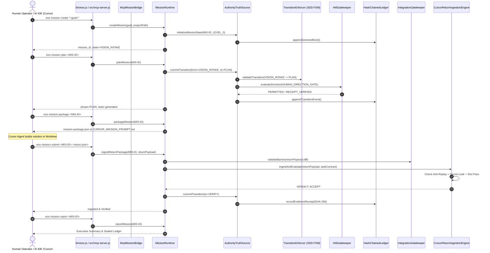

# EOS Runtime Execution Path Map
**Document ID:** MAP-RUNTIME-001  
**Classification:** ARCHITECTURAL_MAPPING  

---

## 1. Primary Execution Lifecycles

```mermaid
sequenceDiagram
    autonumber
    actor Human as Human Operator / AI IDE (Cursor)
    participant CLI as bin/eos.js / src/mcp-server.js
    participant Bridge as McpMissionBridge
    participant Runtime as MissionRuntime
    participant ATS as AuthorityTruthSource
    participant FSM as TransitionEnforcer (SDD FSM)
    participant HITL as HitlGatekeeper
    participant Ledger as HashChainedLedger
    participant Gate as IntegrationGatekeeper
    participant Return as CursorReturnIngestionEngine

    Human->>CLI: eos mission create "<goal>"
    CLI->>Runtime: createMission(goal, projectPath)
    Runtime->>ATS: initializeMissionState(MIS-ID, LEVEL_0)
    ATS->>Ledger: appendGenesisBlock()
    Runtime-->>Human: mission_id, state=VISION_INTAKE

    Human->>CLI: eos mission plan <MIS-ID>
    CLI->>Runtime: planMission(MIS-ID)
    Runtime->>ATS: commitTransition(from=VISION_INTAKE, to=PLAN)
    ATS->>FSM: validateTransition(VISION_INTAKE -> PLAN)
    ATS->>HITL: evaluateDecision(HUMAN_DIRECTION_GATE)
    HITL-->>ATS: PERMITTED / RECEIPT_VERIFIED
    ATS->>Ledger: appendTransitionEvent()
    Runtime-->>Human: phase=PLAN, tasks generated

    Human->>CLI: eos mission package <MIS-ID>
    CLI->>Runtime: packageMission(MIS-ID)
    Runtime-->>Human: mission-package.json & CURSOR_MISSION_PROMPT.md

    Note over Human: Cursor Agent builds solution in Worktree

    Human->>CLI: eos mission submit <MIS-ID> <return.json>
    CLI->>Runtime: ingestReturnPackage(MIS-ID, returnPayload)
    Runtime->>Gate: validateBarrier(returnPayload.diff)
    Runtime->>Return: ingestAndEvaluate(returnPayload, taskContract)
    Return->>Return: Check Anti-Replay + Secret Leak + Test Pass
    Return-->>Runtime: VERDICT: ACCEPT
    Runtime->>ATS: commitTransition(to=VERIFY)
    ATS->>Ledger: recordEvidenceReceipt(SHA-256)
    Runtime-->>Human: Ingested & Verified

    Human->>CLI: eos mission report <MIS-ID>
    CLI->>Runtime: reportMission(MIS-ID)
    Runtime-->>Human: Executive Summary & Sealed Ledger
```
