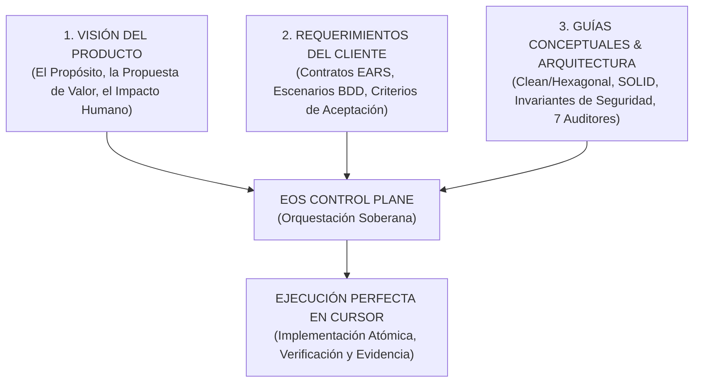

# EOS Doctrine: Infinite Self-Evolution, Scale Invariance, and Procedural Mastery

## 1. The Supreme Vision

> **"Un sistema de ingeniería verdaderamente soberano no depende del tamaño de un proyecto, sino de la perfección de su procedimentura. Cuando el método es riguroso, la escala es un detalle de implementación."**

El objetivo supremo de EOS es alcanzar un nivel de **maestría procedimental infinita** donde cualquier proyecto de software — desde una landing page institucional hasta un sistema distribuido de misión crítica — se ejecute con determinismo, elegancia y cero deuda técnica.

---

## 2. Los Tres Pilares Directrices (The Triad of Direction)

Todo proyecto en EOS es gobernado por tres vectores inmutables:



1. **La Visión del Producto**: Marca el *Norte Estratégico*. Define para quién se construye, qué problema resuelve y qué métricas de negocio o satisfacción definen el éxito.
2. **Los Requerimientos del Cliente (EARS / BDD)**: Convierten la visión en *Contratos Matemáticos*. Cada funcionalidad se describe sin ambigüedad (`CUANDO / MIENTRAS / SI / EL SISTEMA`).
3. **Las Guías Conceptuales y Arquitectónicas**: Definen la *Pureza Estructural*. El Dominio es puro; la infraestructura está aislada; la seguridad, el rendimiento y la accesibilidad son innegociables desde el día cero.

---

## 3. Invarianza de Escala (Scale Invariance)

La grandeza de EOS radica en que **la disciplina no cambia con la escala**:

| Nivel de Proyecto | Ejemplo | Cómo aplica EOS |
|---|---|---|
| **Micro (Nivel 1)** | CLI utility, landing page, componente aislado | 21 pasos, EARS spec, 7 auditores, evidencia criptográfica. |
| **Meso (Nivel 2)** | Aplicación Fullstack, portal de fundaciones, SaaS MVP | Clean Architecture, use cases, mocks en tests, living specs en `specs/`. |
| **Macro (Nivel 3)** | Plataforma multi-servicio, core bancario, motor agéntico | Bounded contexts, Event-Driven/Hexagonal, FDIR, chaos resilience gamedays. |

> **Ley de Invarianza**: *Si un proceso no se puede ejecutar de forma perfecta en un proyecto pequeño, fallará catastróficamente en un proyecto grande. Si el proceso es perfecto en la unidad atómica, escala infinitamente.*

---

## 4. El Ciclo de Aprendizaje e Investigación Continua (Continuous Evolution Engine)

EOS no es un sistema estático; es una **fábrica de ingeniería que aprende con cada línea de código**:

```text
┌─────────────────────────────────────────────────────────────────────────────┐
│ 1. INVESTIGACIÓN Y RECONOCIMIENTO (deep-research, SOTA analysis)            │
├─────────────────────────────────────────────────────────────────────────────┤
│ 2. EJECUCIÓN QUIRÚRGICA (Cursor + Living Specs + Task DAG)                  │
├─────────────────────────────────────────────────────────────────────────────┤
│ 3. DETECCIÓN DE HALLAZGOS Y AUDITORÍAS (7 Auditores Especializados)         │
├─────────────────────────────────────────────────────────────────────────────┤
│ 4. REMEDIACIÓN DE RAÍZ (Isolación del fallo, refactor y fix determinista)   │
├─────────────────────────────────────────────────────────────────────────────┤
│ 5. CONSOLIDACIÓN EN ENGRAM (mem_save de la decisión, patrón y lección)      │
├─────────────────────────────────────────────────────────────────────────────┤
│ 6. AUTO-EVOLUCIÓN DE POLÍTICAS (Actualización de templates, reglas y checks)│
└─────────────────────────────────────────────────────────────────────────────┘
```

### Reglas de Auto-Mejoramiento Obligatorio:
1. **Zero Repeated Errors**: Si un bug o falla de lint/seguridad ocurre una vez, se resuelve el problema de raíz y se agrega un test o regla en `.cursorrules` para que sea **imposible** que vuelva a ocurrir.
2. **Memory Persistence**: Toda decisión arquitectónica, alternativa rechazada y lección aprendida se guarda en **Engram** para nutrir a todos los agentes futuros.
3. **Evolution Registry**: Las brechas de capacidad y mejoras al control plane se registran formalmente en `docs/evolution/REGISTRY.json` para su evolución supervisada.
