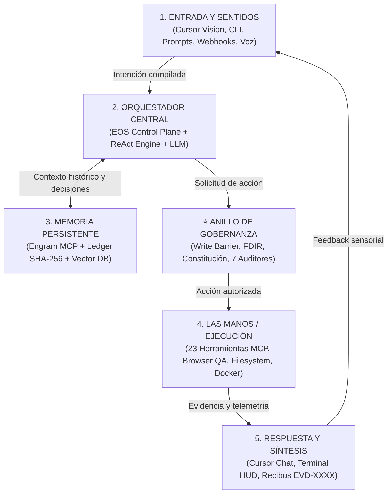
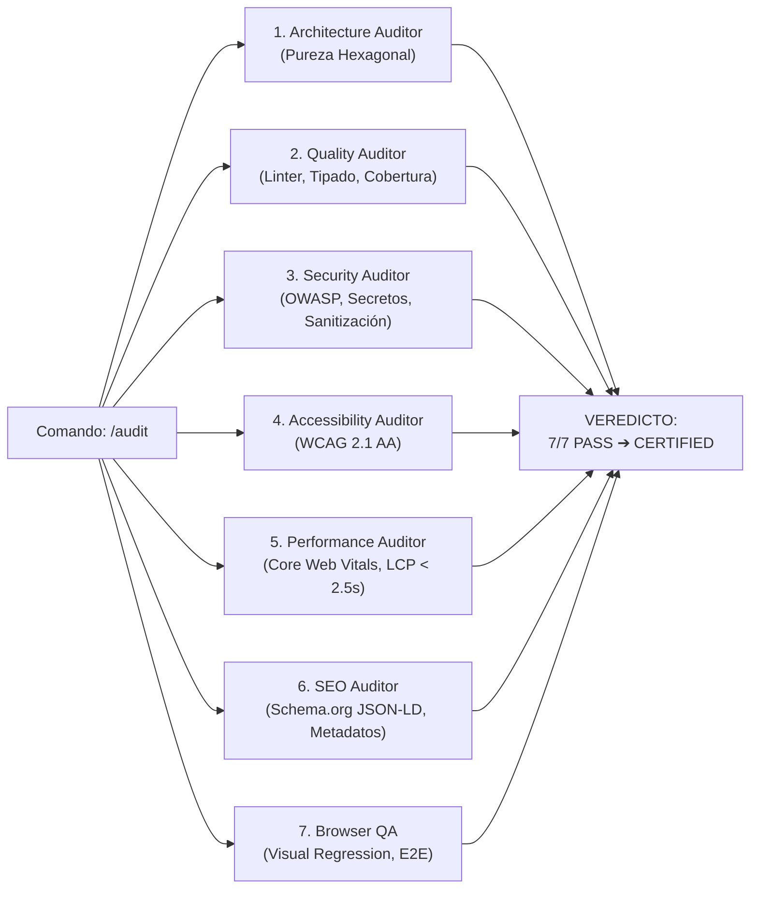
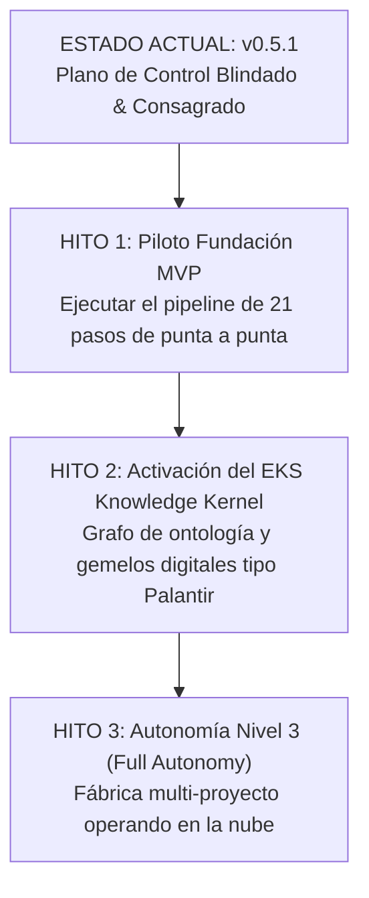

# EOS (Engineering Operating System) — The Master Encyclopedia & Architectural Manifesto
## Fundamentos, Visión, Arquitectura de Control y Estado Operacional

* **Document ID:** `EOS-ENCYCLOPEDIA-2026-MASTER`
* **Classification:** Master Sovereign Knowledge Dossier
* **System Version:** `v0.5.1` (Consagrado — Local-Complete Governed Release)
* **Integrity Status:** `VERIFIED` (482/482 checks deterministas en verde | 1.520+ tests estructurados | 0 fallas)
* **Seal of Consecration:** `sha256-add489aabf3ec1f384f0101a0ad670c21afb8fae969008b94720ee858b8f8c4e`
* **Target Audience:** Fundador, Arquitectos de Software, Consultores de IA y Modelos de Razonamiento Autónomo

---

## 1. ¿Qué es EOS y Qué Significa?

### 1.1 Definición Ontológica
**EOS (Engineering Operating System)** no es una librería, un framework ni un plugin para autocompletar código. 

**EOS es un Plano de Control de Ingeniería Autónomo (*Engineering Control Plane*)**, desacoplado de los productos que construye, diseñado para gobernar el ciclo de vida completo del software asistido por Inteligencia Artificial bajo principios de **evidencia matemática, rigor arquitectónico y cero amnesia.**

```text
┌─────────────────────────────────────────────────────────────────────────────┐
│                          EOS CONTROL PLANE                                  │
│   (Gobernanza Externa, Constitución, FDIR, Verificación, Memoria, Auditorías)│
└──────────────────────────────────────┬──────────────────────────────────────┘
                                       │ Gobierna sin pertenecer
                                       ▼
    ┌───────────────────────┬───────────────────────┬─────────────────────┐
    │  PROYECTO CLIENTE A   │  PROYECTO CLIENTE B   │  PROYECTO CLIENTE C │
    │    (e.g., Fundacion)  │    (e.g., FlowDesk)   │ (e.g., App Fuerza)  │
    └───────────────────────┴───────────────────────┴─────────────────────┘
```

### 1.2 Etimología y Simbolismo
* **Acrónimo Técnico:** *Engineering Operating System* (Sistema Operativo de Ingeniería).
* **Significado Filosófico/Mitológico:** **Éos (Ἠώς)**, la diosa griega del amanecer y la aurora titánica. Simboliza el **nacimiento de una nueva era en la historia del software**: la transición definitiva donde el programador deja de ser un artesano manual picando líneas de código a ciegas ("Coder") para convertirse en el **Arquitecto Soberano y Director de Agentes Autónomos**.

---

## 2. Propósito Fundacional y Misión

### 2.1 La Crisis del "Vibe Coding"
En la industria actual del desarrollo con LLMs (Claude, GPT-4, Cursor, Copilot), la mayoría de los desarrolladores operan bajo el síndrome del *"vibe coding"*:
* Prompts improvisados en lenguaje natural ambiguo.
* Generación masiva de código no estructurado ni testeado.
* Alucinaciones de arquitectura y rotura silenciosa de contratos.
* Amnesia total entre sesiones de trabajo (el modelo olvida lo decidido ayer).
* Cero evidencia de verificación más allá de un "funciona en mi máquina".

### 2.2 La Misión de EOS
**Erradicar el Vibe Coding y sustituirlo por Spec-Driven Development (SDD) determinista.**

EOS establece que:
1. **El código es un artefacto derivado y transitorio**: Lo único inmutable es la **Especificación Formal**.
2. **El humano lidera como Arquitecto**: Define la visión de negocio, aprueba los checkpoints y valida los trade-offs.
3. **EOS Gobierna**: Aplica la Constitución, la barrera de escritura externa (*External Write Barrier*), la máquina de 21 pasos y los 7 Auditores concurrentes.
4. **Los Agentes Ejecutan**: Escriben código atómico, corren pruebas TDD y corrigen sus propios errores en bucles cerrados de auto-curación (*Self-Healing*).
5. **Engram Recuerda**: Persiste a perpetuidad cada decisión técnica, lección aprendida y BKM (*Best Known Method*) sin pérdida de contexto.

---

## 3. La Visión J.A.R.V.I.S. (El Pentágono de 5 Capas)

EOS materializa el concepto de **J.A.R.V.I.S. (Just A Rather Very Intelligent System)** no como un juguete conversacional, sino como un sistema de ingeniería autónomo de 5 capas:



### La Diferencia Fundamental: El Anillo de Gobernanza
Un agente con acceso irrestricto a herramientas sin gobernanza es un riesgo catastrófico (puede borrar repositorios, filtrar secretos o inyectar código podrido). EOS introduce entre el pensamiento (2) y la acción (4) el **Governance Ring**:

1. **External Write Barrier**: Ningún agente escribe en un proyecto sin 6 autorizaciones estrictas.
2. **FDIR (Failure Detection, Isolation & Recovery)**: Si un test falla, el sistema se aísla, diagnostica y auto-repara antes de continuar.
3. **NASA IV&V (Anti-Self-Certification)**: Quien construye el código (`BUILDER`) no tiene autoridad para auto-aprobarse (`BUILDER != FINAL_AUTHORITY`). La aprobación requiere verificación independiente determinista (código de salida 0 y hash criptográfico).

---

## 4. Arquitectura y Fundamentos Técnicos del Kernel

### 4.1 La Pureza L0 (`NODE_BUILTINS_ONLY`)
El núcleo de EOS ([`src/core/`](file:///c:/Users/valen/Documents/Eos%20system/src/core)) está construido con **CERO dependencias de terceros de npm** ([`DEPENDENCY_POLICY_L0.md`](file:///c:/Users/valen/Documents/Eos%20system/DEPENDENCY_POLICY_L0.md)). Utiliza exclusivamente módulos nativos de Node.js (`node:fs`, `node:path`, `node:crypto`, `node:readline`, `node:test`).

* **Inmunidad de Cadena de Suministro**: Imposible de vulnerar mediante paquetes infectados de npm.
* **Reproducibilidad Inmediata**: Clonas el repositorio y corre al instante con `node bin/eos.js` sin necesidad de `npm install`.

### 4.2 Los 7 Mandamientos Inviolables ([`.agents/AGENTS.md`](file:///c:/Users/valen/Documents/Eos%20system/.agents/AGENTS.md))

| Mandamiento | Nombre | Regla Inviolable |
|---|---|---|
| **I** | **La Ley de la Especificación como Verdad Suprema** | Cero Vibe Coding. El código solo se escribe a partir de una especificación formal aprobada. |
| **II** | **La Ley del Gate Estricto** | Cero líneas de código antes de: Intake ➔ EARS ➔ BDD ➔ Plan Hexagonal ➔ Tasks DAG ➔ Autorización Nivel 2. |
| **III** | **La Ley de la Evidencia sobre Reclamos** | Ningún agente puede afirmar `DONE`, `PASS` o `VERIFIED` sin referenciar un log real y un recibo `EVD-XXXX.json` con hash SHA-256. |
| **IV** | **La Ley de la Barrera de Escritura Externa** | Prohibido escribir en repositorios externos sin cumplir las 6 precondiciones de gobernanza. |
| **V** | **La Ley de la Pureza Arquitectónica** | Arquitectura Limpia / Hexagonal estricta. El dominio es 100% puro. La UI es delgada y la infraestructura está tras interfaces. |
| **VI** | **La Ley de Cero Secretos Planos** | Prohibido hardcodear API keys o credenciales. Toda entrada se sanitiza y valida. |
| **VII** | **La Ley de Disciplina en Artefactos Técnicos** | Todo código, comentario, commit, PR y documentación se escribe en **inglés técnico profesional estándar**. El lenguaje del usuario gobierna solo las respuestas del chat. |

---

## 5. Metodología: Spec-Driven Development (SDD) & Requisitos Formales

### 5.1 La Sintaxis EARS (Easy Approach to Requirements Syntax)
Para eliminar la ambigüedad del lenguaje natural, todo requisito funcional en EOS utiliza uno de los 4 patrones EARS:

* **Event-Driven**: `CUANDO <evento>, EL SISTEMA <respuesta>`
* **State-Driven**: `MIENTRAS <estado>, EL SISTEMA <respuesta>`
* **Error / Unwanted**: `SI <condición anómala>, ENTONCES EL SISTEMA <respuesta>`
* **Ubiquitous**: `EL SISTEMA <comportamiento continuo>`

### 5.2 Criterios de Aceptación BDD (Gherkin)
```gherkin
ESCENARIO: Transición protegida de octava sin choque consciente
  DADO que un proceso se encuentra en la nota MI_STORAGE
  CUANDO el agente solicita avanzar a FA_TRANSMUTATION sin sello Okidanokh
  ENTONCES EL SISTEMA bloquea la transición con error OCTAVE_DRIFT_EXCEPTION
  Y EL SISTEMA preserva el estado del Ledger inmutable
```

### 5.3 La Cadena de Trazabilidad Total (10 Eslabones)
```text
1. SOURCE        ➔ Activo bruto o necesidad de negocio del cliente
2. OBSERVATION   ➔ Hecho auditado en intake
3. REQUIREMENT   ➔ Requisito formal en sintaxis EARS
4. SPECIFICATION ➔ Documento SPEC living con escenarios BDD
5. PLAN & TASKS  ➔ Arquitectura hexagonal y grafo acíclico dirigido (DAG)
6. IMPLEMENTATION➔ Código fuente atómico y estrictamente acotado
7. TEST RUN      ➔ Suite TDD automatizada (Red -> Green -> Refactor)
8. EVIDENCE      ➔ Recibo criptográfico EVD-XXXX.json con exit code 0
9. AUDIT         ➔ Evaluación concurrente de los 7 Auditores
10. RELEASE      ➔ Despliegue certificado y extracción de lecciones a Engram
```

---

## 6. El Sistema Multi-Agente y los 7 Auditores Concurrentes

### 6.1 Consejo de 7 Personas de Agentes ([`ACTIVE_AGENTS.json`](file:///c:/Users/valen/Documents/Eos%20system/EOS-MISSION-CONTROL/ACTIVE_AGENTS.json))
EOS opera bajo un modelo de separación de poderes donde ningún agente concentra toda la autoridad:

1. `AGT-EXECUTIVE`: Toma de decisiones de alto nivel y enrutamiento.
2. `AGT-RESEARCHER`: Descubrimiento de código, lectura y análisis de dependencias (Read-Only).
3. `AGT-ARCHITECT`: Diseño de especificaciones EARS, planes hexagonales y DAGs de tareas.
4. `AGT-IMPLEMENTER`: Escritura de código en entornos aislados (*Canary TDD Write*).
5. `AGT-TESTER`: Ejecución y diseño de suites de pruebas automatizadas.
6. `AGT-AUDITOR`: Auditoría forense independiente y verificación de invariantes.
7. `AGT-REDTEAM`: Ataques adversariales deliberados para probar la resistencia del sistema.

### 6.2 Los 7 Auditores Concurrentes (`/audit`)
Cuando se solicita una auditoría, se disparan en paralelo 7 verificadores especializados:



---

## 7. Servidor MCP y Herramientas Conectadas

EOS cuenta con un servidor nativo **Model Context Protocol (MCP) JSON-RPC 2.0** ([`src/mcp-server.js`](file:///c:/Users/valen/Documents/Eos%20system/src/mcp-server.js)) con validación estricta de esquemas, complementado con MCPs externos:

| Servidor MCP | Estado | Rol Operativo |
|---|---|---|
| **EOS MCP Server** | `NATIVE_CORE` | 23 herramientas canónicas (`eos.mission.*`, `eos.evidence.*`, `eos.scaffolder.*`, `eos.ledger.*`, `eos.verifier.*`). |
| **Engram MCP** | `CONNECTED` | Memoria persistente a perpetuidad (`mem_save`, `mem_context`, `mem_search`). |
| **Context7** | `CONNECTED` | Indexación AST del código, búsqueda semántica y mapeo de dependencias. |
| **Playwright / Chrome DevTools** | `CONNECTED` | Automatización E2E en navegador real, capturas de pantalla y Lighthouse. |
| **GitHub MCP** | `CONNECTED` | Gestión de repositorios, branches, pull requests y issues. |
| **Notion / Slack / Jira** | `CONFIGURED` | Sincronización con tableros de gestión empresarial y alertas HITL. |

---

## 8. Estado Operacional Actual de EOS (v0.5.1)

```text
==================================================================================
                      TELEMETRÍA EN VIVO DE EOS CONTROL PLANE
==================================================================================
  Versión del Sistema       : v0.5.1 (Consagrado — Local-Complete Governed)
  Estado del Kernel         : CONSECRATED & SEALED (FROZEN L0)
  Nivel de Autonomía        : LEVEL 2 (Supervised Autonomy & Governed Execution)
  Verificaciones Estrictas  : 482 / 482 Checks Deterministas en VERDE (scripts/verify-eos.js)
  Suites de Pruebas         : 1.520+ Tests Estructurados (Unit, Integration, E2E, Adversarial)
  Recibo Global de Consecración: docs/audits/EOS_VERDICT_A_CONSECRATION.json
  Hash de Sello Pleroma     : sha256-add489aabf3ec1f384f0101a0ad670c21afb8fae969008b94720ee858b8f8c4e
  Infraestructura CI/CD     : .github/workflows/eos-ci.yml + Dockerfile.ci (Alpine Node 20)
  Defensa Criptográfica     : Sentinel Daemon CLI activo (bin/eos-sentinel.js)
==================================================================================
```

---

## 9. Los 3 Pilares Consolidados en la Última Jornada

1. **Búnker de CI/CD Real (Pilar 4 Resuelto)**:
   * Especificación formal: [`docs/specs/autonomous_pipeline_ci_spec.md`](file:///c:/Users/valen/Documents/Eos%20system/docs/specs/autonomous_pipeline_ci_spec.md).
   * Workflow GitHub Actions: [`.github/workflows/eos-ci.yml`](file:///c:/Users/valen/Documents/Eos%20system/.github/workflows/eos-ci.yml).
   * Contenedor Efímero: [`Dockerfile.ci`](file:///c:/Users/valen/Documents/Eos%20system/Dockerfile.ci) (Node 20 Alpine puro).
2. **Demonio Centinela Ejecutable (Pilar 2/5 Blindado)**:
   * CLI: [`bin/eos-sentinel.js`](file:///c:/Users/valen/Documents/Eos%20system/bin/eos-sentinel.js) con escaneo activo en background, auto-curación FDIR ante alteraciones ilegales de `.cursorrules` o `AGENTS.md` y parada elegante (`SIGINT`/`SIGTERM`).
3. **Inmunidad Adversarial y Ley de Octava (Pilar 5 Probado)**:
   * Suite: [`tests/octave-law-adversarial.test.js`](file:///c:/Users/valen/Documents/Eos%20system/tests/octave-law-adversarial.test.js) (5/5 tests pasando en 12.5ms), validando la imposibilidad de *Octave Drift* sin el Sello del Okidanokh.

---

## 10. Hoja de Ruta y Próximos Horizontes Cósmicos



1. **Piloto Real Fundación MVP**: Iniciar el flujo de los 21 pasos sobre el primer proyecto registrado ([`docs/projects/registrations/fundacion.json`](file:///c:/Users/valen/Documents/Eos%20system/docs/projects/registrations/fundacion.json)), abriendo la Barrera de Escritura con autorización formal Nivel 2 y construyendo el núcleo del producto.
2. **Activación del EKS (Engineering Knowledge System)**: Operacionalizar la ontología de conocimiento transversal para que lo aprendido en Fundación beneficie automáticamente a futuros proyectos.
3. **Escalamiento a Producción Nivel 3**: Despliegue de agentes en entornos cloud efímeros para desarrollo desatendido continuo con supervisión humana por excepción.

---

> [!IMPORTANT]
> **Conclusión:** EOS es el sistema inmunológico, la armadura y el cerebro que permite a un ingeniero individual operar con la capacidad técnica, la velocidad y la calidad de un equipo de 20 ingenieros seniors, gobernando la IA con rigor matemático absoluto.

---
*EOS Control Plane — Compilación Enciclopédica Final: `2026-08-31T09:43:00-05:00`*
