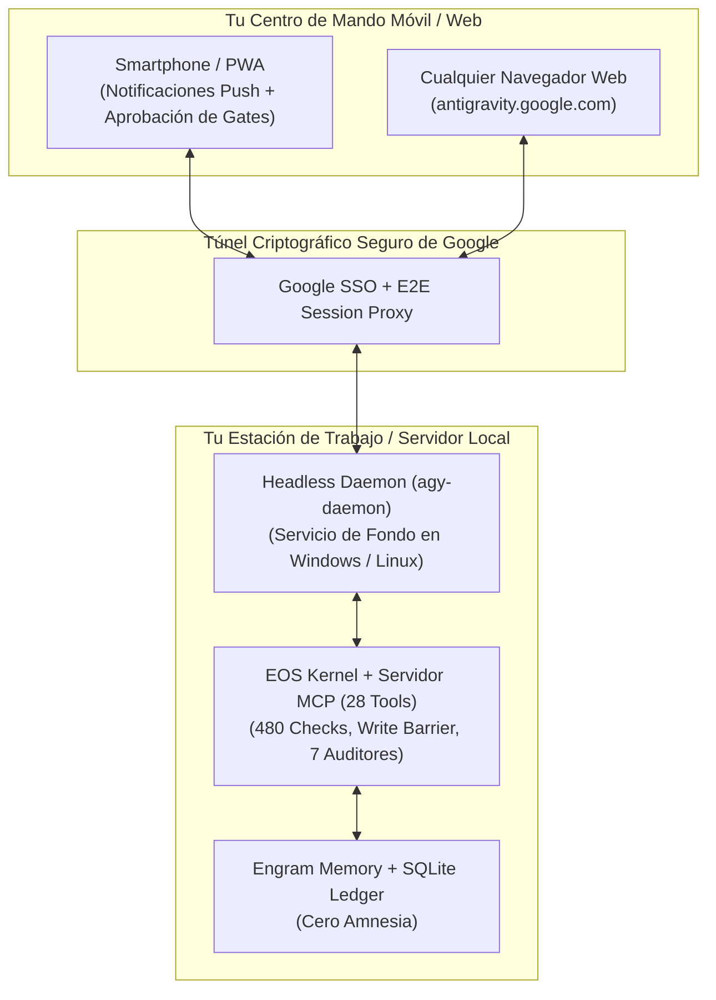

# EOS & Antigravity Remote Control: The Ubiquitous J.A.R.V.I.S. Cockpit

## 1. Executive Concept: Omnipresence & Remote Governance

> **"Un verdadero J.A.R.V.I.S. no te ata a la silla del escritorio. Trabaja de fondo en tu máquina o servidor, ejecuta tareas complejas de horas, y te permite supervisar, aprobar gates y dar órdenes desde tu teléfono o cualquier navegador."**

Con **Antigravity Remote Control** y el **Headless Daemon (`agy-daemon`)**, el plano de control de EOS se desacopla de la presencia física:
* **En tu máquina**: EOS ejecuta refactorizaciones masivas, los 480 checks deterministas y las suites de pruebas completas.
* **En tu bolsillo (Móvil / Web)**: Accedés al panel web (`https://antigravity.google.com/`), recibís notificaciones push cuando se requiere aprobación humana (HITL Level 2) y revisás artefactos en tiempo real.



---

## 2. Métodos de Activación del Control Remoto

### Método A: Activación Directa desde la Interfaz Gráfica
1. Abrí la configuración pulsando `Ctrl + ,`.
2. Dirigite a la sección **Aplicación**.
3. Activá la opción **"Habilitar control remoto"** (*Enable Remote Control*).
4. Asignale un apodo identificatorio a tu equipo (ej. `estacion-principal` o `servidor-eos`).

---

### Método B: Instalación del Demonio sin Cabeza (Headless Daemon en Windows)
Para que el sistema siga operando incluso si cerrás sesión o reiniciás la máquina:

1. Abrí el **Símbolo del Sistema (cmd.exe)** como **Administrador** (*Ejecutar como Administrador*).
2. Ejecutá el script oficial de instalación:
   ```cmd
   curl -fsSL https://antigravity.google/cli/agy-daemon.cmd -o agy-daemon.cmd && agy-daemon.cmd install --name "eos-workstation"
   ```
3. **Inicio de Sesión Único**: Seguí el link impreso en la consola para autenticarte una sola vez con tu cuenta de Google.

### Comandos de Control del Demonio:
* **Ver Estado**: `agy-daemon.cmd status`
* **Reiniciar Servicio**: `agy-daemon.cmd restart`
* **Desinstalar**: `agy-daemon.cmd uninstall` (desde consola de Administrador).

---

## 3. Flujo Operativo J.A.R.V.I.S. en Movimiento

```text
┌─────────────────────────────────────────────────────────────────────────────┐
│ 1. ORDEN REMOTA (Desde el móvil en antigravity.google.com)                  │
│    "EOS, ejecutá la auditoría completa de seguridad y performance."         │
├─────────────────────────────────────────────────────────────────────────────┤
│ 2. EJECUCIÓN AUTÓNOMA LOCAL (En tu PC / Daemon)                             │
│    El Kernel activa los 7 Auditores y ejecuta verify:strict (480 checks).    │
├─────────────────────────────────────────────────────────────────────────────┤
│ 3. PUSH NOTIFICATION EN EL TELÉFONO                                         │
│    "Gatekeeper EOS: Tareas de planificación completadas. ¿Aprobar Nivel 2?" │
├─────────────────────────────────────────────────────────────────────────────┤
│ 4. APROBACIÓN TÁCTIL (HITL)                                                 │
│    Tocás 'Aprobar' en la pantalla del móvil ➔ La Write Barrier se abre.     │
├─────────────────────────────────────────────────────────────────────────────┤
│ 5. REPORTE FINAL Y EVIDENCIA CRIPTOGRÁFICA                                  │
│    EVD-XXXX.json generado y persistido en Engram.                           │
└─────────────────────────────────────────────────────────────────────────────┘
```

---

## 4. Configuración y Ubicación de Archivos

* **Archivo de Configuración Global**: `%USERPROFILE%\.gemini\config\config.json`
* **Variables Clave**:
  * `cliRemoteControlHostname`: Nombre de la instancia del demonio sin cabeza.
  * `remoteControlHostname`: Nombre de la aplicación de escritorio Antigravity.
