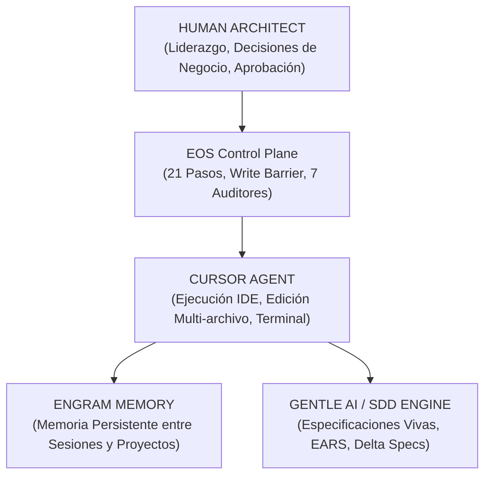

# Cursor Operational Mastery: The Sovereign AI Engineering Engine

## 1. The Core Economic & Architectural Strategy

> **"Un crédito de Cursor Pro/Ultra no se gasta en pensar qué hacer; se gasta en ejecutar con precisión quirúrgica lo que ya está perfectamente especificado."**

Cuando pagás una suscripción de Cursor (Pro, Pro+, Ultra), el error más costoso es el **vibe coding**: pedirle a modelos caros (Claude Sonnet 4, Opus, Gemini) que improvisen código. Eso quema créditos en alucinaciones, refactorizaciones innecesarias y código muerto.

### La Ecuación de Rendimiento Máximo
```text
┌───────────────────────────┐      ┌───────────────────────────┐      ┌───────────────────────────┐
│     FASE 1: CEREBRO       │ ──►  │    FASE 2: CONTRATO       │ ──►  │    FASE 3: EJECUCIÓN      │
│  (Arquitecto + EARS/BDD)  │      │ (spec.md + plan.md + DAG) │      │   (Cursor Agent a fondo)  │
│ Cero código / Alta visión │      │ Invariable y versionado   │      │ 100% acotado / 0% pérdida │
└───────────────────────────┘      └───────────────────────────┘      └───────────────────────────┘
```

---

## 2. La Fuerza Operativa Cuádruple (The Power Stack)



| Componente | Rol en la Maquinaria | Por qué es indispensable |
|---|---|---|
| **Cursor IDE** | **El Brazo Ejecutor**: Edición multi-archivo, composer agent, terminal integrada, indexación semántica del codebase. | Máxima velocidad de I/O y manipulación de código en tu máquina. |
| **EOS** | **El Sistema de Gobierno**: Protege tus repositorios (`Write Barrier`), impone las 7 auditorías automáticas y los 21 pasos. | Impide que la IA rompa arquitectura o toque cosas fuera de alcance. |
| **Engram** | **La Memoria Eterna**: Guarda decisiones arquitectónicas, lecciones aprendidas, patrones y estado persistente entre reinicios. | La IA nunca "olvida" lo que se decidió en la sesión anterior. |
| **Gentle AI / SDD** | **La Brújula de Precisión**: Formato EARS, escenarios Given-When-Then, living specs (`specs/`) y deltas (`changes/`). | Elimina el 100% de la ambigüedad en los requerimientos. |

---

## 3. Guía de Operación Táctica en Cursor (Comandos y Símbolos)

### Símbolos de Contexto Inteligente (`@`)
En Cursor, **el contexto lo es todo**. Para no saturar el contexto ni gastar tokens en cosas irrelevantes, usá los punteros `@`:

* `@Files` (`@spec.md`, `@AGENTS.md`): Apunta a la especificación activa y las reglas maestras.
* `@Folders` (`@docs/specs/001-mvp/`): Entrega la carpeta completa de la feature.
* `@Docs`: Permite indexar documentación oficial de librerías externas.
* `@Codebase`: Búsqueda semántica global en todo el repositorio (usar solo en fase de exploración).
* `@Git`: Inserta los diffs y commits recientes para dar contexto de cambios.

### Modos Operativos en Cursor

1. **Cursor Chat (`Ctrl + L` / `Cmd + L`)**:
   * **Uso**: Fase de *Entrevista*, *Clarificación*, *Diseño de Arquitectura* y *Preguntas de Plan*.
   * **Regla**: Acá NO se genera código; se discute la spec, se desafían supuestos y se aprueban ADRs.

2. **Cursor Composer / Agent Mode (`Ctrl + I` / `Cmd + I`)**:
   * **Uso**: Fase de *Implementación Tarea por Tarea*.
   * **Regla**: Se le da como input: `@spec.md @plan.md @tasks.md Implementa ÚNICAMENTE la tarea T2`.
   * **Comportamiento**: Edita múltiples archivos a la vez, corre tests en la terminal y reporta el resultado.

3. **Inline Edit (`Ctrl + K` / `Cmd + K`)**:
   * **Uso**: Refactorizaciones micro o corrección quirúrgica de una función específica.

---

## 4. El Loop Infinito de Iteración Consciente (Continuous Flow)

Para trabajar **sin parar, editar, iterar e iterar de forma consciente**:

```text
┌─────────────────────────────────────────────────────────────────────────────────┐
│ 1. EXPLORAR (@Codebase + @Docs)                                                 │
│    Pensar la necesidad, identificar módulos afectados sin tocar código.        │
├─────────────────────────────────────────────────────────────────────────────────┤
│ 2. ESPECIFICAR (docs/templates/SPEC_TEMPLATE.md)                                │
│    Redactar en EARS: CUANDO / MIENTRAS / SI / EL SISTEMA.                       │
├─────────────────────────────────────────────────────────────────────────────────┤
│ 3. PLANIFICAR Y DIVIDIR (docs/templates/PLAN_TEMPLATE.md + TASKS_TEMPLATE.md)   │
│    Arquitectura Limpia + DAG de Tareas atómicas con checkboxes [ ].             │
├─────────────────────────────────────────────────────────────────────────────────┤
│ 4. APROBAR GATE (IMPLEMENTATION_AUTHORIZATION.md ➔ Nivel 2)                     │
│    El humano da luz verde formal para abrir la Write Barrier.                   │
├─────────────────────────────────────────────────────────────────────────────────┤
│ 5. EJECUTAR (Cursor Composer / Agent Mode)                                      │
│    T1 ➔ Test RED ➔ Código GREEN ➔ Refactor ➔ T2 ➔ Test RED ➔ ...                │
├─────────────────────────────────────────────────────────────────────────────────┤
│ 6. AUDITAR (Los 7 Auditores Especializados)                                     │
│    Arch, Quality, Security, A11y, Perf, SEO, Browser QA.                        │
├─────────────────────────────────────────────────────────────────────────────────┤
│ 7. EVIDENCIA & MEMORIA (EVD-XXXX.json + Engram mem_save)                        │
│    Registrar prueba criptográfica y consolidar memoria persistente.             │
├─────────────────────────────────────────────────────────────────────────────────┤
│ 8. REPETIR CON LA SIGUIENTE ITERACIÓN (Siguiente Delta Spec)                    │
└─────────────────────────────────────────────────────────────────────────────────┘
```

Con esta maquinaria lista, cada centavo invertido en Cursor rinde como si tuvieras un equipo completo de ingenieros Senior trabajando en paralelo para vos.
