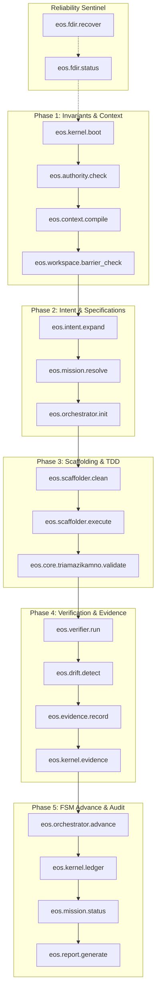

# EOS MCP Golden Path Execution Guide
## The Authoritative, Minimal, and Verified 19-Tool Critical Path for Spec-Driven Development

---

### The Minimal Critical Path Architecture

Of the 80 tools in the `eos-local` MCP catalog, exactly **19 tools** constitute the true, hardened Critical Path required to execute the 21-step Master Engineering Pipeline from Intake to Verification.

---

### Step-by-Step Golden Path Protocol

#### Step 1: Boot & Constitutional Assertion
1. `eos.kernel.boot`: Verify that `CONSTITUTION.md` and `.cursorrules` match their SHA-256 cryptographic baselines (480 deterministic checks).
2. `eos.authority.check`: Confirm that the granted autonomy level (e.g. `LEVEL_1` or `LEVEL_2`) satisfies the task's required authority rank.

#### Step 2: Context Compilation & Scope Containment
3. `eos.context.compile`: Compile token-budgeted surgical prompt context with receipts.
4. `eos.workspace.barrier_check`: Ensure all target file paths reside strictly within the allowed workspace and do not cross into protected directories (`Fundacion/`, `docs/governance/`).

#### Step 3: Formal Requirements & Mission Initialization
5. `eos.intent.expand`: Expand raw user instructions into formal **EARS** requirements (`CUANDO... EL SISTEMA...`) and **BDD** scenarios (`GIVEN-WHEN-THEN`).
6. `eos.mission.resolve`: Validate DAG structure and cite canonical governance rules.
7. `eos.orchestrator.init`: Initialize the formal SDD mission in `INTAKE` phase and log the initial transaction in the ledger.

#### Step 4: Clean Architecture Scaffolding
8. `eos.scaffolder.clean`: Generate the atomic triad skeletons (`docs/specs/spec.md`, `tests/<name>.test.js`, `src/domain/<name>.js`, `src/adapters/<name>.js`).

#### Step 5: Closed-Loop TDD Implementation
9. `eos.scaffolder.execute`: Execute the closed-loop TDD runner. Runs native Node tests, catches assertion failures, and iterates up to `maxIterations` until all tests pass (Exit Code 0).
10. `eos.core.triamazikamno.validate`: Assert creational triad balance across the specification (affirm), test suite (deny), and production code (conciliate).

#### Step 6: Strict Verification & Evidence Capture
11. `eos.verifier.run`: Validate that all JSON schemas and mission packages conform strictly to schema contracts.
12. `eos.drift.detect`: Confirm zero configuration drift occurred during code execution.
13. `eos.evidence.record`: Write the physical immutable evidence receipt (`EVD-XXXX.json`) containing raw test logs, execution metadata, and SHA-256 hash.
14. `eos.kernel.evidence`: Seal the evidence receipt into the kernel ledger.

#### Step 7: Phase Transition & Governance Gate
15. `eos.orchestrator.advance`: Submit the SHA-256 evidence hash to unlock the next mission phase gate in the state machine.
16. `eos.kernel.ledger`: Commit the state transition to the persistent append-only ledger.

#### Step 8: Status & Executive Reporting
17. `eos.mission.status`: Inspect mission telemetry and verify zero homedir leaks.
18. `eos.report.generate`: Generate the final executive mission summary report in Markdown.

---

### Anti-Patterns and Prohibited Tool Usages

- ❌ **DO NOT use `eos.environment.sandbox.execute` for real command execution**: It is a simulation stub. Use native authorized runtime tools or `eos.scaffolder.execute`.
- ❌ **DO NOT use `eos.security.adversarial.review` as a replacement for real security auditing**: It performs trivial substring checks. Use real static analysis and manual code review.
- ❌ **DO NOT use `eos.pleroma.akasha.engram` for memory persistence**: Use native `engram` MCP tools (`mem_save`, `mem_context`).
- ❌ **DO NOT call `eos.fdir.trip` unless an unrecoverable corruption is detected**: It will halt all subsequent mutating operations across the server.
