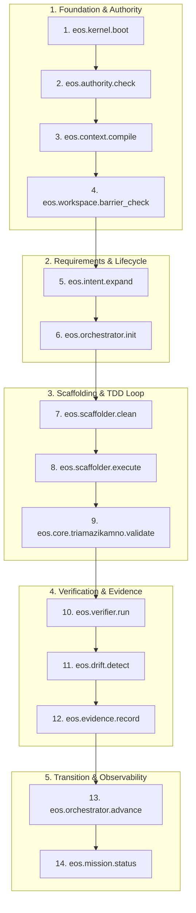

# EOS MCP Canonical Golden Path (The 14-Tool Sovereign Lifecycle)
## Mission ID: EOS-MCP-SURFACE-RATIONALIZATION-001 — Phase 6 Deliverable

---

### The Unification: Eliminating the 12 vs 18 vs 19 Contradiction

Previous documents cited different numbers due to conflating:
1. Operational steps (18 steps in the blueprint execution).
2. Exposed tool count (19 tools marked critical).
3. Core minimum tools (12 tools).

**The Definitive Architectural Truth**:
There are exactly **14 Atomic Capabilities** required for an autonomous agent to execute the full Spec-Driven Development (SDD) mission lifecycle with zero redundancy, zero simulation stubs, and zero governance gaps.

---

### The 14 Canonical Tools & Code-Backed Justifications

| Step # | Canonical Tool | Capability ID | Real Owner File | Why Required / Cannot Be Omitted |
|---|---|---|---|---|
| **1** | `eos.kernel.boot` | `CAP-CORE-001` | `src/core/kernel.js` | Validates `CONSTITUTION.md` and runs 480 deterministic checks before any operation. |
| **2** | `eos.authority.check` | `CAP-AUTH-001` | `src/core/authority/authority-adapter.js` | Enforces monotonic rank arithmetic (`A0`-`A4`) preventing unauthorized privilege escalation. |
| **3** | `eos.context.compile` | `CAP-CTX-001` | `src/core/runtime/context-compiler.js` | Surgically compresses workspace context to fit LLM attention budgets with hash receipts. |
| **4** | `eos.workspace.barrier_check` | `CAP-WRK-001` | `src/core/mcp/mcp-mission-bridge.js` | Protects `Fundacion/` and `docs/governance/` against unauthorized file system writes. |
| **5** | `eos.intent.expand` | `CAP-REQ-001` | `src/core/intent-compiler.js` | Translates raw instructions into formal **EARS** and **BDD** specifications without vibe coding. |
| **6** | `eos.orchestrator.init` | `CAP-MSN-001` | `src/core/orchestrator.js` | Creates the formal SDD state machine in `INTAKE` and registers nodes in the knowledge graph. |
| **7** | `eos.scaffolder.clean` | `CAP-ENG-001` | `src/core/scaffolder-clean.js` | Writes clean hexagonal module triads (`spec.md`, `.test.js`, `domain.js`, `adapter.js`) to disk. |
| **8** | `eos.scaffolder.execute` | `CAP-ENG-002` | `src/core/runtime/tdd-executor.js` | Runs native Node tests in an autonomous repair loop, capturing failure traces until 100% pass. |
| **9** | `eos.core.triamazikamno.validate` | `CAP-QAL-001` | `src/core/runtime/triamazikamno-validator.js` | Asserts triad balance across specification (affirm), test (deny), and code (conciliate). |
| **10** | `eos.verifier.run` | `CAP-QAL-002` | `src/core/mcp/mcp-mission-bridge.js` | Validates JSON schema contracts across all generated mission artifacts and descriptors. |
| **11** | `eos.drift.detect` | `CAP-GOV-001` | `src/core/drift.js` | Verifies zero configuration or constitutional drift occurred during code implementation. |
| **12** | `eos.evidence.record` | `CAP-EVD-001` | `src/mcp-server.js` | Writes physical immutable `EVD-XXXX.json` file to disk containing raw test logs and SHA-256 hash. |
| **13** | `eos.orchestrator.advance` | `CAP-FSM-001` | `src/core/orchestrator.js` | Validates evidence cryptographic hash and unlocks the next SDD phase gate transition. |
| **14** | `eos.mission.status` | `CAP-OBS-001` | `src/core/mcp/mcp-mission-bridge.js` | Inspects real mission state, telemetry, and verifies zero homedir leaks across the control plane. |
