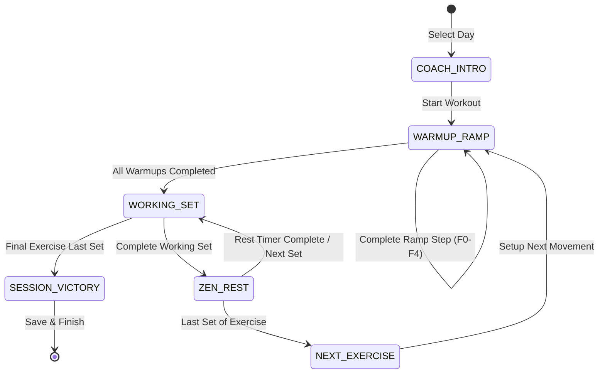

# Architecture Plan & ADR: [PLAN-FUERZA-002] Coach-Guided UX Architecture

* **Project ID:** `PRJ-APP-FUERZA`
* **Status:** `APPROVED`
* **Traceability:** `SPEC-FUERZA-002` ➔ `PLAN-FUERZA-002` ➔ `TASKS-FUERZA-002`

---

## 1. Architectural Overview

The goal is to provide a warm, human, intuitive, step-by-step coaching experience without breaking existing domain logic or increasing technical debt.

We adhere strictly to the **Container-Presentational Pattern**:
```text
┌────────────────────────────────────────────────────────┐
│               src/app/page.tsx (Container)             │
│                 └── useZenDashboard()                  │
└───────────────────────────┬────────────────────────────┘
                            │
            ┌───────────────┴───────────────┐
            ▼                               ▼
┌───────────────────────────┐   ┌───────────────────────────┐
│   CoachGuidedView.tsx     │   │   ZenDashboardView.tsx    │
│  (Warm, Linear Coach UI)  │   │  (Pro Dense Analytics UI) │
│  - Active Step Card       │   │  - Full Multi-Cards       │
│  - Big Touch Actions      │   │  - Advanced Calibrations  │
│  - Zen Rest Breath Mode   │   │  - Raw Telemetry Tables   │
└───────────────────────────┘   └───────────────────────────┘
```

---

## 2. Finite State Machine (FSM) for Guided Flow

The guided coach operates on a deterministic FSM:


---

## 3. Architecture Decision Record (ADR-0012)

### Context
Athletes training under high load cannot navigate multiple nested cards or dense text. We need an intuitive interface that guides the lifter one set at a time while allowing power users to inspect raw telemetry.

### Decision
1. **Composable Dual-Mode View**: Create `CoachGuidedView.tsx` as a focused presentational view consuming the exact same `d: ReturnType<typeof useZenDashboard>` props as `ZenDashboardView.tsx`.
2. **Seamless Toggle**: Provide an accessible switch at the top header (`"Modo Coach"` vs. `"Modo Pro"`), persisted in `localStorage`.
3. **Warm Human Tone**: Transform cold telemetry cues into encouraging, clear Spanish cues in the UI copy (while keeping all code, comments, and identifiers strictly in standard English).
4. **Touch Ergonomics**: Minimum button height `56px`, large high-contrast numerals, and zero layout shift.

### Rejected Alternatives
* **Alternative A (Replace existing UI completely):** Rejected. Power users and advanced lifters benefit from the full telemetry, formulas, and history comparison of the pro dashboard. Eliminating it would degrade capability.
* **Alternative B (Modal / Multi-Step Wizard overlay):** Rejected. Modals feel claustrophobic on mobile gym screens and create z-index / scroll lock bugs. A full-page reactive view is smoother and battery-efficient.
* **Alternative C (Heavy Third-Party Animation / Tour Library like Joyride):** Rejected. Adds bundle bloat and runtime latency. Pure CSS and Tailwind transitions are zero-cost and 60fps compliant.
