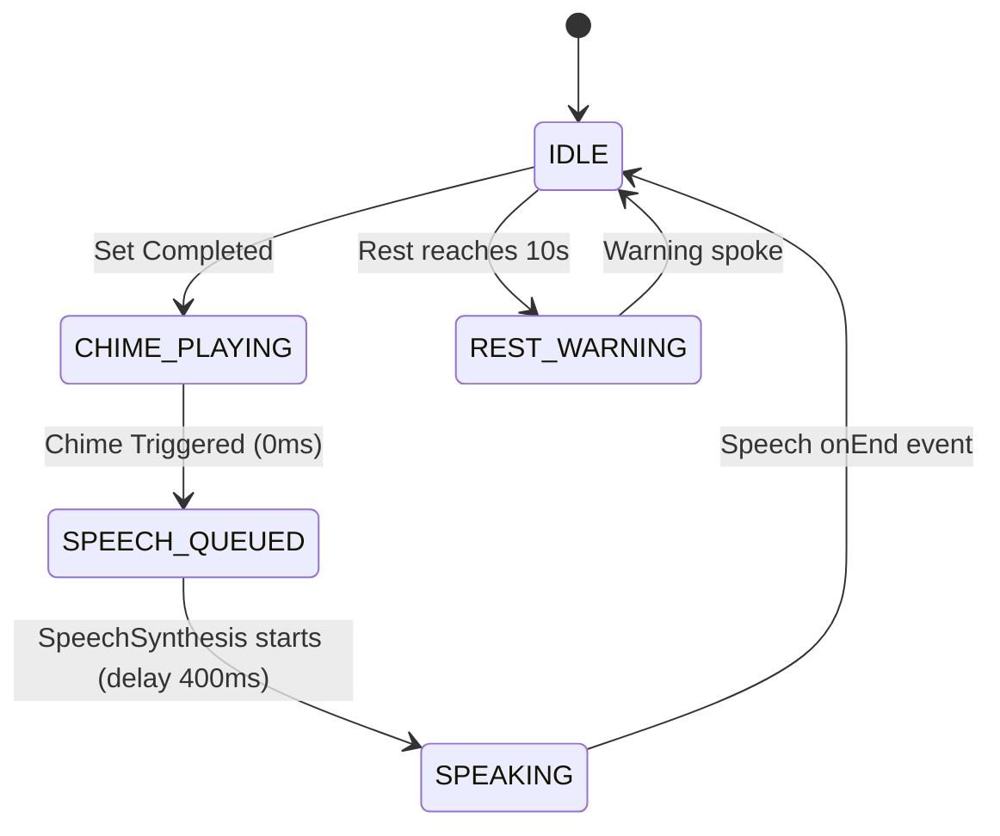

# Architecture Plan & ADR: [PLAN-FUERZA-003] Neuro-Acoustic Biofeedback Architecture

* **Project ID:** `PRJ-APP-FUERZA`
* **Status:** `APPROVED_FOR_IMPLEMENTATION`
* **Traceability:** `SPEC-0005` ➔ `PLAN-FUERZA-003` ➔ `TASKS-FUERZA-003`

---

## 1. Architectural Overview

The goal is to deliver multi-modal sensory feedback (auditory chimes + motivational voice coaching cues + haptic pulses) to lifters in Coach Mode, eliminating cognitive load and providing athletic pacing.

We adhere strictly to the **Clean / Hexagonal Architecture**:
```text
┌─────────────────────────────────────────────────────────────┐
│                 UI Layer (CoachGuidedView.tsx)              │
│       - Audio toggle control (Voice Coach ON / OFF)         │
│       - Event hooks (onSetComplete, onRestTick, onFinish)   │
└──────────────────────────────┬──────────────────────────────┘
                               │ Calls port
                               ▼
┌─────────────────────────────────────────────────────────────┐
│             Domain / Adapter Layer (zenAudio.ts)            │
│               - Pure cue selection logic                    │
│               - SpeechSynthesis queue coordinator           │
│               - Web Audio oscillator synthesizer (0ms)      │
│               - Safe navigator.vibrate wrapper              │
└─────────────────────────────────────────────────────────────┘
```

---

## 2. Audio State Machine & Coexistence

To prevent overlapping audio collisions (e.g. chime drowning speech or speech repeating on fast clicks):


---

## 3. Architecture Decision Record (ADR-0013)

### Context
Athletes training under maximum physical stress have saturated visual attention. Auditory cues must have instant feedback without introducing latency, blocking the JS event loop, or bloating the mobile bundle size with megabytes of MP3 files.

### Decision
1. **Web Audio + Native SpeechSynthesis (Zero-Bundle Overhead)**:
   - Use existing `AudioContext` in `zenAudio.ts` for instant 0ms tone synthesis (528 Hz ATP chime & 880 Hz milestone warning).
   - Use browser-native `window.speechSynthesis` with `SpeechSynthesisUtterance` for spoken Spanish motivational cues.
2. **Audio Controls in UI**:
   - Provide an accessible mute/unmute toggle in `CoachGuidedView.tsx` so users in quiet environments or listening to personal music can toggle voice coaching independently.
3. **Resilience & Fallback**:
   - Wrap all speech and audio calls in try/catch and check `typeof window !== 'undefined'`. If the browser restricts speech or autoplay, fall back immediately to `navigator.vibrate` without interrupting session progression.

### Rejected Alternatives
* **Alternative A (Pre-recorded MP3 voice assets):** Rejected. Downloading 20-30 audio files adds 5-10 MB to initial page payload, fails in low-connectivity gym basements, and cannot narrate dynamic kilograms/reps.
* **Alternative B (Third-Party Cloud TTS like ElevenLabs API):** Rejected. Requires network roundtrips (500-1500ms latency), costs API credits, fails offline, and leaks athlete telemetry to external services.
* **Alternative C (Web Audio only with no spoken words):** Rejected. Pure beeps are ambiguous; lifters cannot distinguish between a set complete chime vs rest warnings without checking the screen.
