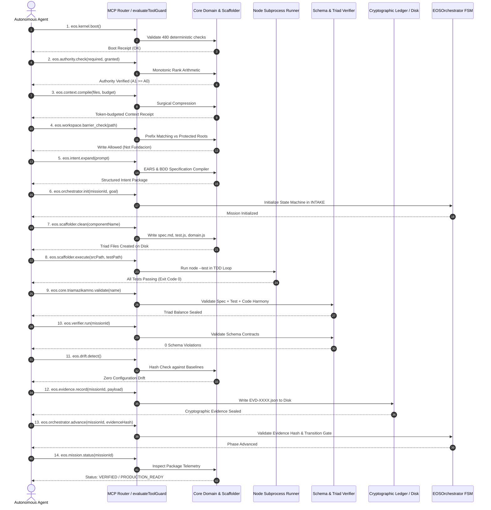

# EOS Canonical Runtime Path Specification
## The 14-Step Deterministic Engineering Lifecycle
**Document ID:** `EOS-PATH-CANONICAL-001`

---

### Step-by-Step Execution Sequence

```mermaid
sequenceDiagram
    autonumber
    actor Agent as Autonomous Agent
    participant MCP as MCP Router / evaluateToolGuard
    participant Core as Core Domain & Scaffolder
    participant Exec as Node Subprocess Runner
    participant Verif as Schema & Triad Verifier
    participant Ledger as Cryptographic Ledger / Disk
    participant FSM as EOSOrchestrator FSM

    Agent->>MCP: 1. eos.kernel.boot()
    MCP->>Core: Validate 480 deterministic checks
    Core-->>Agent: Boot Receipt (OK)

    Agent->>MCP: 2. eos.authority.check(required, granted)
    MCP->>Core: Monotonic Rank Arithmetic
    Core-->>Agent: Authority Verified (A1 >= A0)

    Agent->>MCP: 3. eos.context.compile(files, budget)
    MCP->>Core: Surgical Compression
    Core-->>Agent: Token-budgeted Context Receipt

    Agent->>MCP: 4. eos.workspace.barrier_check(path)
    MCP->>Core: Prefix Matching vs Protected Roots
    Core-->>Agent: Write Allowed (Not Fundacion)

    Agent->>MCP: 5. eos.intent.expand(prompt)
    MCP->>Core: EARS & BDD Specification Compiler
    Core-->>Agent: Structured Intent Package

    Agent->>MCP: 6. eos.orchestrator.init(missionId, goal)
    MCP->>FSM: Initialize State Machine in INTAKE
    FSM-->>Agent: Mission Initialized

    Agent->>MCP: 7. eos.scaffolder.clean(componentName)
    MCP->>Core: Write spec.md, test.js, domain.js
    Core-->>Agent: Triad Files Created on Disk

    Agent->>MCP: 8. eos.scaffolder.execute(srcPath, testPath)
    MCP->>Exec: Run node --test in TDD Loop
    Exec-->>Agent: All Tests Passing (Exit Code 0)

    Agent->>MCP: 9. eos.core.triamazikamno.validate(name)
    MCP->>Verif: Validate Spec + Test + Code Harmony
    Verif-->>Agent: Triad Balance Sealed

    Agent->>MCP: 10. eos.verifier.run(missionId)
    MCP->>Verif: Validate Schema Contracts
    Verif-->>Agent: 0 Schema Violations

    Agent->>MCP: 11. eos.drift.detect()
    MCP->>Core: Hash Check against Baselines
    Core-->>Agent: Zero Configuration Drift

    Agent->>MCP: 12. eos.evidence.record(missionId, payload)
    MCP->>Ledger: Write EVD-XXXX.json to Disk
    Ledger-->>Agent: Cryptographic Evidence Sealed

    Agent->>MCP: 13. eos.orchestrator.advance(missionId, evidenceHash)
    MCP->>FSM: Validate Evidence Hash & Transition Gate
    FSM-->>Agent: Phase Advanced

    Agent->>MCP: 14. eos.mission.status(missionId)
    MCP->>Core: Inspect Package Telemetry
    Core-->>Agent: Status: VERIFIED / PRODUCTION_READY
```
