# EOS Executive Architecture Atlas
## The 12 Canonical System Diagrams
**Document ID:** `EOS-ATLAS-001`

---

### Diagram 1: Canonical System Architecture
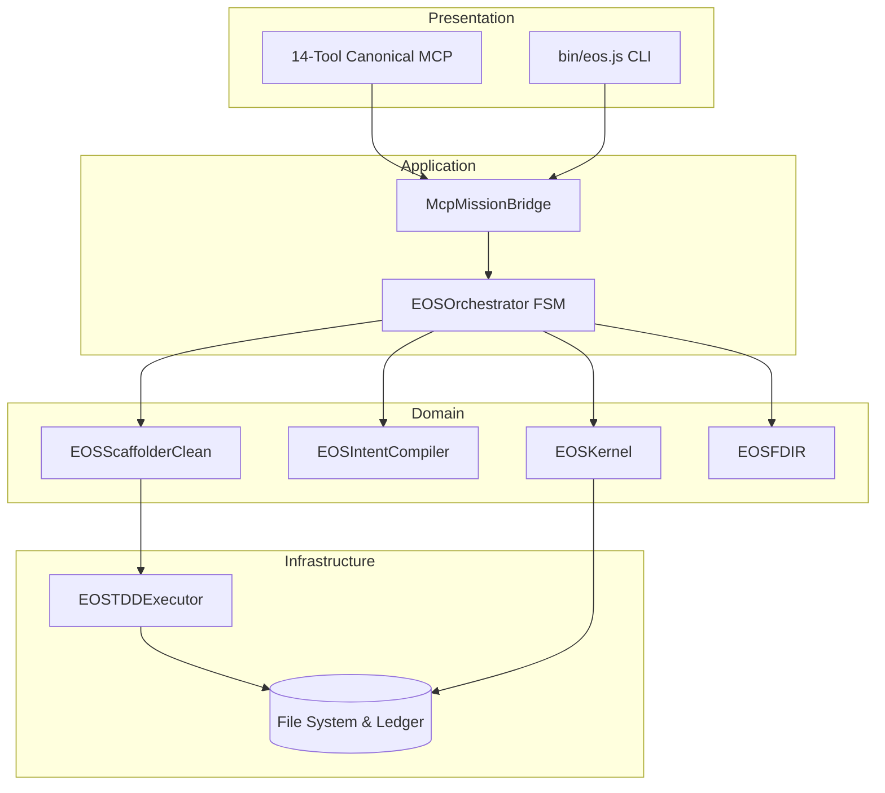

---

### Diagram 2: Runtime Golden Path

---

### Diagram 3: State Ownership Topology
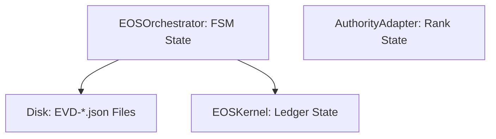

---

### Diagram 4: Authority Flow & Gateways
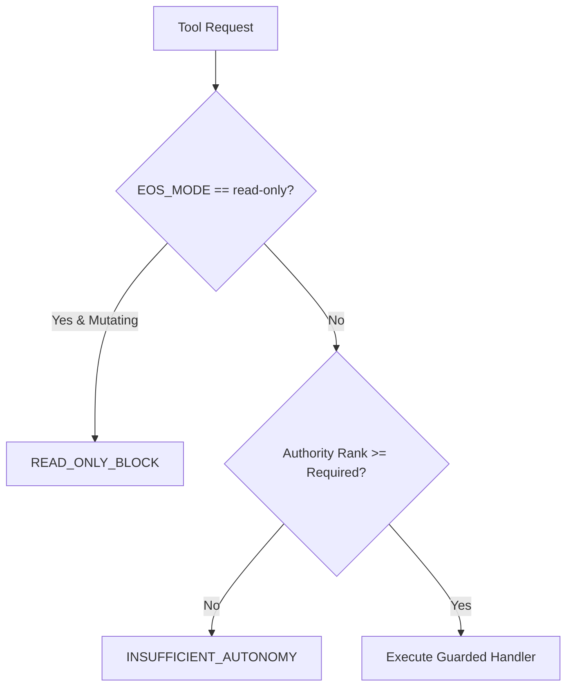

---

### Diagram 5: Four-Tier Tool Surface
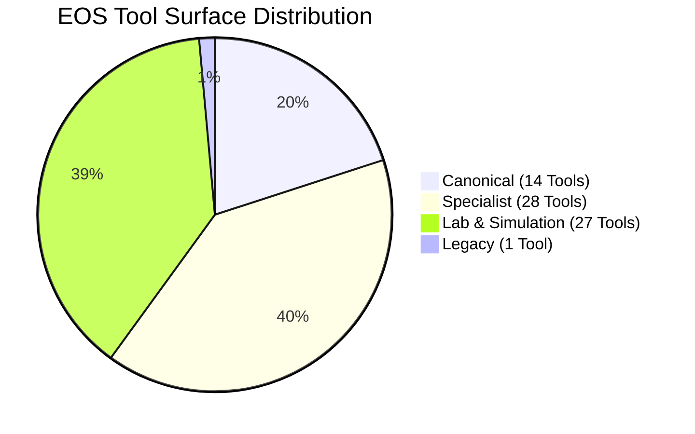

---

### Diagram 6: Core Dependency Topology
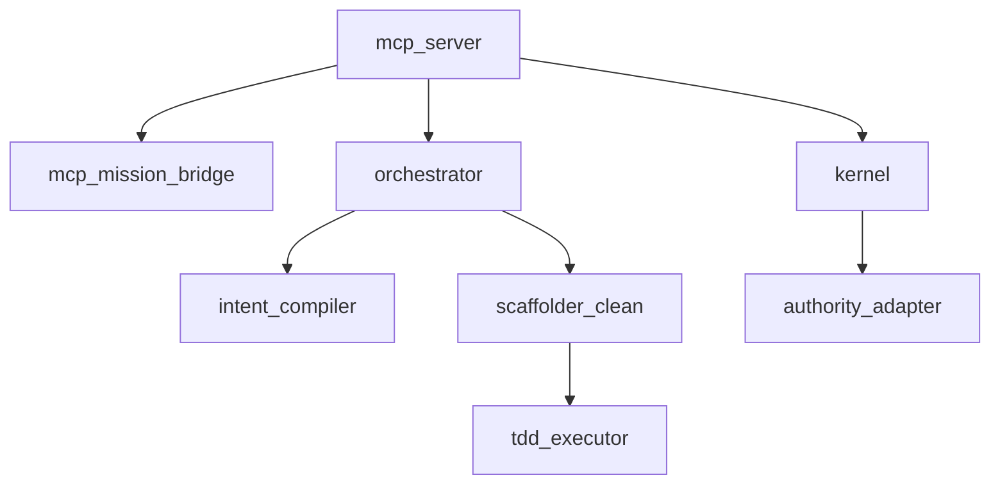

---

### Diagram 7: Component Quality Classification
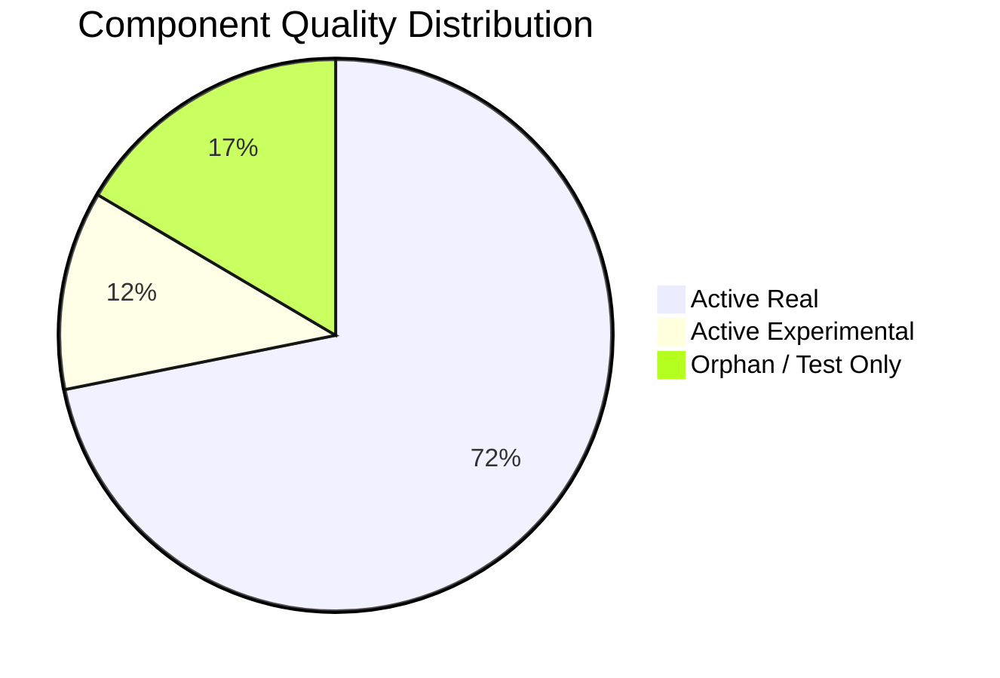

---

### Diagram 8: Technical Debt Landscape
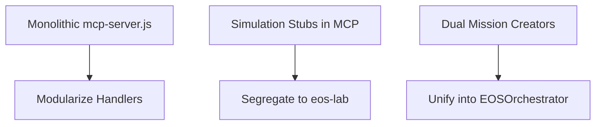

---

### Diagram 9: Security & Risk Heatmap
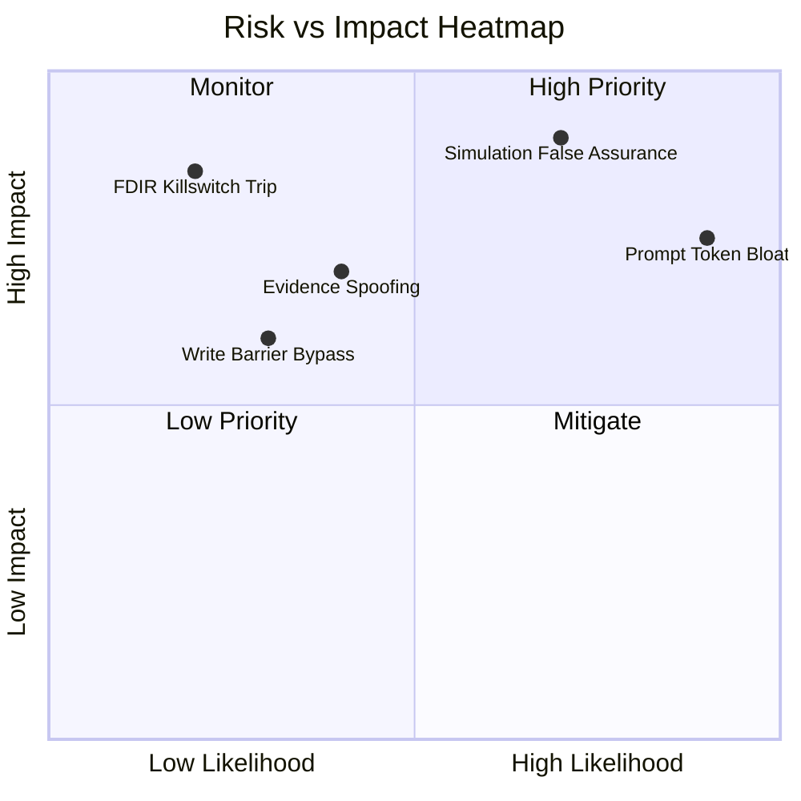

---

### Diagram 10: Evidence Lifecycle
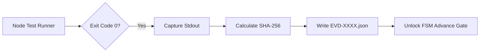

---

### Diagram 11: FDIR & Recovery Lifecycle
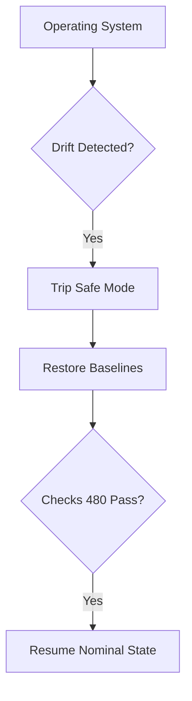

---

### Diagram 12: Agent Operating Model
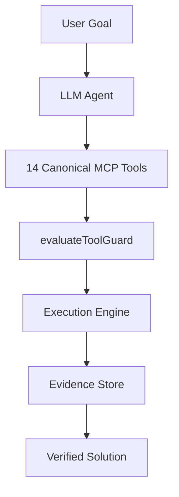
