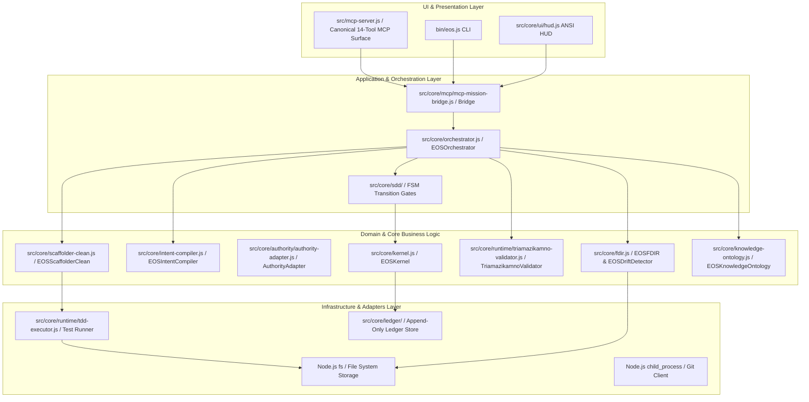

# EOS Final Architecture Specification
## Unified Canonical Operating System for Governed Agentic Engineering
**Document ID:** `EOS-ARCH-FINAL-001` | **Status:** `CANONICAL_PROPOSED`

---

### 1. Architectural Philosophy: The Three Inviolable Laws

EOS is not an assortment of experimental engines; it is a deterministic, evidence-bearing software factory.

```
                                  CONSTITUTION
                                       │
                         ┌─────────────┴─────────────┐
                         ▼                           ▼
                 ZERO VIBE CODING             EVIDENCE OVER CLAIMS
            (Specification as Truth)       (Executable Proof Required)
                         │                           │
                         └─────────────┬─────────────┘
                                       ▼
                             CONTAINED MUTATION
                          (Strict External Barrier)
```

1. **The Law of Specification as Supreme Truth**: Improvised prompts never generate production code directly. Code is a derived, transient artifact compiled against formal EARS/BDD specifications.
2. **The Law of Evidence Over Claims**: No component may claim `VERIFIED` or `PRODUCTION_READY` without referencing verifiable, executable test logs with Exit Code 0 and cryptographic SHA-256 signatures.
3. **The Law of Contained Mutation**: External project directories (e.g. `Fundacion/`) and core governance are shielded by impermeable write barriers.

---

### 2. Clean / Hexagonal System Decomposition



---

### 3. The 14 Canonical Capabilities

EOS converges from 74 scattered tools down to **14 atomic capabilities**:
1. `CAP-CORE-001`: Kernel Constitutional Verification & Invariant Boot (`eos.kernel.boot`)
2. `CAP-AUTH-001`: Monotonic Authority Rank Arithmetic (`eos.authority.check`)
3. `CAP-CTX-001`: Surgical Context Compilation (`eos.context.compile`)
4. `CAP-WRK-001`: External Write Barrier Enforcement (`eos.workspace.barrier_check`)
5. `CAP-REQ-001`: Formal EARS & BDD Specification AST Expansion (`eos.intent.expand`)
6. `CAP-MSN-001`: Mission Lifecycle FSM Initialization (`eos.orchestrator.init`)
7. `CAP-ENG-001`: Hexagonal Triad Code Scaffolding (`eos.scaffolder.clean`)
8. `CAP-ENG-002`: Autonomous Closed-Loop TDD Execution (`eos.scaffolder.execute`)
9. `CAP-QAL-001`: Triadic Balance Verification (`eos.core.triamazikamno.validate`)
10. `CAP-QAL-002`: JSON Schema Contract Verification (`eos.verifier.run`)
11. `CAP-GOV-001`: Forensic Drift Detection (`eos.drift.detect`)
12. `CAP-EVD-001`: Cryptographic Evidence File Sealing (`eos.evidence.record`)
13. `CAP-FSM-001`: Phase Gate Transition with Evidence Hash (`eos.orchestrator.advance`)
14. `CAP-OBS-001`: Mission Status & Telemetry Inspection (`eos.mission.status`)
