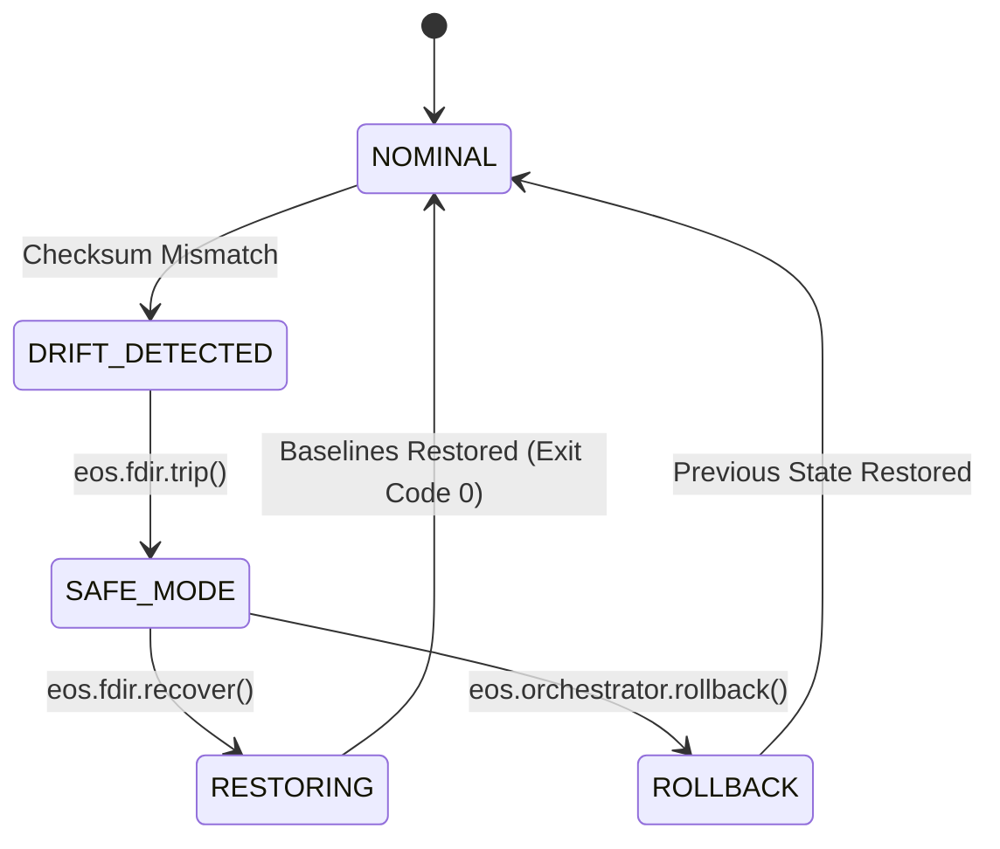

# EOS Failure Recovery & FDIR Architecture
**Document ID:** `EOS-REC-001`

---

### Stop, Recover, Resume, Rollback Protocol

- **STOP**: `eos.fdir.trip` trips safe-mode breaker, halting mutating tools.
- **RECOVER**: `eos.fdir.recover` restores `.cursorrules` and `CONSTITUTION.md` from verified SHA-256 baselines.
- **ROLLBACK**: `eos.orchestrator.rollback` reverts FSM state in mission history.
- **RESUME**: `eos.orchestrator.advance` resumes execution after evidence verification.
