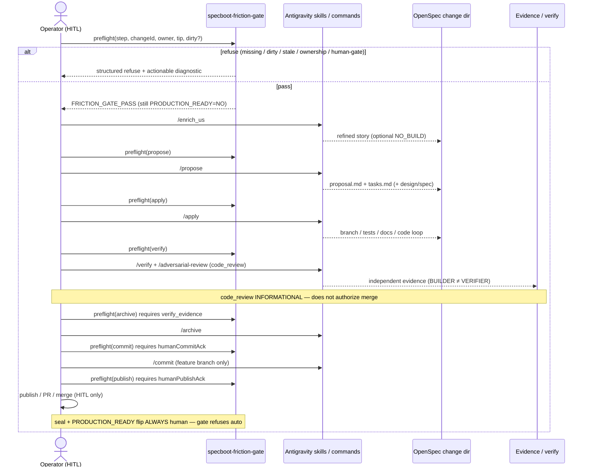

# Post-L26 E — SpecBoot Friction Inventory + Sequence (2026-09-19)

**Owner:** Valentin Florez  
**Package:** `eos-post-l26-e-specboot-friction`  
**PRODUCTION_READY:** NO  
**NON-CLAIM:** Inventory + safe automation proposals ≠ automatic seal / ≠ production flip.

## 1. LIDR sequence (preferred)

## 2. Step-by-step friction inventory

| ID | Step | Friction | Class | Pain |
| --- | --- | --- | --- | --- |
| F1 | all | Manual copy/paste of `changeId` / paths between slash steps | manual copy/paste | High — typos skip wrong change |
| F2 | apply→archive | Re-check dirty tree by hand at every step | repeated check | Medium — easy to skip |
| F3 | propose→verify | Re-check HEAD vs change tip / freeze by eye | repeated check | High — stale apply risk |
| F4 | archive/commit | Ambiguous who owns archive vs commit vs publish | ambiguous decision | High — dual claim / no claim |
| F5 | enrich→apply | Manual scan that proposal/tasks/SPECBOOT_CYCLE exist | repeated check | Medium |
| F6 | apply→verify | Stale proposal/tasks vs moved HEAD after parallel commits | stale inputs | High |
| F7 | verify→archive | Paste evidence path / pass counts into next prompt | manual copy/paste | Medium |
| F8 | any late step | Unclear whether gate PASS implies seal or PRODUCTION_READY | ambiguous decision | **Critical** — honesty risk |

## 3. Safe automation proposals (preserve human gates)

| ID | Automation | Automate? | Human gate preserved |
| --- | --- | --- | --- |
| A1 | Prerequisite probe (paths / verify_evidence flags) | YES | Does not create missing artifacts |
| A2 | Dirty-tree probe (injectable git) | YES | Operator still chooses commit/stash |
| A3 | Stale tip / age probe | YES | Operator refreshes change or acks ahead-lag |
| A4 | Ownership probe (primaryOwner required) | YES | Operator declares owner; no auto-assign invent |
| A5 | Structured refuse reasons + actionable diagnostics | YES | Improves decisions; does not decide seal |
| A6 | Refuse auto-seal without `humanSealAck` | YES (refuse) | **Seal remains HITL** |
| A7 | Refuse PRODUCTION_READY flip without ack | YES (refuse) | **Readiness flip remains HITL** |

**Explicit non-automation:** `/publish` merge to main, L26 seal, `PRODUCTION_READY=YES`, reopening L17–L26, starting L27.

## 4. Fail-closed matrix (gate)

| Condition | Code | Actionable diagnostic (shape) |
| --- | --- | --- |
| Missing proposal/tasks/cycle/verify_evidence/acks | `MISSING_PREREQUISITES` | List missing paths/flags |
| Dirty tree (or git missing → do not invent clean) | `DIRTY_STATE` / `MISSING_PREREQUISITES` | Enumerate dirty paths or inject git/dirty |
| changeTip ≠ HEAD / age exceeded / explicit stale | `STALE_INPUTS` | Refresh change or allowHeadAhead+lagCommits |
| No owner / multi-owner without primary | `AMBIGUOUS_OWNERSHIP` | Set `primaryOwner` |
| autoSeal / prod flip / publish without ack | `AUTO_SEAL_REFUSED` / `AUTO_PRODUCTION_FLIP_REFUSED` / `HUMAN_GATE_REQUIRED` | Explicit human*Ack only after operator decision |

## 5. Mapping to gate module

Machine-readable IDs: `FRICTION_INVENTORY_IDS` + `SAFE_AUTOMATION_IDS` in `specboot-friction-gate.js`.

## 6. NON-CLAIMS

- Fewer manual steps ≠ automatic closure ≠ production flip
- Gate PASS ≠ ceremony complete ≠ GitHub green ≠ Fundacion write
- Inventory is not proof that a step is safe to skip
