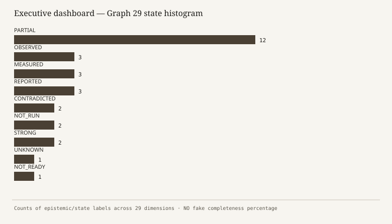
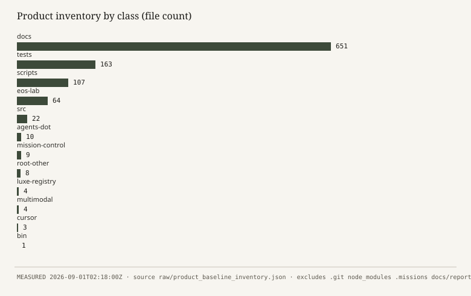
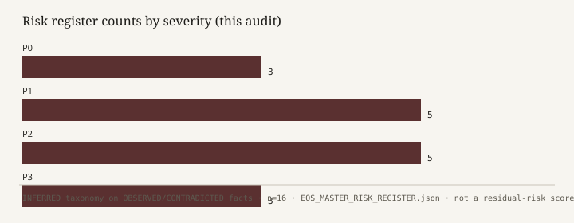
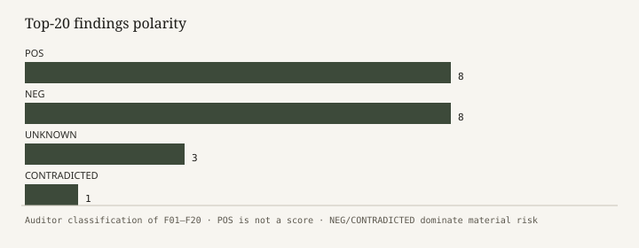
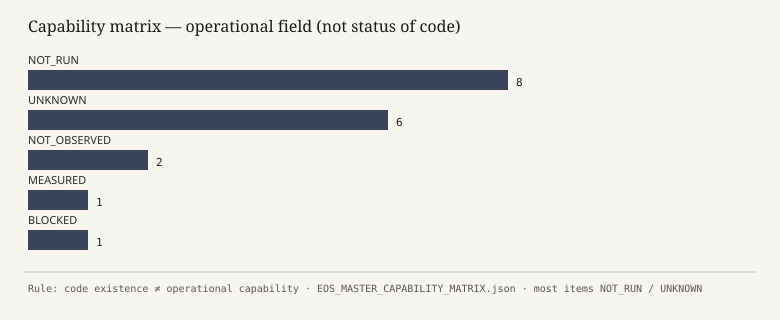
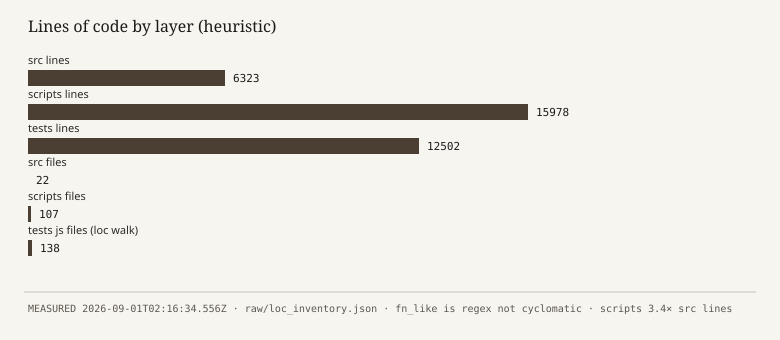
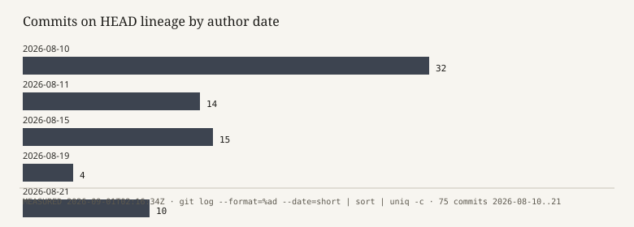
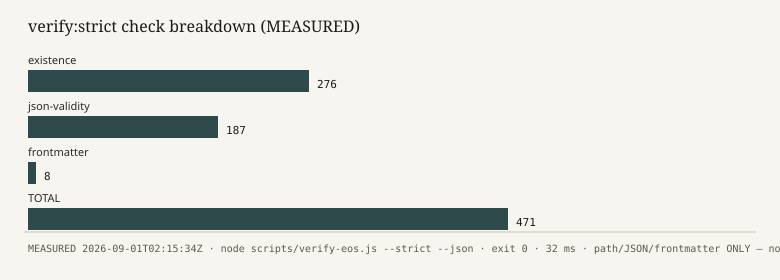

# EOS MASTER EXECUTIVE ATLAS

**Board version** · Report `EOS-MSR-2026-09-01-001` · Audit `AUD-EOS-MASTER-20260901-021328Z` · Generated `2026-09-01T02:18:00Z`  
**Repository:** https://github.com/valentinflorezarbelaez-ai/Eos-  
**VM path:** `/workspace` · **HEAD at start:** `24b69689c447f94afebd4893f5f0f83f45e0a823`  
**Verdict: D — NOT_READY** · Production ready: **NO** · Local-complete on this HEAD: **UNKNOWN**

This atlas is the 20–30 page board cut of the master report. It does not add metrics. Every figure is in `EOS_MASTER_SYSTEM_DATA.json` / `EOS_MASTER_SYSTEM_METRICS.csv`.

---

## A. What this is

EOS is a GitHub-hosted Node.js “Engineering Operating System”: governance documents, a local Mission OS kernel (`src/core`), a larger legacy/lab factory (`scripts/engine`), tests, and mission-control JSON. It is **not** a running production SaaS in this environment.

This audit was **read-only** except for writing these report files.

---

## B. Dashboard (no %)

| Surface | State |
| --- | --- |
| File/JSON verifier | VERIFIED (471/471) |
| Mission OS source | STRONG (exists) |
| Tests executed | NOT_READY (NOT_RUN) |
| Health telemetry | CONTRADICTED |
| Production | NOT_READY |
| Fundación product | NOT_READY (empty) |
| Third-party MCP live | UNKNOWN |
| npm supply chain | STRONG (zero deps) |

---

## C. The only verdict

**D — NOT_READY.**

Not C: freeze suite and MissionRuntime were not reproduced on this HEAD.  
Not E: kernel source exists; verifier passed; git intact.

**Ultimate board question:** treat EOS as an operational production autonomous system today? **NO.**

---

## D. Numbers a director may quote (and no others)

| Quote | Do not say |
| --- | --- |
| verify:strict **471/471 PASS**, 32 ms, 2026-09-01T02:15:34Z | “472 tests” / “full suite green” |
| **777** static `test()`/`it()` calls in **132** files | “777 tests passed” |
| **1046** product files, **651** docs | “62% complete” |
| **22** src files, **6323** lines; scripts **15978** lines | “scripts are the product” without dual-plane caveat |
| **75** commits, **1** RC tag, HEAD `24b6968` | “main is still 78b28d6” |
| **0** npm dependencies | “no code dependencies anywhere” (Lab imports hono/astro) |
| **0** hits for `726/726` and `615/615` | those historical memory numbers |

---

## E. Architecture in one picture

Two planes:

1. **Mission OS** — `bin/eos.js` → `MissionRuntime` → ATS / FSM / HITL / Integration gate / MCP bridge.
2. **Legacy factory** — `scripts/cli/eos.js` + 100+ engines, including **three duplicate kernel filenames**.

Documented modules `synthesisEngine.js` / `executionOrchestrator.js` / `scripts/engine/core` **are not in the tree**.

---

## F. Control and authority

HITL human-only actions are explicit in source (direction/release gates, production release, credentials, constitution exceptions). That is **OBSERVED text**, not a runtime proof.

`.cursor/mcp.json` sets `EOS_MODE=read-write` LEVEL_1 — looser than the server’s default `read-only`.

MissionRuntime **mkdir `.missions` in the constructor** — even help is not a pure read. Help was therefore NOT_RUN.

---

## G. Security and bypass (board-level)

- Step-9 security matrix remediates **files that do not exist** → do not cite 16/16 attacks as current.
- MCP “CONNECTED” in mission-control is **not observed** here.
- Heuristic secret-like assignments in 10 test/engine files — review, do not panic, do not ignore.
- Bypass register is a surface list, not a red-team report.

---

## H. Projects and money

Six registry projects; Fundación empty; GAP-002 still UNKNOWN (do not infer NIT/banking).  
`BUDGET.json` $0.32 / 45200 tokens: **REPORTED**, not measured. Do not use in finance discussions.

---

## I. Risks (P0 first)

- **R-P0-01 P0:** Stale/contradictory system-health pass counts used as live telemetry
- **R-P0-02 P0:** Security remediations cite modules that do not exist
- **R-P0-03 P0:** npm test not executed; mutation risk in suite
- **R-P1-01 P1:** Dual kernel copies (src/core vs scripts/engine)
- **R-P1-02 P1:** MCP CONNECTED claims vs this environment
- **R-P1-03 P1:** Freeze documents pin stale main SHA
- **R-P1-04 P1:** PRJ-FUNDACION empty; GAP-002 still UNKNOWN
- **R-P1-05 P1:** CLI constructor creates .missions as side effect

---

## J. Do not build / do not say

- Production deploy / public hosting — PRODUCTION_READY=NO; no network/prod capability verified
- Unattended LEVEL_3+ autonomy on real client targets — HITL/ATS not exercised this audit; Fundacion barrier exists
- Infer GAP-002 legal/banking data — Explicit constitutional unknown
- Treat verify:strict 471 as test coverage or runtime health — Path/JSON existence only
- npm install / add dependencies without L1/L2 policy — DEPENDENCY_POLICY_L0
- Merge or claim freeze paperwork still equals HEAD — 78b28d6 ≠ 24b6968
- Operate claimed CONNECTED third-party MCPs from this Linux VM as if live — Not observed; Windows engram path
- Cite 726/726 or 615/615 as current facts — Strings absent in tree; previous-memory only

---

## K. Graph 29 (ordinal visual only)

Do not average the 0–5 ordinals. They exist so a board packet can *see* imbalance (testing/security/docs drift vs git/deps).

---

## L. Fifteen questions (answers only)

1. Is EOS production ready? — **NO**
2. Is EOS complete for local governed use? — **PARTIAL**
3. Does a real Mission OS kernel exist in src/? — **YES**
4. Did this audit run the product test suite? — **NO**
5. Did any automated gate pass here? — **YES**
6. Are published test-health numbers trustworthy? — **NO**
7. Is CORE frozen as a single inode? — **UNKNOWN**
8. Is PRJ-FUNDACION operational? — **NO**
9. Is GAP-002 resolved? — **NO**
10. Are third-party MCPs connected here? — **UNKNOWN**
11. Is there an npm lockfile / installed deps? — **NO**
12. Can we claim 726/726 or 615/615 tests? — **NO**
13. Is security Step-9 matrix applicable to current src/core? — **NO**
14. Should the board authorize production or client writes? — **NO**
15. What is the single best next measurement? — **Isolated freeze-suite replay**

---

## M. What to do next (recommendations, not work done)

1. Stop publishing 663/608/472/20 as *current* without a new MEASURED run (REC01).
2. Quarantine Step-9 matrix as historical (REC03).
3. Update or supersede freeze docs for HEAD `24b69689` (REC04).
4. Replay the 4-file freeze suite in a **tmp** workdir and seal the log (REC07).
5. Declare `src/core` the only kernel; mark `scripts/engine` duplicates deprecated (REC08).
6. Keep PRODUCTION_READY=NO (REC18).
7. Keep GAP-002 UNKNOWN (REC12).

---

## N. Findings polarity

Positive: verifier works; kernel source exists; zero npm deps; PRODUCTION_READY=NO is honest at system level.  
Negative: contradictory health, missing security targets, stale freeze SHA, dual kernel, empty Fundación, MCP over-claim.

---

## O. Capability operational field

Most capabilities are **NOT_RUN** or **UNKNOWN**. Only the file/JSON gate is `MEASURED`.

---

## P. Lines of code (not quality)

---

## Q. Git burst

75 commits in 11 days (10–21 Aug 2026). Fast document+code accretion. Drift risk is structural.

---

## R. verify:strict composition

276 existence + 187 JSON + 8 frontmatter = 471. This is a **workspace integrity linter**, not a product test.

---

## S. How to read this packet in 10 minutes

1. Verdict D (§C).  
2. Numbers table (§D) — refuse any other headline figure.  
3. Contradictions (master report §46).  
4. P0/P1 risks (§I).  
5. Ultimate NO (§C / master §51).

---

## T. Authority of this atlas

Prepared by a Cloud Agent under read-only constraints. It **cannot** certify production. It **can** certify that, on this VM, at these timestamps, the listed commands produced the listed outputs.

Full narrative: `EOS_MASTER_SYSTEM_REPORT.md` (53 sections).

---

*End of Executive Atlas.*

---

## U. Full metadata (board record)
| Field | Value | Class |
| --- | --- | --- |
| Report ID | `EOS-MSR-2026-09-01-001` | — |
| Audit ID | `AUD-EOS-MASTER-20260901-021328Z` | — |
| Abs path | `/workspace` | MEASURED |
| HEAD | `24b69689c447f94afebd4893f5f0f83f45e0a823` | MEASURED |
| Node / npm / git | v22.14.0 / 10.9.7 / 2.43.0 | MEASURED |
| Package manager | npm scripts; no lockfile; 0 deps | OBSERVED |
| Commits / tracked files / tags | 75 / 1048 / 1 | MEASURED |

This page exists so a director can file the audit without opening the 53-section report.

## V. Contradiction register (complete)

If a slide still shows 726, 615, 663, 608, 472, or 20 as *today’s* health, it is wrong.

| ID | A | B | Label |
| --- | --- | --- | --- |
| CX-01 | CURRENT_STATE 663/663 | suite NOT_RUN; static 777 | CONTRADICTED |
| CX-02 | cli fallback 608/608 | same | CONTRADICTED |
| CX-03 | historical verify 472/472 | this run 471/471 | CONTRADICTED |
| CX-04 | freeze main 78b28d6 | HEAD 24b6968 | CONTRADICTED |
| CX-05 | Step-9 remediations | target files absent | CONTRADICTED |
| CX-06 | RISK.json scripts/engine/core | directory absent | CONTRADICTED |
| CX-07 | MCP CONNECTED | not observed here | CONTRADICTED |
| CX-08 | memory 726/726 | 0 hits in tree | CONTRADICTED |
| CX-09 | memory 615/615 | 0 hits as live metric | CONTRADICTED |
| CX-10 | freeze 20/20 as current | HEAD moved; NOT_RUN | CONTRADICTED as current |
| CX-11 | CORE FROZEN slogan | src/core changed after freeze docs | CONTRADICTED if Δ=0 |
| CX-12 | EVD-0033/34 PRODUCTION_READY | system dictamen NO | CONTRADICTED if global |

System-level `PRODUCTION_READY=NO` is **consistent** and accepted.

## W. Graph 29 table (all dimensions)

| # | Dimension | State | Note |
| --- | --- | --- | --- |
| 1 | 01 Architecture coherence | `PARTIAL` | Dual planes src/core vs scripts/engine; 3 duplicate kernel basenames |
| 2 | 02 Documented vs actual | `CONTRADICTED` | Security matrix cites missing synthesisEngine/executionOrchestrator; freeze HEAD stale |
| 3 | 03 Entrypoints | `PARTIAL` | bin/eos.js and scripts/cli/eos.js both exist; CLI --help not executed (mkdir side effect) |
| 4 | 04 MissionRuntime | `OBSERVED` | Class and methods exist; no .missions; constructor not invoked this audit |
| 5 | 05 FSM | `OBSERVED` | 17 states, 16 transitions imported from src/core/sdd/sdd-fsm-engine.js |
| 6 | 06 Authority / HITL | `OBSERVED` | ATS + HitlGatekeeper modules exist; runtime not exercised |
| 7 | 07 Tools / MCP | `PARTIAL` | 20 tools declared in src; MCP CONNECTED claims not observed on this VM |
| 8 | 08 Governance matrix | `PARTIAL` | Policies and RISK.json exist; frozen-core path scripts/engine/core missing |
| 9 | 09 Security matrix | `CONTRADICTED` | EOS_STEP_9_SECURITY_MATRIX.json remediates files that do not exist |
| 10 | 10 Bypass resistance | `UNKNOWN` | Guards exist in source; bypass suite not executed this audit |
| 11 | 11 Evidence system | `PARTIAL` | 84 evidence JSON files exist; contents treated as REPORTED |
| 12 | 12 Testing inventory | `MEASURED` | 132 test-like files; 777 static test()/it() calls; count ≠ coverage |
| 13 | 13 Testing execution | `NOT_RUN` | npm test / test:all / coverage not executed |
| 14 | 14 V&V | `PARTIAL` | verify:strict MEASURED; dynamic V&V NOT_RUN |
| 15 | 15 Reproducibility | `PARTIAL` | L0 builtins policy + no lockfile; clean-clone of core is plausible, not replayed |
| 16 | 16 Git health | `STRONG` | 75 commits, 1 tag, clean start, remote origin present |
| 17 | 17 Code health | `PARTIAL` | src 22 files / 6323 lines; scripts 3.4x larger; lint/typecheck NOT_RUN |
| 18 | 18 Dependency health | `STRONG` | No npm dependencies in package.json; node_modules absent |
| 19 | 19 Agents | `REPORTED` | 16 docs agents + 7 mission-control agents; no live process observed |
| 20 | 20 Knowledge plane | `REPORTED` | docs/knowledge and intelligence JSON exist; not executed |
| 21 | 21 Ops maturity | `PARTIAL` | Mission-control JSON present; telemetry hash not reproduced |
| 22 | 22 Performance | `NOT_RUN` | No runtime/perf measurements this audit |
| 23 | 23 Complexity | `MEASURED` | LOC and import-edge counts only; no cyclomatic tool run |
| 24 | 24 Fitness functions | `REPORTED` | verify-eos is a fitness-like gate for files/JSON, not product fitness |
| 25 | 25 Projects | `PARTIAL` | 6 registry projects; Fundacion/ empty; Windows paths invalid here |
| 26 | 26 History | `MEASURED` | 11-day burst 2026-08-10..21; 75 commits |
| 27 | 27 Risk management | `PARTIAL` | Registers exist; several are stale or self-certifying |
| 28 | 28 Production readiness | `NOT_READY` | PRODUCTION_READY=NO consistently reported; this audit agrees |
| 29 | 29 Epistemic honesty | `PARTIAL` | Constitution requires labels; live files still publish stale pass-counts |

## X. All P0–P3 risks

| ID | Sev | Title | Class |
| --- | --- | --- | --- |
| R-P0-01 | P0 | Stale/contradictory system-health pass counts used as live telemetry | `CONTRADICTED` |
| R-P0-02 | P0 | Security remediations cite modules that do not exist | `CONTRADICTED` |
| R-P0-03 | P0 | npm test not executed; mutation risk in suite | `NOT_RUN` |
| R-P1-01 | P1 | Dual kernel copies (src/core vs scripts/engine) | `OBSERVED` |
| R-P1-02 | P1 | MCP CONNECTED claims vs this environment | `CONTRADICTED` |
| R-P1-03 | P1 | Freeze documents pin stale main SHA | `CONTRADICTED` |
| R-P1-04 | P1 | PRJ-FUNDACION empty; GAP-002 still UNKNOWN | `OBSERVED` |
| R-P1-05 | P1 | CLI constructor creates .missions as side effect | `OBSERVED` |
| R-P2-01 | P2 | Registry paths are Windows absolute and invalid on this VM | `OBSERVED` |
| R-P2-02 | P2 | Budget/usage telemetry not reproduced | `REPORTED` |
| R-P2-03 | P2 | RISK.json freezes scripts/engine/core which does not exist | `CONTRADICTED` |
| R-P2-04 | P2 | Historical PRODUCTION_READY verdicts inside EVD-0033/34/35 | `REPORTED` |
| R-P2-05 | P2 | Heuristic secret-like assignments in tests/engines | `OBSERVED` |
| R-P3-01 | P3 | Docs dominate inventory (651/1046 files) | `MEASURED` |
| R-P3-02 | P3 | No lockfile under L0 policy | `OBSERVED` |
| R-P3-03 | P3 | sqlite artifacts in EOS-Lab | `OBSERVED` |

## Y. Findings and recommendations (full)

### Findings

| ID | Pol | Title | Class |
| --- | --- | --- | --- |
| F01 | POS | verify:strict executed 471/471 PASS exit 0 in 32 ms | `MEASURED` |
| F02 | POS | Mission OS kernel modules exist under src/core (22 JS files, 6323 lines) | `MEASURED` |
| F03 | POS | package.json has zero npm dependencies; L0 builtins policy matches observation | `OBSERVED` |
| F04 | POS | PRODUCTION_READY=NO is consistent across CURRENT_MISSION and freeze docs | `REPORTED` |
| F05 | POS | GAP-002 remains labeled UNKNOWN in mission-control and unknown register | `REPORTED` |
| F06 | POS | Git history is short, linear, tagged RC; start working tree was clean | `MEASURED` |
| F07 | POS | MCP tool table in src is enumerable (20 tools) with deny-by-default comments | `OBSERVED` |
| F08 | POS | HITL human-only action set is explicit in source | `OBSERVED` |
| F09 | NEG | System health numbers contradict each other (20 / 471 / 472 / 608 / 663 / static 777) | `CONTRADICTED` |
| F10 | NEG | 726/726 and 615/615 previous-memory claims are not in this tree | `CONTRADICTED` |
| F11 | NEG | Security matrix remediates nonexistent src/core modules | `CONTRADICTED` |
| F12 | NEG | Freeze status pins main=78b28d6; actual HEAD=24b6968 | `CONTRADICTED` |
| F13 | NEG | ACTIVE_TOOLS.json reports MCP CONNECTED; not observed on this VM | `CONTRADICTED` |
| F14 | NEG | Dual FSM/HITL/evidence engines (src vs scripts) | `OBSERVED` |
| F15 | NEG | Fundacion/ is empty; registry points at Windows path | `OBSERVED` |
| F16 | NEG | RISK.json freezes scripts/engine/core which does not exist | `CONTRADICTED` |
| F17 | UNKNOWN | npm test / coverage / CLI runtime / MCP stdio smoke not run this audit | `NOT_RUN` |
| F18 | UNKNOWN | Whether 20/20 freeze tests still pass on 24b6968 is unknown | `NOT_RUN` |
| F19 | UNKNOWN | BUDGET.json usage figures have no measurement chain here | `REPORTED` |
| F20 | CONTRADICTED | Documented CORE freeze locations do not match a single existing kernel directory | `CONTRADICTED` |

### Recommendations

| ID | Finding | Recommendation |
| --- | --- | --- |
| REC01 | F09 | Remove or timestamp-lock all live test-health strings; single measured source or NONE |
| REC02 | F10 | Never restore 726/726 or 615/615 without a new MEASURED run |
| REC03 | F11 | Quarantine EOS_STEP_9_SECURITY_MATRIX.json as HISTORICAL / NOT_APPLICABLE_TO_CURRENT_TREE |
| REC04 | F12 | Rewrite freeze gate docs to current HEAD or mark SUPERSEDED |
| REC05 | F03 | Keep L0 no-dep policy until a lockfile gate exists |
| REC06 | F17 | Create a declared non-mutating test subset (tmp workdir only) and run it under evidence |
| REC07 | F18 | Re-run the freeze 4-file suite in an isolated tmp dir; record exit and SHA |
| REC08 | F14 | Declare one authoritative kernel path; mark the other DEPRECATED in code not just docs |
| REC09 | F13 | Change ACTIVE_TOOLS MCP status from CONNECTED to CONFIGURED or UNKNOWN until a live handshake |
| REC10 | F15 | Keep Fundacion empty until GAP-002 official source; do not infer legal data |
| REC11 | F16 | Point CORE-freeze monitors at src/core (or the real path), not scripts/engine/core |
| REC12 | F05 | Leave GAP-002 UNKNOWN; do not close from web inference |
| REC13 | F19 | Treat BUDGET.json current_usage as demo/stale until a ledger backs it |
| REC14 | R-P1-05 | Stop mkdir in MissionRuntime constructor; create on first write |
| REC15 | F20 | Publish a one-page ACTUAL architecture that names src/core as Mission OS and scripts/engine as legacy/lab |
| REC16 | F01 | Keep verify:strict but label it FILE_JSON_GATE not test health |
| REC17 | F07 | Do not claim eos.provider.* operational; mcp-status already lists them not_configured |
| REC18 | F04 | Retain PRODUCTION_READY=NO until measured runtime + security + tests exist |
| REC19 | R-P2-05 | Human-review the 10 heuristic secret-hit files |
| REC20 | F06 | Pin this audit SHA in any future health dashboard |

## Z. Capability matrix (full)

| ID | Name | Status | Operational | Evidence |
| --- | --- | --- | --- | --- |
| CAP-CLI-MISSION | Mission CLI (bin/eos.js → MissionCLI) | OBSERVED | UNKNOWN | src/cli/mission-cli.js, bin/eos.js |
| CAP-MISSION-RUNTIME | MissionRuntime lifecycle | OBSERVED | NOT_RUN | src/core/runtime/mission-runtime.js |
| CAP-ATS | AuthorityTruthSource commitTransition | OBSERVED | NOT_RUN | src/core/authority/authority-truth-source.js |
| CAP-FSM | SDD FSM TransitionEnforcer | OBSERVED | NOT_RUN | src/core/sdd/sdd-fsm-engine.js import succeeded |
| CAP-HITL | HitlGatekeeper receipts | OBSERVED | NOT_RUN | src/core/sdd/hitl-gatekeeper.js |
| CAP-IG | IntegrationGatekeeper / FDIR | OBSERVED | NOT_RUN | src/core/governance/integration-gatekeeper.js |
| CAP-MCP-LOCAL | eos-local MCP server | OBSERVED | NOT_RUN | src/mcp-server.js + .cursor/mcp.json |
| CAP-MCP-EXTERNAL | Engram/Playwright/Figma/Slack MCP | REPORTED | NOT_OBSERVED | ACTIVE_TOOLS.json CONNECTED vs this Linux VM |
| CAP-VERIFY-STRICT | verify-eos --strict path/JSON gate | VERIFIED | MEASURED | 471/471 exit 0 at 2026-09-01T02:15:34Z |
| CAP-NPM-TEST | npm test suite | NOT_RUN | UNKNOWN | mutation risk |
| CAP-LEGACY-FACTORY | scripts/engine autonomous factory | OBSERVED | NOT_RUN | 107 script js files |
| CAP-FUNDACION | PRJ-FUNDACION product site | NOT_READY | NOT_OBSERVED | Fundacion/ empty; Windows path absent |
| CAP-LUXE | Luxe-Registry in-repo tree | OBSERVED | UNKNOWN | 4 files; registry claims PRODUCTION_READY_WITHIN_TESTED_SCOPE |
| CAP-MULTIMODAL | Multimodal-Creative-Suite in-repo tree | OBSERVED | UNKNOWN | 4 files |
| CAP-CANARY-LAB | EOS-Lab canaries | OBSERVED | NOT_RUN | 64 files including .db |
| CAP-COVERAGE | Test coverage measurement | NOT_RUN | UNKNOWN | no coverage/ |
| CAP-PERF | Runtime performance telemetry | NOT_RUN | UNKNOWN | BUDGET.json is REPORTED |
| CAP-PROD-DEPLOY | Production deploy / network / credentials | NOT_READY | BLOCKED | RELEASE_CAPABILITY_MATRIX FUTURE/BLOCKED |

## AA. Unknowns the board must keep unknown

- GAP-002 legal/banking facts until official PO source.
- npm test result on this HEAD.
- Freeze 20/20 on SHA 24b6968.
- Coverage.
- Live MCP connectivity.
- Runtime performance (except verify-eos 32 ms).
- Whether ATS is the sole writer at runtime.
- Why verify drifted 472 → 471.

## AB. Command ledger (what was and was not run)

| Command (abbrev) | Exit | ms | Class |
| --- | --- | --- | --- |
| env + git metadata | 0 | 676 | MEASURED |
| branch + mkdir report dirs | 0 | 80 | MEASURED (allowed mutation) |
| inventory collector | 0 | 138 | MEASURED |
| existence listing | 0 | 72 | MEASURED |
| verify-eos --strict --json | 0 | 32 | MEASURED |
| verify-eos --strict | 0 | 29 | MEASURED |
| more collectors + kernel import | 0 | 199 | MEASURED |
| product baseline walk | 0 | 80 | MEASURED |
| npm test / CLI help / MCP start | — | — | NOT_RUN |

## AC. How the board should talk about EOS after this audit

**Allowed:** “We have a local Mission OS codebase, a passing file/JSON gate (471/471), zero npm dependencies, and an honest PRODUCTION_READY=NO.”

**Forbidden:** “615/615 tests,” “726/726 tests,” “472/472 current,” “663/663 live,” “608/608,” “production ready,” “MCPs connected,” “CORE frozen meaning src cannot change,” “Fundación is an operating site,” “security 16/16 on current kernel.”

**Next measurement that would change the verdict toward C (not A):** isolated freeze-suite replay on 24b6968 with sealed logs, plus a non-mutating MissionRuntime inspect in tmp. That still would not make production ready.

## AD. Inventory detail (for the packet appendix)

| Class | Files | Bytes |
| --- | ---: | ---: |
| `docs` | 651 | 1930920 |
| `tests` | 163 | 527460 |
| `scripts` | 107 | 613812 |
| `eos-lab` | 64 | 625146 |
| `src` | 22 | 243380 |
| `agents-dot` | 10 | 13862 |
| `mission-control` | 9 | 7661 |
| `root-other` | 8 | 22705 |
| `luxe-registry` | 4 | 18303 |
| `multimodal` | 4 | 17015 |
| `cursor` | 3 | 3203 |
| `bin` | 1 | 557 |

Total 1046 files / 4,024,024 bytes excluding this report directory. MEASURED.

## AE. Entrypoints and why help was not run

`bin/eos.js` constructs `MissionCLI`, which constructs `MissionRuntime`, which `mkdirSync('.missions')` if missing. The auditor treated `--help` as mutating and marked it NOT_RUN. Help text was read from source instead (OBSERVED).

Legacy `npm run eos` is a different program (`scripts/cli/eos.js`) and embeds a fallback health string `608 / 608 PASS`.

## AF. MCP tools declared (20)

| Tool | Effects | Auth |
| --- | --- | --- |
| `eos.mission.resolve` | NONE | A0 |
| `eos.mission.start` | LEDGER_WRITE | A1 |
| `eos.mission.status` | READ_ONLY | A0 |
| `eos.mission.recover` | LEDGER_WRITE | A1 |
| `eos.context.compile` | READ_ONLY | A0 |
| `eos.ledger.get_features` | READ_ONLY | A0 |
| `eos.ledger.update_feature` | LEDGER_WRITE | A1 |
| `eos.authority.check` | READ_ONLY | A0 |
| `eos.policy.validate` | READ_ONLY | A0 |
| `eos.evidence.record` | LEDGER_WRITE | A1 |
| `eos.evidence.get` | READ_ONLY | A0 |
| `eos.verifier.run` | READ_ONLY | A0 |
| `eos.provider.route` | READ_ONLY | A0 |
| `eos.provider.health` | READ_ONLY | A0 |
| `eos.workspace.discover` | READ_ONLY | A0 |
| `eos.workspace.barrier_check` | READ_ONLY | A0 |
| `eos.fdir.status` | READ_ONLY | A0 |
| `eos.fdir.trip` | NONE | A2 |
| `eos.audit.run` | READ_ONLY | A0 |
| `eos.report.generate` | READ_ONLY | A0 |

`eos.provider.route` and `eos.provider.health` are declared in source and marked not_configured in mcp-status.json.

## AG. FSM states (17) and transitions (16)

`VISION_INTAKE`, `MISSION_FORMULATION`, `HUMAN_DIRECTION_GATE`, `DISCOVER`, `DEFINE`, `PLAN`, `DELEGATE`, `SUPERVISE`, `VERIFY`, `REVIEW`, `HUMAN_RELEASE_GATE`, `OPERATE_AND_LEARN`, `PAUSED`, `BLOCKED`, `FAILED`, `CANCELLED`, `COMPLETED`

Canonical transition count: 16. Imported from `src/core/sdd/sdd-fsm-engine.js`. Duplicate file exists under `scripts/engine/`.

## AH. Evidence store vs this audit

84 JSON files sit in `docs/evidence/`. They are a store, not this audit’s certification. This audit’s evidence is only `docs/reports/eos/master/raw/` plus the executed verify-eos logs.

## AI. Print checklist

Print `EOS_MASTER_EXECUTIVE_ATLAS.html` (this document) for the board. Keep `EOS_MASTER_SYSTEM_REPORT.html` for the technical committee. Attach `EOS_MASTER_SYSTEM_METRICS.csv` as the numbers sheet. Do not circulate charts without their captions.

---

*End of expanded Executive Atlas. Same numbers as the master report. Verdict remains D.*
