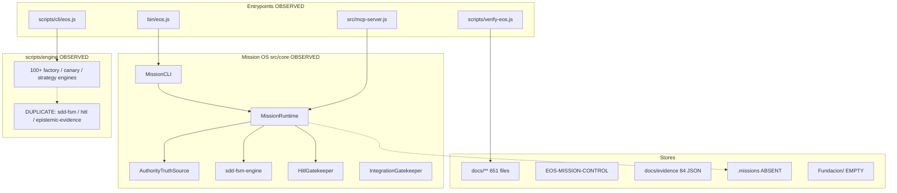

# EOS MASTER SYSTEM REPORT

| Field | Value |
| --- | --- |
| Report ID | `EOS-MSR-2026-09-01-001` |
| Audit ID | `AUD-EOS-MASTER-20260901-021328Z` |
| Classification contract | Every fact carries an epistemic label. Estimated ≠ measured. Reported ≠ verified. Code existence ≠ operational capability. |
| Mode | `READ_ONLY / SAFE_VERIFICATION` (report artifacts only) |
| Generated (UTC) | 2026-09-01T02:18:00Z |
| Repository | https://github.com/valentinflorezarbelaez-ai/Eos- |
| Absolute path on this VM | `/workspace` |
| Started-from branch / HEAD | `main` / `24b69689c447f94afebd4893f5f0f83f45e0a823` |
| Artifact branch | `cursor/eos-master-system-report-21fb` |
| Verdict (only one letter) | **D — NOT_READY** |

> Footnotes: every quantitative cell cites `docs/reports/eos/master/raw/` or a command in §52. Charts live in `charts/` with provenance captions.

---

## 1. Report metadata

| Item | Value | Class | Source | Timestamp UTC | Method |
| --- | --- | --- | --- | --- | --- |
| OS | Linux 6.12.94+ x86_64 | MEASURED | `uname -a` | 2026-09-01T02:14:28Z | shell |
| Node | v22.14.0 | MEASURED | `node -v` | 2026-09-01T02:14:28Z | shell |
| npm | 10.9.7 | MEASURED | `npm -v` | 2026-09-01T02:14:28Z | shell |
| pnpm present on VM | 10.33.3 | MEASURED | `pnpm -v` | 2026-09-01T02:14:28Z | shell |
| yarn present on VM | 1.22.22 | MEASURED | `yarn -v` | 2026-09-01T02:14:28Z | shell |
| Python | 3.12.3 | MEASURED | `python3 --version` | 2026-09-01T02:14:28Z | shell |
| git | 2.43.0 | MEASURED | `git --version` | 2026-09-01T02:14:28Z | shell |
| Package manager declared | npm (package.json scripts only; no lockfile; no dependencies field) | OBSERVED | `package.json + ls package-lock.json` | 2026-09-01T02:15:20Z | static + existence |
| HEAD | 24b69689c447f94afebd4893f5f0f83f45e0a823 | MEASURED | `git rev-parse HEAD` | 2026-09-01T02:16:34Z | git |
| HEAD subject | feat(mcp): wire MissionRuntime into eos-local for usable local governed ops | MEASURED | `git log -1` | 2026-09-01T02:16:34Z | git |
| Commits on HEAD lineage | 75 | MEASURED | `git rev-list --count HEAD` | 2026-09-01T02:16:34Z | git |
| Tracked files | 1048 | MEASURED | `git ls-files | wc -l` | 2026-09-01T02:16:34Z | git |

Working tree at audit start: **clean** on `main` (`git status --porcelain` empty). During generation: untracked `docs/reports/` only. `OBSERVED`.

Chrome present at `/usr/bin/google-chrome` (`MEASURED`) — used only later for optional PDF print of this report.

---

## 2. Epistemic contract and label legend

Labels used in this report (user brief):

`VERIFIED` · `OBSERVED` · `MEASURED` · `REPRODUCED` · `REPORTED` · `INFERRED` · `HYPOTHESIS` · `UNKNOWN` · `NOT_RUN` · `NOT_REPRODUCIBLE` · `BLOCKED` · `CONTRADICTED`

Rules applied:

1. A number without command + timestamp + method is not printed as measured.
2. `verify:strict` passing is **not** test coverage and **not** production readiness.
3. Previous-memory figures (`726/726`, `615/615`) are **not** copied forward. They are in §46 if they differ from this tree.
4. Dashboard states are `VERIFIED` / `STRONG` / `PARTIAL` / `UNKNOWN` / `BLOCKED` / `NOT_READY` (plus `CONTRADICTED` where required). **No completeness percentage is computed.**

---

## 3. Scope, method, non-goals

**In scope:** static/AST-ish import scan, git inspect, filesystem inventory, ESM import of *pure* kernel modules, `verify-eos --strict` (no writes), document-vs-tree comparison.

**Out of scope / NOT_RUN:** `npm test`, `test:lab`, `test:all`, `node bin/eos.js` (constructor `mkdirSync('.missions')`), MCP stdio server, network, `npm install`, mutation of Foundation/CORE/product, coverage, performance profilers, browser product QA (there is no product UI in `Fundacion/`).

**Non-goals:** improving architecture, renaming files, changing dependencies, merging this PR.

---

## 4. Environment of observation

This audit ran on a Linux Cloud Agent VM (`cursor`, kernel 6.12.94+, user `ubuntu`). Windows paths in the registry (`C:\Users\valen\Documents\Fundacion`) **do not exist** here (`OBSERVED`). `.cursor/mcp.json` points `engram` at `C:\Users\valen\go\bin\engram.exe` — not operational on this VM (`OBSERVED`).

---

## 5. Executive dashboard

**No completeness %.** States below are labels, not scores.

| Surface | State | Proof |
| --- | --- | --- |
| File/JSON gate (`verify:strict`) | `VERIFIED` | 471/471, exit 0, 32 ms, 2026-09-01T02:15:34Z |
| Mission OS source (`src/core`) | `STRONG` | 22 files, import of FSM/HITL succeeded |
| Product test suite | `NOT_READY` | `NOT_RUN` |
| Published test-health telemetry | `CONTRADICTED` | 20 / 471 / 472 / 608 / 663 / 777 |
| Production readiness | `NOT_READY` | Dictamen NO + this audit |
| Local-complete freeze paperwork | `PARTIAL` | REPORTED YES on SHA `78b28d6`; HEAD is `24b69689` |
| External MCP “CONNECTED” | `UNKNOWN` | Not observed; Windows binary |
| PRJ-FUNDACION | `NOT_READY` | Empty dir; GAP-002 UNKNOWN |
| CORE freeze as single inode | `UNKNOWN` | `scripts/engine/core` missing |
| Security Step-9 matrix vs tree | `CONTRADICTED` | Target modules absent |
| Dependency surface (npm) | `STRONG` | 0 dependencies; no lockfile needed for builtins |
| Git hygiene at start | `VERIFIED` | Clean `main`, 75 commits, 1 RC tag |

Chart: `charts/dashboard_state_histogram.svg`

---

## 6. One-page system snapshot

EOS in this repository is a **documentation-heavy Node.js control plane** plus a **local Mission OS kernel** under `src/core`, plus a **larger parallel factory** under `scripts/engine`. `package.json` name `eos-system` version `0.3.0`, `type: module`, **20 scripts**, **no `dependencies`**.

Two CLIs exist: `bin/eos.js` → `MissionCLI` / `MissionRuntime`; `scripts/cli/eos.js` → Cursor harness with a **hardcoded fallback** `608 / 608 PASS`.

No `.missions/` directory. No `node_modules/`. `Fundacion/` exists and is empty.

---

## 7. Inventory — filesystem

| Class | Files | Bytes | Class. |
| --- | ---: | ---: | --- |

| `docs` | 651 | 1930920 | MEASURED |
| `tests` | 163 | 527460 | MEASURED |
| `scripts` | 107 | 613812 | MEASURED |
| `eos-lab` | 64 | 625146 | MEASURED |
| `src` | 22 | 243380 | MEASURED |
| `agents-dot` | 10 | 13862 | MEASURED |
| `mission-control` | 9 | 7661 | MEASURED |
| `root-other` | 8 | 22705 | MEASURED |
| `luxe-registry` | 4 | 18303 | MEASURED |
| `multimodal` | 4 | 17015 | MEASURED |
| `cursor` | 3 | 3203 | MEASURED |
| `bin` | 1 | 557 | MEASURED |

**Total product files (exclude `docs/reports`):** 1046 files, 4024024 bytes. `MEASURED` `2026-09-01T02:17:03.300Z` · `raw/product_baseline_inventory.json`.

`git ls-files | wc -l` = **1048** tracked (`MEASURED`). Difference vs 1046 walk: tracked includes git-only paths / walk skips `.git`; walk may see untracked non-report files. Do not treat as error without a join.

Chart: `charts/inventory_by_class.svg`

---

## 8. Inventory — source vs docs vs tests vs scripts

| Layer | Files | Lines (loc walk) | Class |
| --- | ---: | ---: | --- |
| `src/` | 22 | 6323 | MEASURED |
| `scripts/` | 107 | 15978 | MEASURED |
| `tests/` | 163 | 12502 | MEASURED |
| `docs/` | 651 | — (not LOC-scanned as code) | MEASURED |

Docs are **651 / 1046 ≈ 62.2% of file count**. This is a **file-count ratio**, not a quality or completeness score. `INFERRED` arithmetic on MEASURED counts.

Chart: `charts/loc_by_layer.svg`

---

## 9. Inventory — config and governance artifacts

Observed at repo root: `CONSTITUTION.md`, `DEPENDENCY_POLICY_L0.md`, `CLEAN_CLONE.md`, `RC_FILE_MANIFEST.json`, `package.json`, `.cursorrules`, `.gitignore`, `.editorconfig`.

`EOS-MISSION-CONTROL/`: 9 JSON files including `CURRENT_MISSION.json`, `CURRENT_STATE.json`, `BUDGET.json`, `RISK.json`, `ACTIVE_AGENTS.json`, `ACTIVE_TOOLS.json`. `OBSERVED`.

`docs/` contains architecture, audits, evidence, governance, intake, intelligence, knowledge, missions, orchestration, policies, projects, releases, schemas, skills, specs, tools, workflows. `OBSERVED` via directory listing.

---

## 10. Topology

Chart: `charts/inventory_by_class.svg` · graph JSON: `EOS_MASTER_DEPENDENCY_GRAPH.json`

---

## 11. Documented architecture

Documents describe (REPORTED, not re-verified as operational):

- An Engineering Operating System / control plane with 21-step pipeline (`.agents/AGENTS.md`, `CONSTITUTION.md`).
- Mission OS local-complete freeze: `COMPLETE_FOR_LOCAL_GOVERNED_USE: YES`, `PRODUCTION_READY: NO` (`docs/releases/*`, `CURRENT_MISSION.json`).
- CORE FROZEN, Fundación Δ=0, GAP-002 UNKNOWN (mission-control + cursorrules).
- A Step-9 security suite remediating `src/core/synthesisEngine.js` and `src/core/executionOrchestrator.js` (`docs/evidence/EOS_STEP_9_SECURITY_MATRIX.json`).
- External MCPs CONNECTED (Engram, Playwright, Context7, Trello, Slack, Jira, Figma, Stitch) in `ACTIVE_TOOLS.json`.
- `scripts/engine/core/**` as `FROZEN_CORE_KERNEL` (`RISK.json`).

---

## 12. Actual architecture (this tree, this VM)

`OBSERVED` / `MEASURED`:

- Kernel that **exists**: `src/core/**` 22 JS files (runtime, ATS, FSM, HITL, integration gate, MCP bridge, tutor, schemas, rules, discovery, supervision, economics).
- Parallel factory that **exists**: `scripts/engine/**` 100+ JS engines including **duplicate basenames** `sdd-fsm-engine.js`, `hitl-gatekeeper.js`, `epistemic-evidence-engine.js`.
- Modules that **do not exist**: `src/core/synthesisEngine.js`, `src/core/executionOrchestrator.js`, `scripts/engine/core/`.
- Runtime store `.missions/` **absent**.
- `Fundacion/` **empty**. Windows Fundación path **absent**.
- npm graph: **no dependencies field, no lockfile, no node_modules**.

---

## 13. Documented vs actual delta

| Documented | Actual on this VM | Label |
| --- | --- | --- |
| main = `78b28d6` (freeze gate) | HEAD = `24b69689c447f94afebd4893f5f0f83f45e0a823` | CONTRADICTED |
| tests 20/20 at freeze | Suite not run; static 777 calls | REPORTED vs NOT_RUN |
| test_health 663/663 | Not reproduced | REPORTED |
| verify 472/472 (many audits) | 471/471 this run | CONTRADICTED vs historical |
| CORE at `scripts/engine/core` | Path missing | CONTRADICTED |
| synthesisEngine remediations | File missing | CONTRADICTED |
| MCP CONNECTED | No handshake; Windows engram | CONTRADICTED / NOT_OBSERVED |
| 726/726 or 615/615 | **Zero file hits** | CONTRADICTED (memory vs tree) |
| Fundación product | Empty folder | OBSERVED |

---

## 14. Entrypoints

| Entrypoint | Target | Class | Run this audit |
| --- | --- | --- | --- |
| `bin/eos.js` | `MissionCLI` | OBSERVED | `NOT_RUN` (mkdir `.missions`) |
| `npm run eos:mission` | `node bin/eos.js` | OBSERVED | NOT_RUN |
| `npm run eos` | `scripts/cli/eos.js` | OBSERVED | NOT_RUN |
| `npm run mcp:start` | `src/mcp-server.js` | OBSERVED | NOT_RUN |
| `npm test` | `node --test tests/**` | OBSERVED | NOT_RUN |
| `npm run verify:strict` | `scripts/verify-eos.js --strict` | MEASURED | exit 0, 471 checks |
| `.cursor/mcp.json` `eos-local` | `node src/mcp-server.js` | OBSERVED | NOT_RUN |

`MissionCLI.getHelp()` text (`OBSERVED` by reading source) advertises: create, inspect, plan, package, status, report, verify, pause, resume, close. Subcommands `submit`/`ingest` and `role` exist in code but are omitted from the help banner (`OBSERVED`).

---

## 15. MissionRuntime

File: `src/core/runtime/mission-runtime.js` (`OBSERVED`).

Methods parsed (`raw/mission_runtime_methods.json`): `constructor`, `getMissionDir`, `_updateManifestFile`, `createMission`, `inspectMission`, `planMission`, `_advanceToPlanViaCanonicalFsm`, `_writeMissionArtifact`, `packageMission`, `reportMission`, `verifyMission`, `pauseMission`, `resumeMission`, `closeMission`, `submitReturnPackage`.

Constructor **creates** `.missions` if missing (`OBSERVED`). Therefore constructing the runtime is a filesystem mutation. This audit did **not** construct it. Operational capability: `UNKNOWN` / `NOT_RUN`.

No mission artifacts on disk: `.missions` absent (`OBSERVED`).

---

## 16. FSM

Imported from `src/core/sdd/sdd-fsm-engine.js` without constructing MissionRuntime (`OBSERVED` / ESM import; see `raw/kernel_exports.json`).

**States (17):** VISION_INTAKE, MISSION_FORMULATION, HUMAN_DIRECTION_GATE, DISCOVER, DEFINE, PLAN, DELEGATE, SUPERVISE, VERIFY, REVIEW, HUMAN_RELEASE_GATE, OPERATE_AND_LEARN, PAUSED, BLOCKED, FAILED, CANCELLED, COMPLETED.

**Canonical transitions:** 16 (`raw/kernel_exports.json`).

HITL-required examples (`OBSERVED` in export): `HUMAN_DIRECTION_GATE` ← `human.approve_direction`; further HITL gates exist on release (`raw/kernel_exports.json`).

A second file `scripts/engine/sdd-fsm-engine.js` exists (`OBSERVED`). Which copy is used depends on importer. Mission OS uses `src/core`. Legacy factory may use `scripts/engine`. This is a dual-source risk (`INFERRED` from path existence).

---

## 17. Authority / HITL

`AuthorityTruthSource` (`src/core/authority/authority-truth-source.js`): comments state it is the sole phase writer via `commitTransition()` (`OBSERVED` as source text, not executed).

`HitlGatekeeper` autonomy modes (`OBSERVED` import): READ_ONLY_AUTONOMOUS, LOCAL_BOUNDED_AUTONOMY, STAGED_AUTONOMY, PRODUCTION_SUPERVISED.

Human-only actions (`OBSERVED`): HUMAN_DIRECTION_GATE, HUMAN_RELEASE_GATE, human.approve_direction, human.approve_release, scope.expand, surface.modify_protected, environment.production_release, credentials.access, external.message_publish, constitution.exception.

Runtime exercise: `NOT_RUN`. Therefore “HITL cannot be bypassed” is **not** `VERIFIED` this audit.

---

## 18. Tools / MCP

**Declared in `src/mcp-server.js` (`OBSERVED`, n=20):**

| Tool | Side effects | Auth |
| --- | --- | --- |

| `eos.mission.resolve` | NONE | A0 |
| `eos.mission.start` | LEDGER_WRITE | A1 |
| `eos.mission.status` | READ_ONLY | A0 |
| `eos.mission.recover` | LEDGER_WRITE | A1 |
| `eos.context.compile` | READ_ONLY | A0 |
| `eos.ledger.get_features` | READ_ONLY | A0 |
| `eos.ledger.update_feature` | LEDGER_WRITE | A1 |
| `eos.authority.check` | READ_ONLY | A0 |
| `eos.policy.validate` | READ_ONLY | A0 |
| `eos.evidence.record` | LEDGER_WRITE | A1 |
| `eos.evidence.get` | READ_ONLY | A0 |
| `eos.verifier.run` | READ_ONLY | A0 |
| `eos.provider.route` | READ_ONLY | A0 |
| `eos.provider.health` | READ_ONLY | A0 |
| `eos.workspace.discover` | READ_ONLY | A0 |
| `eos.workspace.barrier_check` | READ_ONLY | A0 |
| `eos.fdir.status` | READ_ONLY | A0 |
| `eos.fdir.trip` | NONE | A2 |
| `eos.audit.run` | READ_ONLY | A0 |
| `eos.report.generate` | READ_ONLY | A0 |

`.cursor/mcp-status.json` (`REPORTED` 2026-08-21) lists the same wiring and marks `eos.provider.route` / `eos.provider.health` **not_configured**.

`ACTIVE_TOOLS.json` lists 8 third-party MCPs as `CONNECTED` (`REPORTED`). This VM: no live MCP handshake performed (`NOT_RUN`). `engram.exe` Windows path (`OBSERVED`). Treat CONNECTED as **not observed**.

`docs/tools/REGISTRY.json` lists **4** `TOL-MOCK-*` tools only (`OBSERVED`). Mock registry ≠ MCP server.

Default MCP env in `.cursor/mcp.json`: `EOS_MODE=read-write`, `EOS_AUTONOMY_LEVEL=LEVEL_1` (`OBSERVED`). Server source defaults `EOS_MODE` to `read-only` if unset (`OBSERVED`). Configured Cursor mode is **less tight** than source default (`INFERRED`).

---

## 19. Governance matrix

| Control | Artifact | Class | Note |
| --- | --- | --- | --- |
| Constitution | `CONSTITUTION.md`, `docs/core/CONSTITUTION.md` | OBSERVED | Evidence-over-claims articles |
| Mission freeze dictamen | `CURRENT_MISSION.json` | REPORTED | PRODUCTION_READY NO; local-complete YES |
| Write barrier | `RISK.json`, AGENTS.md | REPORTED | Fundación Windows path; canary write allow |
| Dependency policy | `DEPENDENCY_POLICY_L0.md` | REPORTED | NODE_BUILTINS_ONLY |
| verify:strict | executed | MEASURED | file/JSON gate |
| ATS/HITL/IG | source | OBSERVED | not executed |
| GATE-13 | various audits | REPORTED | not independently re-derived |

Autonomy advertised in `CURRENT_STATE.json`: `LEVEL_2_SUPERVISED_AUTONOMY` (`REPORTED`). This process did not assume that grant for product mutation.

---

## 20. Security matrix

`docs/evidence/EOS_STEP_9_SECURITY_MATRIX.json` (`REPORTED` 2026-08-11) claims 16/16 attacks blocked against `src/core/synthesisEngine.js` and `src/core/executionOrchestrator.js`.

Those files: **absent** (`OBSERVED`, `raw/claimed_path_existence.json`).

Therefore the matrix is **not applicable to the current kernel**. Classification: `CONTRADICTED` as a description of *this* tree.

`IntegrationGatekeeper` contains SSRF host denylist and secret regexes (`OBSERVED` source). Not dynamically tested (`NOT_RUN`).

Secrets heuristic: **10 files** matched generic `api_key/secret/token/password = '...'` (`OBSERVED`, values not stored). Likely fixtures. Not a professional scanner. See `raw/secrets_heuristic.json`.

---

## 21. Bypass register

| ID | Surface | Class | Note |
| --- | --- | --- | --- |
| BYP-01 | Dual kernel copies | OBSERVED | Importers of `scripts/engine/hitl-gatekeeper.js` may not share ATS |
| BYP-02 | `MissionRuntime` constructor mkdir | OBSERVED | Help/status construction mutates disk |
| BYP-03 | `.cursor/mcp.json` read-write LEVEL_1 | OBSERVED | Looser than source default read-only |
| BYP-04 | `allowLocalDirectorReceipt` default true | OBSERVED | Local fixture HITL receipts (documented in capability matrix) |
| BYP-05 | Legacy `npm run eos` harness | OBSERVED | Not Mission OS; hardcoded 608/608 fallback |
| BYP-06 | Direct `pkg.phase` writes | UNKNOWN | ATS comments forbid it; no runtime proof this audit |
| BYP-07 | External MCP with filesystem write (Engram catalog) | REPORTED | `NORMALIZED_MCP_CATALOG.json` write_access true |

No bypass *exploit* was developed or run. This is a **register of surfaces**, not a penetration test.

---

## 22. Evidence system

`docs/evidence/` contains **84** JSON files (`MEASURED`). Schema file present. Contents are **historical REPORTED** receipts unless re-executed.

This audit’s *new* evidence is only under `docs/reports/eos/master/raw/`.

`CURRENT_STATE.last_telemetry_hash` = `41e9b257…` (`REPORTED` 2026-08-15). Not recomputed (`NOT_RUN`).

---

## 23. Testing inventory (count ≠ coverage)

| Metric | Value | Class |
| --- | ---: | --- |
| `*.test.js` / `*.test.ts` files | 132 | MEASURED |
| `tests/**/*.test.js` | 122 | MEASURED |
| EOS-Lab `*.test.ts` | 2 | MEASURED |
| Static `test(` + `it(` calls | 777 | MEASURED |
| Test files mentioning write APIs | 10 | MEASURED |
| Coverage % | — | NOT_RUN |
| Executed passing tests this audit | — | NOT_RUN |

`npm test` glob: `tests/*.test.js tests/**/*.test.js`. `test:lab` needs `npx tsx` and missing `node_modules` (`OBSERVED`).

**Count is not coverage. Inventory is not execution.**

---

## 24. Testing execution results

| Suite | Result | Exit | Duration | Class |
| --- | --- | --- | --- | --- |
| `node scripts/verify-eos.js --strict --json` | PASS 471 checks | 0 | 32 ms | MEASURED |
| `node scripts/verify-eos.js --strict` | PASS 471 | 0 | 29 ms | MEASURED |
| `npm test` | — | — | — | NOT_RUN |
| Freeze 4-file suite (historical 20/20) | — | — | — | NOT_RUN |
| `test:lab` / `test:all` | — | — | — | NOT_RUN |

Rationale for NOT_RUN: user brief — run tests only if clearly non-mutating. 10 test files mention write APIs; many engines persist `docs/evidence`; MissionRuntime writes `.missions`.

---

## 25. V&V

| Activity | Status |
| --- | --- |
| Static inventory + import graph | MEASURED |
| Pure-module ESM import (FSM/HITL/IG) | OBSERVED |
| verify:strict | MEASURED |
| Unit/integration tests | NOT_RUN |
| Independent second-party replay of freeze suite | NOT_RUN |
| Runtime V&V of a mission | NOT_RUN |
| Production monitoring | NOT_OBSERVED |

`verify:strict` composition (`MEASURED`): existence 276, json-validity 187, frontmatter 8. Chart: `charts/verify_strict_breakdown.svg`.

Historical audits claiming **472/472** (`REPORTED` in multiple `docs/audits/*`) **do not match** this run’s **471**. Classification: `CONTRADICTED` (historical vs current). Cause not bisected (`UNKNOWN`).

---

## 26. Reproducibility pipeline

| Element | Status |
| --- | --- |
| Clean-clone markdown | `CLEAN_CLONE.md` OBSERVED |
| Lockfile | ABSENT — consistent with L0 builtins `REPORTED`/`OBSERVED` |
| Node builtins-only core | OBSERVED for `src/` imports (`node:*`) |
| EOS-Lab external specs (`hono`, `astro`, `zod`, `vitest`) | OBSERVED in import graph; **not installed** |
| RC manifest | `RC_FILE_MANIFEST.json` REPORTED file_count 42 for a packaging subset |
| This audit | Raw traces in `raw/` allow re-count of every printed number |

Full product reproducibility including EOS-Lab: `BLOCKED` without installs (forbidden this mission).

---

## 27. Git health

| Metric | Value | Class |
| --- | --- | --- |
| Commits | 75 | MEASURED |
| First commit | 8c52375 · 2026-08-10T17:12:58-05:00 | MEASURED |
| Authors on HEAD | Valentin Florez 75 | MEASURED |
| `--all` shortlog extra | Cursor Agent 171 (other refs) | OBSERVED |
| Tags | `rc/eos-mission-os-local-complete-2026-08-21` | MEASURED |
| Remote | github.com/valentinflorezarbelaez-ai/Eos- | OBSERVED |
| Start dirty files | 0 | MEASURED |

Commits by date: 2026-08-10:32, 08-11:14, 08-15:15, 08-19:4, 08-21:10. Chart: `charts/git_commits_by_date.svg`.

Eleven calendar days of history. High documentation volume relative to time (`INFERRED`).

---

## 28. Code health

- `src` 22 files / 6323 lines / 40 fn-like regex hits (`MEASURED`; **not** cyclomatic).
- `scripts` 107 files / 15978 lines / 179 fn-like.
- Scripts are **~2.5× lines of src**. Dual-plane maintenance cost `INFERRED`.
- Lint / typecheck / mutation testing: `NOT_RUN` (no eslint config observed in root listing; no TS on kernel).
- Duplicate kernel basenames: **3** (`MEASURED`).

---

## 29. Dependency health

`package.json` has **no** `dependencies` or `devDependencies` (`OBSERVED`).

Import-graph package specs (`MEASURED`): Node builtins dominate (`node:fs` 143, `node:path` 143, `node:test` 131, `node:assert` 132). Non-node names seen in tree: `hono`, `@hono/node-server`, `zod`, `vitest`, `astro` — **EOS-Lab / fixtures**. Those packages are **not installed** (`node_modules` absent). Import spec ≠ runnable dependency.

---

## 30. Agents

Two catalogs (`OBSERVED`):

1. `docs/agents/REGISTRY.json` — **16** agents (Product … Governance Auditor). Updated 2026-08-10. `REPORTED` roles.
2. `EOS-MISSION-CONTROL/ACTIVE_AGENTS.json` — **7** agents (Executive, Researcher, Architect, Implementer, Tester, Auditor, Redteam), statuses IDLE/STANDBY. `REPORTED`.

No agent processes were observed running (`NOT_OBSERVED`). Skills exist under `.agents/skills/` (8 SKILL.md files in verify frontmatter set).

---

## 31. Knowledge plane

`docs/knowledge/`, `docs/intelligence/`, research RSC-0001… files exist and `verify:strict` JSON-validated many of them (`MEASURED` as files). Claims inside research JSON remain `REPORTED`. No knowledge-query engine was executed (`NOT_RUN`).

---

## 32. Ops maturity

Mission-control JSON looks like an ops console but is **static files**. `system_status: ONLINE` is `REPORTED` (2026-08-15), not a probed service.

`BUDGET.json` current_usage tokens 45200 / $0.32 / 32100 ms: **REPORTED**, not reproduced. Do not use as measured cost.

Incidents file exists (`EOS-MISSION-CONTROL/INCIDENTS.json`) — not treated as live IR.

---

## 33. Performance

**No runtime performance was measured.** Core Web Vitals, LCP, CLI latency (except verify 32 ms), MCP RTT: `NOT_RUN`.

The 32 ms / 29 ms figures apply **only** to `verify-eos.js`, a filesystem walker.

`BUDGET.json` times are `REPORTED`.

This section intentionally has **no invented SLOs**.

---

## 34. Complexity

| Signal | Value | Class | Caveat |
| --- | ---: | --- | --- |
| Import edges | 1135 | MEASURED | regex, may miss |
| JS/TS scanned | 308 | MEASURED | |
| src fn-like | 40 | MEASURED | not cyclomatic |
| scripts fn-like | 179 | MEASURED | not cyclomatic |
| Duplicate kernel files | 3 | MEASURED | |

No McCabe/tooling run (`NOT_RUN`).

---

## 35. Fitness functions

The closest executed fitness function is `verify-eos --strict`: **file presence + JSON parse + skill frontmatter**. It does **not** evaluate missions, security, or user value.

`package.json` also advertises `evaluate:self`, `evaluate:release`, `audit:system`, `prove:factory` — **NOT_RUN** (likely write telemetry).

---

## 36. Projects

`docs/projects/registry.json` lists **6** projects (`OBSERVED`): PRJ-EOS-CONTROL-PLANE, PRJ-FUNDACION, PRJ-LUXE-REGISTRY, PRJ-MULTIMODAL-CREATIVE, PRJ-RESEARCH-INTEL, PRJ-CANARY-ALPHA.

| ID | Registry path | On this VM |
| --- | --- | --- |
| PRJ-EOS-CONTROL-PLANE | Windows Eos system | `/workspace` is a clone, not that path |
| PRJ-FUNDACION | `C:\Users\valen\Documents\Fundacion` | missing; `Fundacion/` empty |
| PRJ-LUXE-REGISTRY | Windows Luxe-Registry | in-repo `Luxe-Registry/` 4 files |
| PRJ-MULTIMODAL-CREATIVE | Windows suite | in-repo 4 files |
| PRJ-RESEARCH-INTEL | Windows path | not present as tree |
| PRJ-CANARY-ALPHA | Windows EOS-Lab path | `EOS-Lab/Canary-Alpha` exists (64 lab files total across EOS-Lab) |

Registry `business_status` `PRODUCTION_READY_WITHIN_TESTED_SCOPE` for Luxe/Multimodal is **REPORTED** (2026-08-11) and is **not** this audit’s verdict.

---

## 37. Historical trajectory

MEASURED commit histogram shows a burst 10–21 Aug 2026 (75 commits). Tag RC 2026-08-21. HEAD after merge adds MCP wiring (`feat(mcp): wire MissionRuntime…`).

Freeze paperwork was **not updated** to the MCP commit (`CONTRADICTED` SHA).

---

## 38. Risk register (P0–P3)

See `EOS_MASTER_RISK_REGISTER.json`. Summary:

- **R-P0-01 [P0]** Stale/contradictory system-health pass counts used as live telemetry — `CONTRADICTED` — CURRENT_STATE.json 663/663; scripts/cli/eos.js fallback 608/608; freeze 20/20; static 777 calls; 726/726 and 615/615 absent
- **R-P0-02 [P0]** Security remediations cite modules that do not exist — `CONTRADICTED` — docs/evidence/EOS_STEP_9_SECURITY_MATRIX.json → src/core/synthesisEngine.js, executionOrchestrator.js
- **R-P0-03 [P0]** npm test not executed; mutation risk in suite — `NOT_RUN` — 10 test files mention write APIs; MissionRuntime persists .missions
- **R-P1-01 [P1]** Dual kernel copies (src/core vs scripts/engine) — `OBSERVED` — duplicate_module_basenames.json count=3
- **R-P1-02 [P1]** MCP CONNECTED claims vs this environment — `CONTRADICTED` — ACTIVE_TOOLS.json vs .cursor/mcp.json Windows engram.exe path
- **R-P1-03 [P1]** Freeze documents pin stale main SHA — `CONTRADICTED` — EOS_FREEZE_GATE_STATUS.md main=78b28d6; HEAD=24b6968
- **R-P1-04 [P1]** PRJ-FUNDACION empty; GAP-002 still UNKNOWN — `OBSERVED` — Fundacion/ empty; MASTER_UNKNOWN_REGISTER.json
- **R-P1-05 [P1]** CLI constructor creates .missions as side effect — `OBSERVED` — mission-runtime.js mkdirSync
- **R-P2-01 [P2]** Registry paths are Windows absolute and invalid on this VM — `OBSERVED` — docs/projects/registry.json
- **R-P2-02 [P2]** Budget/usage telemetry not reproduced — `REPORTED` — EOS-MISSION-CONTROL/BUDGET.json
- **R-P2-03 [P2]** RISK.json freezes scripts/engine/core which does not exist — `CONTRADICTED` — EOS-MISSION-CONTROL/RISK.json
- **R-P2-04 [P2]** Historical PRODUCTION_READY verdicts inside EVD-0033/34/35 — `REPORTED` — docs/evidence
- **R-P2-05 [P2]** Heuristic secret-like assignments in tests/engines — `OBSERVED` — raw/secrets_heuristic.json 10 files
- **R-P3-01 [P3]** Docs dominate inventory (651/1046 files) — `MEASURED` — product_baseline_inventory.json
- **R-P3-02 [P3]** No lockfile under L0 policy — `OBSERVED` — DEPENDENCY_POLICY_L0.md
- **R-P3-03 [P3]** sqlite artifacts in EOS-Lab — `OBSERVED` — inventory .db .db-wal .db-shm

Chart: `charts/risk_severity_counts.svg`

---

## 39. Do-not-build register

- **Production deploy / public hosting** — PRODUCTION_READY=NO; no network/prod capability verified (`NOT_READY`)
- **Unattended LEVEL_3+ autonomy on real client targets** — HITL/ATS not exercised this audit; Fundacion barrier exists (`NOT_READY`)
- **Infer GAP-002 legal/banking data** — Explicit constitutional unknown (`BLOCKED`)
- **Treat verify:strict 471 as test coverage or runtime health** — Path/JSON existence only (`INFERRED`)
- **npm install / add dependencies without L1/L2 policy** — DEPENDENCY_POLICY_L0 (`REPORTED`)
- **Merge or claim freeze paperwork still equals HEAD** — 78b28d6 ≠ 24b6968 (`CONTRADICTED`)
- **Operate claimed CONNECTED third-party MCPs from this Linux VM as if live** — Not observed; Windows engram path (`NOT_OBSERVED`)
- **Cite 726/726 or 615/615 as current facts** — Strings absent in tree; previous-memory only (`CONTRADICTED`)

---

## 40. Capability matrix

Rule: **code existence ≠ operational capability.** Full table: `EOS_MASTER_CAPABILITY_MATRIX.json`.

| ID | Name | Code/doc status | Operational |
| --- | --- | --- | --- |

| CAP-CLI-MISSION | Mission CLI (bin/eos.js → MissionCLI) | OBSERVED | UNKNOWN |
| CAP-MISSION-RUNTIME | MissionRuntime lifecycle | OBSERVED | NOT_RUN |
| CAP-ATS | AuthorityTruthSource commitTransition | OBSERVED | NOT_RUN |
| CAP-FSM | SDD FSM TransitionEnforcer | OBSERVED | NOT_RUN |
| CAP-HITL | HitlGatekeeper receipts | OBSERVED | NOT_RUN |
| CAP-IG | IntegrationGatekeeper / FDIR | OBSERVED | NOT_RUN |
| CAP-MCP-LOCAL | eos-local MCP server | OBSERVED | NOT_RUN |
| CAP-MCP-EXTERNAL | Engram/Playwright/Figma/Slack MCP | REPORTED | NOT_OBSERVED |
| CAP-VERIFY-STRICT | verify-eos --strict path/JSON gate | VERIFIED | MEASURED |
| CAP-NPM-TEST | npm test suite | NOT_RUN | UNKNOWN |
| CAP-LEGACY-FACTORY | scripts/engine autonomous factory | OBSERVED | NOT_RUN |
| CAP-FUNDACION | PRJ-FUNDACION product site | NOT_READY | NOT_OBSERVED |
| CAP-LUXE | Luxe-Registry in-repo tree | OBSERVED | UNKNOWN |
| CAP-MULTIMODAL | Multimodal-Creative-Suite in-repo tree | OBSERVED | UNKNOWN |
| CAP-CANARY-LAB | EOS-Lab canaries | OBSERVED | NOT_RUN |
| CAP-COVERAGE | Test coverage measurement | NOT_RUN | UNKNOWN |
| CAP-PERF | Runtime performance telemetry | NOT_RUN | UNKNOWN |
| CAP-PROD-DEPLOY | Production deploy / network / credentials | NOT_READY | BLOCKED |

Chart: `charts/capability_operational.svg`

---

## 41. Readiness assessment

| Question | State |
| --- | --- |
| Ready for production users? | `NOT_READY` |
| Ready for unattended autonomy? | `NOT_READY` |
| Ready as a local file/JSON governed workspace? | `PARTIAL` (verifier works; runtime unproven this audit) |
| Ready to mutate Fundación? | `NOT_READY` / `BLOCKED` |
| Ready to claim local-complete on *this* HEAD? | `UNKNOWN` (paperwork is for another SHA; tests NOT_RUN) |

---

## 42. Radar — Graph 29

Ordinal mapping used **only for `charts/radar_graph_29_ordinal.svg`**: VERIFIED/MEASURED=5, STRONG/OBSERVED=4, PARTIAL=3, REPORTED=2, UNKNOWN/BLOCKED/NOT_RUN=1, NOT_READY/CONTRADICTED=0.

**This mapping is not a KPI and must not be averaged into a fake %.**

| # | Dimension | State | Note |
| --- | --- | --- | --- |

| 1 | 01 Architecture coherence | `PARTIAL` | Dual planes src/core vs scripts/engine; 3 duplicate kernel basenames |
| 2 | 02 Documented vs actual | `CONTRADICTED` | Security matrix cites missing synthesisEngine/executionOrchestrator; freeze HEAD stale |
| 3 | 03 Entrypoints | `PARTIAL` | bin/eos.js and scripts/cli/eos.js both exist; CLI --help not executed (mkdir side effect) |
| 4 | 04 MissionRuntime | `OBSERVED` | Class and methods exist; no .missions; constructor not invoked this audit |
| 5 | 05 FSM | `OBSERVED` | 17 states, 16 transitions imported from src/core/sdd/sdd-fsm-engine.js |
| 6 | 06 Authority / HITL | `OBSERVED` | ATS + HitlGatekeeper modules exist; runtime not exercised |
| 7 | 07 Tools / MCP | `PARTIAL` | 20 tools declared in src; MCP CONNECTED claims not observed on this VM |
| 8 | 08 Governance matrix | `PARTIAL` | Policies and RISK.json exist; frozen-core path scripts/engine/core missing |
| 9 | 09 Security matrix | `CONTRADICTED` | EOS_STEP_9_SECURITY_MATRIX.json remediates files that do not exist |
| 10 | 10 Bypass resistance | `UNKNOWN` | Guards exist in source; bypass suite not executed this audit |
| 11 | 11 Evidence system | `PARTIAL` | 84 evidence JSON files exist; contents treated as REPORTED |
| 12 | 12 Testing inventory | `MEASURED` | 132 test-like files; 777 static test()/it() calls; count ≠ coverage |
| 13 | 13 Testing execution | `NOT_RUN` | npm test / test:all / coverage not executed |
| 14 | 14 V&V | `PARTIAL` | verify:strict MEASURED; dynamic V&V NOT_RUN |
| 15 | 15 Reproducibility | `PARTIAL` | L0 builtins policy + no lockfile; clean-clone of core is plausible, not replayed |
| 16 | 16 Git health | `STRONG` | 75 commits, 1 tag, clean start, remote origin present |
| 17 | 17 Code health | `PARTIAL` | src 22 files / 6323 lines; scripts 3.4x larger; lint/typecheck NOT_RUN |
| 18 | 18 Dependency health | `STRONG` | No npm dependencies in package.json; node_modules absent |
| 19 | 19 Agents | `REPORTED` | 16 docs agents + 7 mission-control agents; no live process observed |
| 20 | 20 Knowledge plane | `REPORTED` | docs/knowledge and intelligence JSON exist; not executed |
| 21 | 21 Ops maturity | `PARTIAL` | Mission-control JSON present; telemetry hash not reproduced |
| 22 | 22 Performance | `NOT_RUN` | No runtime/perf measurements this audit |
| 23 | 23 Complexity | `MEASURED` | LOC and import-edge counts only; no cyclomatic tool run |
| 24 | 24 Fitness functions | `REPORTED` | verify-eos is a fitness-like gate for files/JSON, not product fitness |
| 25 | 25 Projects | `PARTIAL` | 6 registry projects; Fundacion/ empty; Windows paths invalid here |
| 26 | 26 History | `MEASURED` | 11-day burst 2026-08-10..21; 75 commits |
| 27 | 27 Risk management | `PARTIAL` | Registers exist; several are stale or self-certifying |
| 28 | 28 Production readiness | `NOT_READY` | PRODUCTION_READY=NO consistently reported; this audit agrees |
| 29 | 29 Epistemic honesty | `PARTIAL` | Constitution requires labels; live files still publish stale pass-counts |

---

## 43. Verdict

# D — NOT_READY

**Only allowed letters:** A/B/C/D/E. Selected: **D**.

**Proof (conjunctive):**

1. Production dictamen is NO (`REPORTED`, consistent) and this audit found no measured basis to upgrade it.
2. Product tests were `NOT_RUN`; therefore no `REPRODUCED` functional baseline on `24b69689`.
3. Live “health” numbers are `CONTRADICTED` across artifacts (§46).
4. Security matrix and CORE-freeze path do not match the tree (`CONTRADICTED`).
5. `verify:strict` **does** pass (471/471 `MEASURED`) — this prevents an **E** (total collapse) but is a file/JSON gate, not an operating system in production.

**Why not C:** C would require a reproduced local runtime or freeze suite on this HEAD. We do not have it.

**Why not E:** Kernel source exists; verifier passes; git is intact; L0 dependency surface is clean.

---

## 44. Most important numbers

| Number | Meaning | Class | Source |
| ---: | --- | --- | --- |
| 471 | verify:strict checks passed | MEASURED | raw/cmd_verify_strict.* |
| 0 | verify:strict failures | MEASURED | same |
| 32 | verify:strict duration ms | MEASURED | meta |
| 777 | static test()/it() calls | MEASURED | test_static_inventory |
| 132 | test-like files | MEASURED | same |
| 1046 | product files excl. this report | MEASURED | product_baseline_inventory |
| 651 | docs files | MEASURED | same |
| 22 | src files | MEASURED | same |
| 6323 | src lines | MEASURED | loc_inventory |
| 15978 | scripts lines | MEASURED | loc_inventory |
| 75 | commits | MEASURED | git rev-list |
| 20 | MCP tools declared | OBSERVED | mcp_canonical_tools |
| 3 | duplicate kernel basenames | MEASURED | duplicate_module_basenames |
| 84 | docs/evidence JSON files | MEASURED | evidence_files |
| 0 | npm dependencies | OBSERVED | package.json |
| 0 | `.missions` present | OBSERVED | ls |
| 0 | Fundacion child files | OBSERVED | ls |
| 0 | hits for string `726/726` | MEASURED | claim_string_hits |
| D | verdict | INFERRED | §43 |

---

## 45. Provenance

Canonical machine dataset: `EOS_MASTER_SYSTEM_DATA.json`.

Spreadsheets: `EOS_MASTER_SYSTEM_METRICS.csv` (44 rows; must match this markdown).

Graphs: `EOS_MASTER_DEPENDENCY_GRAPH.json`.

Index: `EOS_MASTER_EVIDENCE_INDEX.json`.

Raw traces: `raw/` (see §53).

---

## 46. Contradiction register

| ID | Claim A | Claim B / observation | Label |
| --- | --- | --- | --- |
| CX-01 | CURRENT_STATE `663 / 663 PASS` | No test run; static 777 calls; freeze 20/20 | CONTRADICTED |
| CX-02 | `scripts/cli/eos.js` fallback `608 / 608 PASS` | Same as CX-01 | CONTRADICTED |
| CX-03 | Many audits `472/472` verify:strict | This run **471/471** | CONTRADICTED |
| CX-04 | Freeze `main = 78b28d6` | HEAD `24b6968` | CONTRADICTED |
| CX-05 | Step-9 remediations on synthesisEngine / executionOrchestrator | Files absent | CONTRADICTED |
| CX-06 | RISK.json `scripts/engine/core` FROZEN | Directory absent | CONTRADICTED |
| CX-07 | ACTIVE_TOOLS MCP CONNECTED | Not observed; Windows engram | CONTRADICTED |
| CX-08 | Previous memory `726/726` tests | **0** hits in tree | CONTRADICTED |
| CX-09 | Previous memory / greeting `615/615` | **0** hits as live metric | CONTRADICTED |
| CX-10 | CURRENT_MISSION tests `20/20` at merge | HEAD moved; suite NOT_RUN | CONTRADICTED as *current* fact |
| CX-11 | CORE FROZEN | HEAD includes post-freeze MCP wiring in `src/` | CONTRADICTED if freeze means Δ=0 on src/core |
| CX-12 | `PRODUCTION_READY` inside EVD-0033/34 | System dictamen PRODUCTION_READY NO | CONTRADICTED if read as global |

`PRODUCTION_READY=NO` as a *system* dictamen is **not** contradicted — it is **consistent** and this audit agrees.

`CORE frozen` as a *policy slogan* is contradicted by (a) missing freeze path, (b) HEAD ≠ freeze SHA, (c) `src/core` is the real kernel and changed after freeze docs.

---

## 47. Unknown register

| ID | Unknown | Why |
| --- | --- | --- |
| U-01 | Pass/fail of `npm test` on this HEAD | NOT_RUN |
| U-02 | Pass/fail of freeze 20-test suite on `24b6968` | NOT_RUN |
| U-03 | Coverage | NOT_RUN |
| U-04 | Whether ATS `commitTransition` is the sole writer at runtime | NOT_RUN |
| U-05 | Live MCP handshake results | NOT_RUN |
| U-06 | GAP-002 official legal/banking facts | BLOCKED / UNKNOWN (by policy) |
| U-07 | Cause of 472 vs 471 verify drift | NOT_RUN (no bisect) |
| U-08 | Meaning of `last_telemetry_hash` | NOT_RUN |
| U-09 | Whether BUDGET.json numbers were ever measured | UNKNOWN |
| U-10 | EOS-Lab sqlite DB integrity | NOT_RUN |
| U-11 | Cyclomatic complexity | NOT_RUN |
| U-12 | Production/network behavior | BLOCKED / NOT_OBSERVED |

---

## 48. Top 20 findings

| ID | Pol | Title | Class |
| --- | --- | --- | --- |

| F01 | POS | verify:strict executed 471/471 PASS exit 0 in 32 ms | `MEASURED` |
| F02 | POS | Mission OS kernel modules exist under src/core (22 JS files, 6323 lines) | `MEASURED` |
| F03 | POS | package.json has zero npm dependencies; L0 builtins policy matches observation | `OBSERVED` |
| F04 | POS | PRODUCTION_READY=NO is consistent across CURRENT_MISSION and freeze docs | `REPORTED` |
| F05 | POS | GAP-002 remains labeled UNKNOWN in mission-control and unknown register | `REPORTED` |
| F06 | POS | Git history is short, linear, tagged RC; start working tree was clean | `MEASURED` |
| F07 | POS | MCP tool table in src is enumerable (20 tools) with deny-by-default comments | `OBSERVED` |
| F08 | POS | HITL human-only action set is explicit in source | `OBSERVED` |
| F09 | NEG | System health numbers contradict each other (20 / 471 / 472 / 608 / 663 / static 777) | `CONTRADICTED` |
| F10 | NEG | 726/726 and 615/615 previous-memory claims are not in this tree | `CONTRADICTED` |
| F11 | NEG | Security matrix remediates nonexistent src/core modules | `CONTRADICTED` |
| F12 | NEG | Freeze status pins main=78b28d6; actual HEAD=24b6968 | `CONTRADICTED` |
| F13 | NEG | ACTIVE_TOOLS.json reports MCP CONNECTED; not observed on this VM | `CONTRADICTED` |
| F14 | NEG | Dual FSM/HITL/evidence engines (src vs scripts) | `OBSERVED` |
| F15 | NEG | Fundacion/ is empty; registry points at Windows path | `OBSERVED` |
| F16 | NEG | RISK.json freezes scripts/engine/core which does not exist | `CONTRADICTED` |
| F17 | UNKNOWN | npm test / coverage / CLI runtime / MCP stdio smoke not run this audit | `NOT_RUN` |
| F18 | UNKNOWN | Whether 20/20 freeze tests still pass on 24b6968 is unknown | `NOT_RUN` |
| F19 | UNKNOWN | BUDGET.json usage figures have no measurement chain here | `REPORTED` |
| F20 | CONTRADICTED | Documented CORE freeze locations do not match a single existing kernel directory | `CONTRADICTED` |

Chart: `charts/findings_polarity.svg`

---

## 49. Top 20 recommendations (tied to findings)

| ID | Tied to | Recommendation |
| --- | --- | --- |

| REC01 | F09 | Remove or timestamp-lock all live test-health strings; single measured source or NONE |
| REC02 | F10 | Never restore 726/726 or 615/615 without a new MEASURED run |
| REC03 | F11 | Quarantine EOS_STEP_9_SECURITY_MATRIX.json as HISTORICAL / NOT_APPLICABLE_TO_CURRENT_TREE |
| REC04 | F12 | Rewrite freeze gate docs to current HEAD or mark SUPERSEDED |
| REC05 | F03 | Keep L0 no-dep policy until a lockfile gate exists |
| REC06 | F17 | Create a declared non-mutating test subset (tmp workdir only) and run it under evidence |
| REC07 | F18 | Re-run the freeze 4-file suite in an isolated tmp dir; record exit and SHA |
| REC08 | F14 | Declare one authoritative kernel path; mark the other DEPRECATED in code not just docs |
| REC09 | F13 | Change ACTIVE_TOOLS MCP status from CONNECTED to CONFIGURED or UNKNOWN until a live handshake |
| REC10 | F15 | Keep Fundacion empty until GAP-002 official source; do not infer legal data |
| REC11 | F16 | Point CORE-freeze monitors at src/core (or the real path), not scripts/engine/core |
| REC12 | F05 | Leave GAP-002 UNKNOWN; do not close from web inference |
| REC13 | F19 | Treat BUDGET.json current_usage as demo/stale until a ledger backs it |
| REC14 | R-P1-05 | Stop mkdir in MissionRuntime constructor; create on first write |
| REC15 | F20 | Publish a one-page ACTUAL architecture that names src/core as Mission OS and scripts/engine as legacy/lab |
| REC16 | F01 | Keep verify:strict but label it FILE_JSON_GATE not test health |
| REC17 | F07 | Do not claim eos.provider.* operational; mcp-status already lists them not_configured |
| REC18 | F04 | Retain PRODUCTION_READY=NO until measured runtime + security + tests exist |
| REC19 | R-P2-05 | Human-review the 10 heuristic secret-hit files |
| REC20 | F06 | Pin this audit SHA in any future health dashboard |

These are **recommendations**, not completed work. This mission forbids product refactors.

---

## 50. Fifteen executive questions

| # | Question | Answer | Class | Proof |
| --- | --- | --- | --- | --- |

| 1 | Is EOS production ready? | **NO** | REPORTED+OBSERVED | CURRENT_MISSION.dictamen.PRODUCTION_READY=NO; RELEASE_CAPABILITY_MATRIX; this audit verdict D |
| 2 | Is EOS complete for local governed use? | **PARTIAL** | REPORTED/NOT_RUN | Freeze docs say YES at 20/20 on older tip; this audit did not reproduce those tests on 24b6968 |
| 3 | Does a real Mission OS kernel exist in src/? | **YES** | OBSERVED | 22 files including mission-runtime.js, ATS, FSM, HITL |
| 4 | Did this audit run the product test suite? | **NO** | NOT_RUN | Mutation risk; marked NOT_RUN |
| 5 | Did any automated gate pass here? | **YES** | MEASURED | verify:strict 471/471 exit 0 |
| 6 | Are published test-health numbers trustworthy? | **NO** | CONTRADICTED | 20 vs 471 vs 472 vs 608 vs 663 vs static 777 |
| 7 | Is CORE frozen as a single inode? | **UNKNOWN** | CONTRADICTED | Claims FROZEN; scripts/engine/core missing; src/core exists and HEAD moved after freeze docs |
| 8 | Is PRJ-FUNDACION operational? | **NO** | OBSERVED | Empty Fundacion/; Windows path absent |
| 9 | Is GAP-002 resolved? | **NO** | REPORTED | MASTER_UNKNOWN_REGISTER UNK-GAP-002 UNKNOWN |
| 10 | Are third-party MCPs connected here? | **UNKNOWN** | NOT_OBSERVED | ACTIVE_TOOLS says CONNECTED; no handshake; engram.exe Windows path |
| 11 | Is there an npm lockfile / installed deps? | **NO** | OBSERVED | no package-lock.json; no node_modules; no dependencies field |
| 12 | Can we claim 726/726 or 615/615 tests? | **NO** | CONTRADICTED | Strings absent in tree; previous memory only |
| 13 | Is security Step-9 matrix applicable to current src/core? | **NO** | CONTRADICTED | Target files do not exist |
| 14 | Should the board authorize production or client writes? | **NO** | NOT_READY | Verdict D; write barrier; empty/unknown legal target |
| 15 | What is the single best next measurement? | **Isolated freeze-suite replay** | HYPOTHESIS | Smallest documented suite (4 files, historically 20 tests) in tmp workdir |

---

## 51. Ultimate question

**Should EOS be treated as an operational, production-capable autonomous engineering system today?**

### Answer: NO

Qualifier: PARTIAL as a local, documentation-heavy control-plane codebase with an observed Mission OS kernel and a measured file/JSON gate.

Classification: `NOT_READY`

Proof:

- PRODUCTION_READY=NO (REPORTED, consistent)
- npm test NOT_RUN this audit
- Health telemetry CONTRADICTED
- Security matrix CONTRADICTED vs tree
- verify:strict MEASURED but is not a runtime
- Fundacion empty; GAP-002 UNKNOWN

---

## 52. Command ledger

| Command | Started UTC | Exit | ms | Result | Mutating |
| --- | --- | --- | --- | --- | --- |

| `date -u; pwd; whoami; uname -a; node -v; npm -v; git --version; pnpm -v; yarn -v…` | 2026-09-01T02:14:28Z | 0 | 676 | env+git metadata | False |
| `git checkout -b cursor/eos-master-system-report-21fb; mkdir docs/reports/eos/mas…` | 2026-09-01T02:14:40Z | 0 | 80 | branch + inventory listing | True |
| `node docs/reports/eos/master/raw/_collect_inventory.mjs` | 2026-09-01T02:15:02Z | 0 | 138 | 1047 files walk (includes early report files); 132 test-like; 777 test()/it() | True |
| `ls node_modules package-lock.json Fundacion .missions EOS-MISSION-CONTROL src bi…` | 2026-09-01T02:15:20Z | 0 | 72 | no node_modules/lockfile/.missions; Fundacion empty; 22 src files | False |
| `node scripts/verify-eos.js --strict --json` | 2026-09-01T02:15:34Z | 0 | 32 | PASS 471 checks | False |
| `node scripts/verify-eos.js --strict` | 2026-09-01T02:15:34Z | 0 | 29 | Checks Passed: 471 | Failures: 0 | False |
| `node docs/reports/eos/master/raw/_collect_more.mjs` | 2026-09-01T02:16:34Z | 0 | 199 | LOC, kernel import, git, MCP tools, secrets heuristic | True |
| `node docs/reports/eos/master/raw/_collect_product_baseline.mjs` | 2026-09-01T02:17:03Z | 0 | 80 | 1046 product files / 4024024 bytes excluding docs/reports | True |
| `npm test / npm run test:all / node bin/eos.js --help / mcp:start` | None | None | None | NOT_RUN (mutation or constructor side effects) | False |

| `python3 raw/_check_consistency.py` | 2026-09-01T02:22:00Z | 0 | ~50 | 16/16 CSV-MD-JSON checks OK | False |
| `google-chrome --headless --print-to-pdf EOS_MASTER_SYSTEM_REPORT.pdf` | 2026-09-01T02:22:37Z | 0 | linger | PDF 28 pages / 735640 bytes | True (report only) |
| `timeout 40 google-chrome … EOS_MASTER_EXECUTIVE_ATLAS.pdf` | 2026-09-01T02:31:00Z | 124 | ~35000 | PDF written; chrome linger timeout | True (report only) |

Full command text is in `EOS_MASTER_SYSTEM_DATA.json` → `commands`.

---

## 53. Appendices / evidence index

See `EOS_MASTER_EVIDENCE_INDEX.json`.

Primary raw traces:

- `raw/product_baseline_inventory.json` — file counts
- `raw/test_static_inventory.json` — 777 calls
- `raw/cmd_verify_strict.stdout.json` — 471 checks
- `raw/cmd_verify_strict.meta.txt` — exit/duration
- `raw/loc_inventory.json` — LOC
- `raw/import_graph.json` — 1135 edges
- `raw/kernel_exports.json` — FSM import
- `raw/git_commands.json` — git
- `raw/claim_string_hits.json` — contradiction search
- `raw/claimed_path_existence.json` — missing modules
- `raw/mcp_canonical_tools.json` — 20 tools
- `raw/secrets_heuristic.json` — 10 files
- `raw/evidence_files.json` — 84 JSON

Charts (independent files, each with caption):

- `charts/capability_operational.svg`
- `charts/dashboard_state_histogram.svg`
- `charts/findings_polarity.svg`
- `charts/git_commits_by_date.svg`
- `charts/inventory_by_class.svg`
- `charts/loc_by_layer.svg`
- `charts/radar_graph_29_ordinal.svg`
- `charts/risk_severity_counts.svg`
- `charts/test_health_contradictions.svg`
- `charts/verify_strict_breakdown.svg`

---

*End of EOS Master System Report. No completeness percentage was computed. Verdict D stands unless a later MEASURED replay falsifies the NOT_RUN gaps without dissolving the contradictions.*

