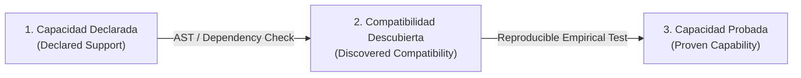

# EOS-UNIVERSAL-TECHNICAL-DISCOVERY-SPEC: Governed Technology Agnosticism Specification

**Specification ID:** SPEC-EOS-DISCOVERY-001  
**Status:** DRAFT_APPROVED_FOR_P1  
**Version:** 1.0.0  
**Date:** 2026-08-20  
**Target Milestone:** P1 — Universal Technical Discovery & Multi-Stack Governance  

---

## 1. Constitutional Foundation: Governed Technology Agnosticism

EOS does not operate with fixed linguistic or framework dogmatism. Rather than claiming superficial universal mastery, EOS implements a **governed discovery, evaluation, and selection pipeline** that identifies the exact technical requirements of any target project and selects the optimal architecture based on empirical criteria and trade-off analysis.

```text
Human Vision & Objectives
    ↓
Requirements & Constraints Discovery
    ↓
10-Domain Technical Discovery
    ↓
Architecture Candidate Exploration
    ↓
8-Dimensional Multi-Stack Scoring
    ↓
Justified Stack Selection & Trade-Off Matrix
    ↓
Human Director ADR Approval Gate (when required)
    ↓
Compatible Agent & Tool Binding
    ↓
Bounded Implementation under TDD
    ↓
Stack-Specific Epistemic Verification
```

---

## 2. The 10 Technical Discovery Domains

For every registered project or target repository, EOS discovers and compiles a canonical [`project-profile.json`](file:///c:/Users/valen/Documents/Eos%20system/docs/schemas/project-profile.schema.json) covering ten structured domains:

| Domain | What EOS Discovers and Documents |
|---|---|
| **1. Product** | Business goals, target personas, critical user journeys, operational constraints, and quantifiable success metrics. |
| **2. Code** | Programming languages, frameworks, library versions, directory structure, package manifests, AST patterns, and coding conventions. |
| **3. Runtime** | Operating systems, runtime engines (Node, Python, Go, Rust, JVM), package managers, entrypoints, background workers, and daemons. |
| **4. Data** | Relational/NoSQL databases, schema definitions, migration tools, object storage, caching engines, and data sensitivity classifications (Public vs Restricted). |
| **5. Backend** | API architectures (REST, GraphQL, gRPC, WebSocket), endpoint schemas, authentication/authorization schemes, rate limits, and error handling contracts. |
| **6. Frontend** | Target platforms (Web, Mobile, Desktop), UI frameworks, routing paradigms, state management, accessibility standards (WCAG AA), assets, and performance budgets (LCP, bundle size). |
| **7. Infrastructure** | Hosting environments (Cloud, Edge, On-Premise, Containerized), CI/CD pipelines, secret management, observability/logging stacks, and rollback strategies. |
| **8. AI Models** | Required cognitive capabilities, context window demands, tool-calling support, vision/multimodal requirements, reasoning depth, cost profiles, and privacy tiers (Zero Data Retention). |
| **9. Integrations** | External APIs, MCP servers, SDKs, webhooks, third-party services, permission scopes, and external side-effect classification. |
| **10. Governance** | Monotonic authority level (`LEVEL_0` to `LEVEL_4`), token budgets, financial cost caps, risk tiers, and required Human-in-the-Loop (HITL) gates. |

---

## 3. Epistemic Taxonomy: Three Distinct Capability States

To prevent false claims of universal readiness, EOS enforces a strict epistemic distinction:



1. **Capacidad Declarada (Declared Support):** An agent manifest, MCP catalog, or skill states that a technology is supported. (Epistemic Level: `ASSUMPTION`).
2. **Compatibilidad Descubierta (Discovered Compatibility):** EOS inspects the project, verifies syntax compatibility, dependency resolution, and configuration alignment. (Epistemic Level: `PARTIALLY_VERIFIED`).
3. **Capacidad Probada (Proven Capability):** A reproducible test suite has executed against a controlled fixture or real runtime, generating a cryptographic SHA-256 evidence receipt that proves the tool/runtime functions correctly. (Epistemic Level: `VERIFIED`).

> **Constitutional Rule:** EOS may recommend any stack compatible with the mission, but may *only* declare a capability as **proven** when reproducible evidence exists for that specific language, runtime, provider, or endpoint.

---

## 4. Multi-Dimensional Stack Evaluation Algorithm

When selecting an architecture or stack candidate, EOS evaluates all viable candidates across eight weighted dimensions using the [`stack-candidate.schema.json`](file:///c:/Users/valen/Documents/Eos%20system/docs/schemas/stack-candidate.schema.json):

$$\text{Score} = \sum_{i=1}^{8} w_i \cdot S_i$$

1. **Project Compatibility ($S_1$, weight 20%):** Direct alignment with existing code, conventions, and constraints.
2. **Ecosystem Maturity ($S_2$, weight 15%):** Community size, package stability, active maintenance, and LTS guarantees.
3. **Security Posture ($S_3$, weight 15%):** Vulnerability history, memory safety, secret handling, and sandboxing support.
4. **Cost Efficiency ($S_4$, weight 10%):** Infrastructure hosting costs, license fees, and token consumption profile.
5. **Performance Profile ($S_5$, weight 10%):** Latency (p95), throughput, memory footprint, and startup overhead.
6. **Talent Availability ($S_6$, weight 10%):** Industry standard adoption, documentation quality, and debuggability.
7. **Operational Simplicity ($S_7$, weight 10%):** Low deployment complexity, minimal moving parts, and clear observability.
8. **Reversibility ($S_8$, weight 10%):** Low vendor lock-in, clean abstraction boundaries, and straightforward migration paths.

---

## 5. Architectural Decision Records (ADRs) & HITL Escalation

Every stack selection and major architectural choice must be formalized as a machine-readable ADR following [`architecture-decision.schema.json`](file:///c:/Users/valen/Documents/Eos%20system/docs/schemas/architecture-decision.schema.json).

### Mandatory HITL Human Escalation Triggers:
- **Financial Risk:** Proposed stack increases recurring cloud/API costs above the project budget limit.
- **Security / Privacy Risk:** Integration with third-party APIs requiring sensitive credential delegation or non-zero data retention.
- **Low Reversibility:** Irreversible architectural locks (e.g. proprietary database migrations, breaking framework rewrites).
- **Unproven Stack:** Selection of a stack where EOS only holds `DECLARED` but not `PROVEN` capability status.

---

## 6. Canonical Schemas Registry (Milestone P1)

| Schema File | Path | Role |
|---|---|---|
| `project-profile.schema.json` | [`docs/schemas/project-profile.schema.json`](file:///c:/Users/valen/Documents/Eos%20system/docs/schemas/project-profile.schema.json) | 10-domain comprehensive repository discovery schema |
| `stack-candidate.schema.json` | [`docs/schemas/stack-candidate.schema.json`](file:///c:/Users/valen/Documents/Eos%20system/docs/schemas/stack-candidate.schema.json) | Multi-stack candidate comparison & 8-dimensional scoring |
| `architecture-decision.schema.json` | [`docs/schemas/architecture-decision.schema.json`](file:///c:/Users/valen/Documents/Eos%20system/docs/schemas/architecture-decision.schema.json) | Machine-readable ADR schema with cryptographic evidence hashes |
| `model-capability.schema.json` | [`docs/schemas/model-capability.schema.json`](file:///c:/Users/valen/Documents/Eos%20system/docs/schemas/model-capability.schema.json) | AI model routing, latency, cost, and capability matrix |
| `endpoint-contract.schema.json` | [`docs/schemas/endpoint-contract.schema.json`](file:///c:/Users/valen/Documents/Eos%20system/docs/schemas/endpoint-contract.schema.json) | Service/API endpoint contracts, schemas, and side-effect classes |
