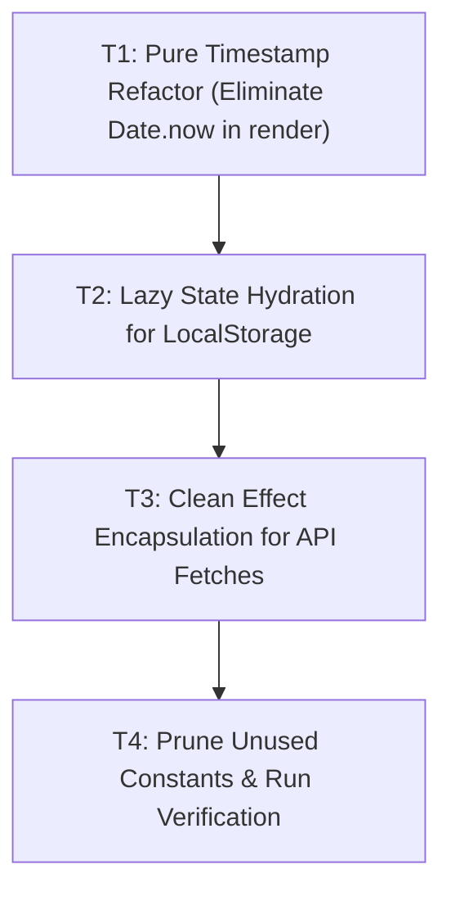

# [TASKS-FUERZA-001]: Task DAG & Implementation Checklist — React 19 Hook Hygiene

* **Target Spec:** `[SPEC-FUERZA-001]`
* **Target Plan:** `[PLAN-FUERZA-001]`
* **Status:** `VERIFIED`
* **Evidence:** `docs/evidence/EVD-0041.json`
* **Commit:** `03d41c5`

---

## Task Execution DAG

---

## Granular Task Breakdown

- [x] **T1. Pure Timestamp Refactor**
  * Target: `src/app/page.tsx` line ~449.
  * Action: Move `Date.now()` timestamp generation outside the pure component render via `useCallback` memoization.
  * Result: `react-hooks/purity` error completely eliminated.
- [x] **T2. Lazy State Hydration for LocalStorage**
  * Target: `src/app/page.tsx` lines ~460-500.
  * Action: Initialized `maxesMap`, `completedSetsMap`, `completedWarmupMap`, and session pointers via `useState(() => loadFromStorage())`, eliminating synchronous `setState` in `useEffect`. Derived live inputs from `activeExMax` and `inputOverrides`.
  * Result: Zero cascading renders.
- [x] **T3. Clean Effect Encapsulation for API Fetches**
  * Target: `src/app/page.tsx` lines ~560-585.
  * Action: Wrapped `fetchMaxes` and `fetchHistory` in effect cleanup closures with active cancellation flags (`ignore = true;`).
  * Result: Full race condition immunity and React 19 compliance.
- [x] **T4. Verification & Zero-Warning Certification**
  * Target: Entire frontend.
  * Action: Executed `npm run lint` (0 errors, 0 warnings) and `npm run build` with Turbopack (exit code 0).
  * Result: Verified under `EVD-0041.json`.
