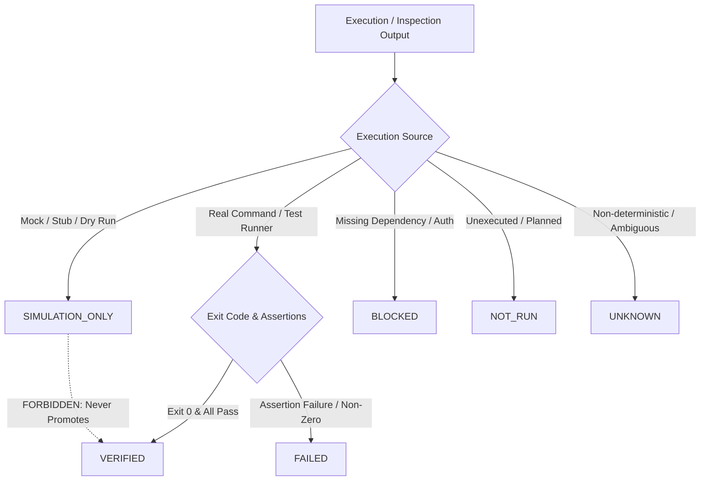

# Specification: SPEC-EOS-EVIDENCE-ENGINE-001 (EOS Epistemic Evidence Engine & Hash-Chained Ledger)

* **Status:** DRAFT (LEVEL_0 / MCL-0 — Documentary & Controlled Local Testing)
* **Author:** Senior Architect & EOS Core Engine
* **Date:** 2026-08-20
* **Target Subsystem:** EOS Core / Epistemic Evidence Engine & Mission Ledger
* **Authority Level:** LEVEL_0 (No external code mutation)

---

## 1. Executive Summary & Core Objectives

This specification defines the **EOS Epistemic Evidence Engine and Hash-Chained Mission Ledger**. The Evidence Engine guarantees four non-negotiable properties for every mission:

1. **Immutable Provenance**: Every claim made by an agent or the orchestrator is cryptographically anchored to an identifiable command execution log, test result artifact, human receipt, or formal decision.
2. **Cryptographic Integrity (Hash Chaining)**: Every event in the Mission Ledger is linked via SHA-256 hash chaining (`previous_hash → current_hash`). Any offline tampering or deletion breaks the chain deterministically.
3. **Crash Recovery & State Reconstruction**: The entire mission state (FSM phase, active tasks, feature DoD statuses, evidence index) can be deterministically reconstructed by replaying the append-only ledger from genesis.
4. **Epistemic Honesty**: Strict preservation of the 6-status taxonomy (`VERIFIED`, `NOT_VERIFIED`, `NOT_RUN`, `UNKNOWN`, `BLOCKED`, `SIMULATION_ONLY`), preventing simulations or unrun tests from masquerading as verified claims.

---

## 2. Hash Chaining Architecture

Every event appended to `mission-events.jsonl` follows a cryptographic block format:

```text
Genesis Event (Seq 0)
  ├── previous_hash: "0000000000000000000000000000000000000000000000000000000000000000"
  ├── payload_hash:  SHA-256(canonical_json(payload))
  └── event_hash:    SHA-256(seq + previous_hash + payload_hash + timestamp + event_type)
        │
        ▼ (linked)
Event 1 (Seq 1)
  ├── previous_hash: event_hash[0]
  ├── payload_hash:  SHA-256(canonical_json(payload))
  └── event_hash:    SHA-256(seq + previous_hash + payload_hash + timestamp + event_type)
        │
        ▼ (linked)
Event n (Seq n)
  ├── previous_hash: event_hash[n-1]
  ├── payload_hash:  SHA-256(canonical_json(payload))
  └── event_hash:    SHA-256(seq + previous_hash + payload_hash + timestamp + event_type)
```

### 2.1 Canonical Serialization Rule
To ensure deterministic hashing across different platforms, all payloads are serialized using **Canonical JSON** (keys sorted lexicographically, UTF-8 encoding, no arbitrary whitespace).

---

## 3. Epistemic Evidence Classification Model



### 3.1 Evidence Receipt Schema (`docs/schemas/evidence-receipt.schema.json`)
Every verified evidence receipt must include:
- `receipt_id`: Unique identifier (`EVD-YYYYMMDD-XXXX`)
- `mission_id` & `task_id`
- `status`: One of the 6 epistemic statuses
- `category`: `UNIT_TEST` | `INTEGRATION_TEST` | `STRICT_LINT` | `SECURITY_AUDIT` | `MANUAL_INSPECTION` | `HUMAN_DECISION`
- `execution_context`:
  - `command`: Full command line string executed
  - `cwd_hash`: SHA-256 of working directory
  - `exit_code`: Numeric exit code
  - `duration_ms`: Execution time
- `provenance`:
  - `stdout_sha256`: Hash of standard output log
  - `stderr_sha256`: Hash of error log
  - `artifact_refs`: List of generated files with hashes
- `assertions`: List of verified assertions `{ id, statement, status }`
- `issued_at`: ISO timestamp

---

## 4. Crash Recovery Algorithm

The recovery engine rebuilds mission state using the following deterministic loop:

```text
1. Open ledger file (run_log_<missionId>.jsonl or mission-events.jsonl).
2. Initialize state: state = 'VISION_INTAKE', sequence = 0, expected_prev_hash = '0'*64.
3. For each line in file:
     a. Parse JSON.
     b. Verify payload_hash == SHA256(canonical(payload)).
     c. Verify previous_hash == expected_prev_hash.
     d. Verify event_hash == SHA256(seq + previous_hash + payload_hash + timestamp + type).
     e. If any hash fails -> STOP with TAMPER_DETECTED.
     f. Apply event to state snapshot (FSM state, features, evidence index).
     g. expected_prev_hash = event_hash.
     h. sequence++.
4. Verify rebuilt snapshot matches latest checkpoint (if present).
5. Return reconstructed mission snapshot.
```

---

## 5. Non-Negotiable Invariants

1. **Zero Simulation Promotion**: No tool or role can mark `SIMULATION_ONLY` evidence as `VERIFIED`.
2. **Chain Break = Hard Halt**: If any historical event in the ledger is modified, deleted, or inserted out of order, the recovery engine halts with `TAMPER_DETECTED` and locks all write operations.
3. **Atomic Append**: Appends to the JSONL log must be atomic and synchronized to disk before returning a receipt.
4. **Separation of Technical vs Business Evidence**: Technical test passes (`TECHNICAL_VERIFIED`) must never be used to claim conversion, revenue, or business market fit (`BUSINESS_VERIFIED`).
