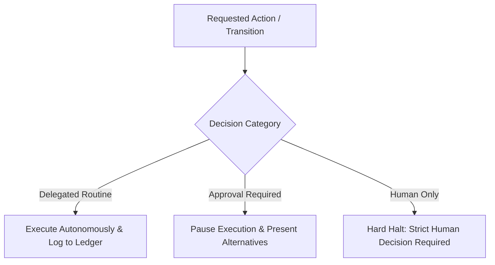

# Specification: SPEC-EOS-HITL-GATEKEEPER-001 (EOS HITL Gatekeeper & Supervised Autonomy)

* **Status:** DRAFT (LEVEL_0 / MCL-0 — Documentary & Controlled Local Testing)
* **Author:** Senior Architect & EOS Core Engine
* **Date:** 2026-08-20
* **Target Subsystem:** EOS Core / HITL Gatekeeper & Autonomy Engine
* **Authority Level:** LEVEL_0 (No external code mutation)

---

## 1. Executive Summary & Philosophy

EOS is an **executive engineering orchestrator with supervised autonomy**. The Human Director provides high-level intent, priorities, acceptable risk, and strategic approvals. EOS independently formulates the plan, decomposes tasks, assigns specialized agents, supervises progress, executes verification, and generates detailed evidence reports.

EOS does **NOT** require micromanagement for routine internal steps (inspecting code, compiling context, running local unit tests, generating draft specs). However, EOS **strictly halts** and requests explicit Human Director sign-off for actions that:
1. Establish or alter the mission direction and contract boundary (`HUMAN_DIRECTION_GATE`).
2. Release or publish software artifacts (`HUMAN_RELEASE_GATE`).
3. Expand scope or modify protected surfaces.
4. Execute irreversible side effects (data deletion, credential access, external communication).
5. Exceed agreed token, tool, or duration budgets.

---

## 2. Supervised Autonomy Operational Modes

| Mode | Allowed Operational Envelope | Required Human Checkpoint |
|---|---|---|
| **`READ_ONLY_AUTONOMOUS`** | Research, AST analysis, context compilation, planning, test design, and read-only audits. | Direction approval and final report review. |
| **`LOCAL_BOUNDED_AUTONOMY`** | Automated local execution within isolated worktrees, declared edit roots, and bounded budgets. | Direction gate, task graph approval, and release gate. |
| **`STAGED_AUTONOMY`** | Execution and deployment within isolated staging environments and synthetic integrations. | Staging deployment approval and release gate. |
| **`PRODUCTION_SUPERVISED`** | Production release and operations under strict, expiring receipts and real-time telemetry. | Explicit, non-delegable Human Director approval. |

---

## 3. Decision Classification Model

The Gatekeeper categorizes every action into one of three decision classes:

### 3.1 Decision Taxonomy

1. **`delegated_routine`**: Internal, reversible, within-budget actions (e.g., reading files, compiling context, running unit tests, formatting drafts). EOS proceeds automatically and appends receipts to the ledger.
2. **`approval_required`**: Significant architectural tradeoffs, minor scope adjustments, or budget extensions. EOS prepares options with risk analyses, pauses, and awaits approval.
3. **`human_only`**: Mission direction sign-off, production release, credential manipulation, external network writes, legal/privacy acceptance, and constitutional exceptions. EOS cannot decide or execute autonomously.

---

## 4. Deterministic HITL Receipt Validator

The Gatekeeper enforces a 15-point deterministic validation pipeline on every HITL receipt:

1. **Schema Conformance**: Validates against `docs/schemas/hitl-receipt.schema.json`.
2. **Identity & Authentication**: Verifies `approver.identity` and non-empty `authentication_ref`.
3. **Mission/Task Binding**: Matches `mission_id` and optional `task_ids`.
4. **Gate Target Match**: Matches the exact gate (`HUMAN_DIRECTION_GATE`, `HUMAN_RELEASE_GATE`, etc.).
5. **Authority & Monotonicity**: Verifies granted level <= contract limit and monotonicity preserved.
6. **Action Classes**: Verifies requested action is in `scope.action_classes`.
7. **Edit Roots & Surfaces**: Ensures `allowed_edit_roots` contains targets and zero overlap with `protected_surfaces`.
8. **Environment Alignment**: Verifies target environment matches receipt (`local_isolated`, `staging`, `production`).
9. **Temporal Validity**: Validates `issued_at <= now < expires_at`.
10. **Revocation Status**: Verifies `revoked_at` is null and receipt is not in revocation index.
11. **Evidence Reviewed Integrity**: Validates all reviewed evidence references exist with verified SHA-256 hashes.
12. **Approval Conditions**: Verifies all listed approval conditions are satisfied.
13. **Approver Independence**: For high-risk gates, verifies approver != author/implementer.
14. **Fallback Definition**: Verifies explicit handlers for `on_expiry`, `on_rejection`, `on_scope_violation`.
15. **Replay Protection**: Verifies receipt ID and audit hash have not been previously consumed in a conflicting state.

---

## 5. Reporting and Telemetry

The Gatekeeper generates structured mission status reports after each checkpoint and upon completion:
- Purpose, approved vision, and boundary.
- Active mode and authority level.
- Completed, running, and blocked tasks.
- Tools used (explicitly noting `REAL` vs `SIMULATION_ONLY`).
- Evidence hashes and test execution records.
- Consumed vs remaining budgets.
- Discovered risks, unknowns, and unresolved questions.
- Separate Technical Verification Verdict vs Business Outcome Statement.
