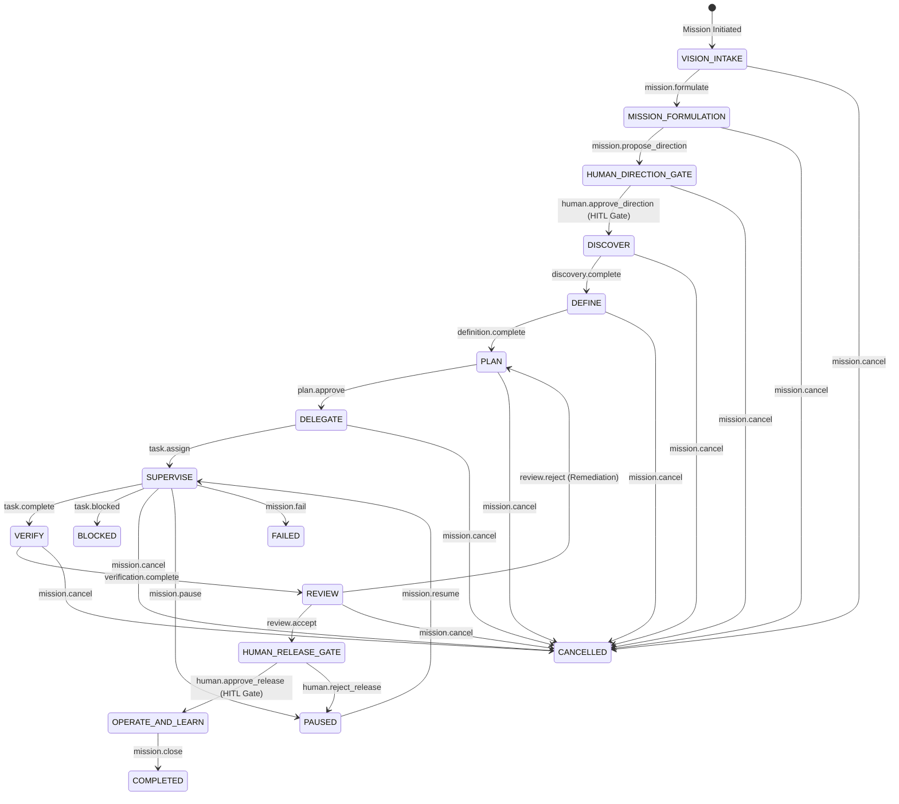

# Specification: SPEC-EOS-SDD-FSM-001 (EOS SDD Orchestration FSM & Transition Enforcer)

* **Status:** DRAFT (LEVEL_0 / MCL-0 — Documentary Only)
* **Author:** Senior Architect & EOS Core Engine
* **Date:** 2026-08-20
* **Target Subsystem:** EOS Core / SDD State Machine & Transition Enforcer
* **Authority Level:** LEVEL_0 (No code mutation permitted)

---

## 1. Executive Summary

This specification formalizes the **EOS SDD Orchestration Finite State Machine (FSM) and Transition Enforcer**. EOS operates as an **executive engineering orchestrator**: the human director provides intent, vision, and authority gates; EOS formulates missions, proposes plans, delegates bounded tasks, supervises agents, evaluates evidence, blocks deviations, and escalates decisions.

The Transition Enforcer is a **deterministic, fail-closed gatekeeper**. No Large Language Model or autonomous subagent may decide by itself whether a structural state transition is permitted. Every transition must satisfy explicit preconditions, authority grants, budget constraints, artifact presence, and epistemic evidence standards.

---

## 2. FSM States

The FSM defines 17 typed states divided into Lifecycle States and Control Outcome States:



### 2.1 State Definitions

| State | Category | Description | Exit Condition |
|---|---|---|---|
| **`VISION_INTAKE`** | Lifecycle | Captures initial user vision, motivation, and boundaries | `direction/human-vision.md` exists |
| **`MISSION_FORMULATION`** | Lifecycle | Analyzes intent, maps unknowns, and drafts mission package | `mission.yaml` and `contract.yaml` drafted |
| **`HUMAN_DIRECTION_GATE`** | Lifecycle | Pauses for Human Director approval of mission direction | Valid, unexpired, in-scope `HITL` receipt |
| **`DISCOVER`** | Lifecycle | Explores repository AST, dependencies, and environment | `context/repository-inventory.md` generated |
| **`DEFINE`** | Lifecycle | Freezes functional, technical, and acceptance specs | `specs/product-spec.md` & `specs/technical-spec.md` complete |
| **`PLAN`** | Lifecycle | Decomposes specs into bounded DAG tasks and rollback plan | `task-graph.json` and rollback plan ready |
| **`DELEGATE`** | Lifecycle | Binds task contracts to specialized agents with budgets | Typed `TASK-*.yaml` assigned to role |
| **`SUPERVISE`** | Lifecycle | Monitors task execution, step evidence, and tool usage | Step criteria met; zero contract breaches |
| **`VERIFY`** | Lifecycle | Executes tests and checks against actual environment | All checks classified (zero unrun/simulated) |
| **`REVIEW`** | Lifecycle | Adversarially inspects diffs, evidence, and policies | Independent review receipt generated |
| **`HUMAN_RELEASE_GATE`** | Lifecycle | Pauses for Human Director release sign-off | Valid human release receipt |
| **`OPERATE_AND_LEARN`** | Lifecycle | Measures post-release telemetry and outcome metrics | Technical metrics separated from ROI |
| **`PAUSED`** | Control | Execution temporarily halted; state snapshotted | Resume event with valid state token |
| **`BLOCKED`** | Control | Execution stopped due to missing dependency or receipt | Blocker resolution event |
| **`FAILED`** | Control | Unrecoverable error, invariant breach, or exhausted budget | Post-mortem analysis |
| **`CANCELLED`** | Control | Explicit kill switch or human cancellation | Mission abort record |
| **`COMPLETED`** | Control | Mission successfully delivered, verified, and closed | Final ledger sealing |

---

## 3. Canonical Transition Table

| From State | Event Type | To State | Required Authority | Required Artifacts / Receipts | Precondition Checks |
|---|---|---|---|---|---|
| `VISION_INTAKE` | `mission.formulate` | `MISSION_FORMULATION` | `LEVEL_0` | `direction/human-vision.md` | Vision text non-empty |
| `MISSION_FORMULATION` | `mission.propose_direction` | `HUMAN_DIRECTION_GATE` | `LEVEL_0` | `mission.yaml`, `contract.yaml` | Unknowns registered; schema valid |
| `HUMAN_DIRECTION_GATE` | `human.approve_direction` | `DISCOVER` | `LEVEL_0` | `hitl-receipt.json` | Receipt valid, unexpired, in-scope |
| `DISCOVER` | `discovery.complete` | `DEFINE` | `LEVEL_0` | `context/repository-inventory.md` | AST mapped; dependencies recorded |
| `DEFINE` | `definition.complete` | `PLAN` | `LEVEL_0` | `specs/technical-spec.md`, `specs/acceptance-criteria.md` | Specs complete; acceptance criteria explicit |
| `PLAN` | `plan.approve` | `DELEGATE` | `LEVEL_0` | `plan/implementation-plan.md`, `task-graph.json` | DAG acyclic; tasks bounded (< 15 min / 50 LOC) |
| `DELEGATE` | `task.assign` | `SUPERVISE` | `LEVEL_0` | `TASK-*.yaml` | Valid task contract; role declared |
| `SUPERVISE` | `task.complete` | `VERIFY` | `LEVEL_1`+ | Execution logs, diff manifest | Edits within `allowed_write_roots`; zero protected writes |
| `SUPERVISE` | `task.blocked` | `BLOCKED` | `LEVEL_0` | Blocker receipt | Blocker reason and missing dependency recorded |
| `VERIFY` | `verification.complete` | `REVIEW` | `LEVEL_0` | Test matrix results, raw logs | All tests classified (`VERIFIED`); zero `SIMULATION_ONLY` |
| `REVIEW` | `review.accept` | `HUMAN_RELEASE_GATE` | `LEVEL_0` | `review-receipt.md` | Reviewer != Implementer; zero open critical findings |
| `REVIEW` | `review.reject` | `PLAN` | `LEVEL_0` | Findings report | Remediation tasks created |
| `HUMAN_RELEASE_GATE` | `human.approve_release` | `OPERATE_AND_LEARN` | `LEVEL_0` | `hitl-release-receipt.json` | Release receipt valid, signed by Human Director |
| `HUMAN_RELEASE_GATE` | `human.reject_release` | `PAUSED` | `LEVEL_0` | Rejection reason | State snapshotted; reasons logged |
| Any Active State | `mission.pause` | `PAUSED` | `LEVEL_0` | Checkpoint snapshot | State snapshot saved with SHA-256 |
| `PAUSED` | `mission.resume` | `PREVIOUS_STATE` | `LEVEL_0` | Checkpoint reference | Snapshot hash matches |
| Any State | `mission.cancel` | `CANCELLED` | `LEVEL_0` | Cancellation reason | Rollback executed if needed |
| Any State | `mission.fail` | `FAILED` | `LEVEL_0` | Failure diagnostic | Diagnostic error envelope recorded |

---

## 4. Transition Evaluation Algorithm

The Transition Enforcer executes a deterministic 10-step pipeline:

```text
1. Parse & Validate Event Envelope (check against transition-event.schema.json)
   ↓
2. Load Current Mission Snapshot (verify active state matches event.from_state)
   ↓
3. Check Idempotency & Replay Status (reject duplicate non-idempotent event_ids)
   ↓
4. Resolve Transition Table Entry (verify from_state + event_type → to_state exists)
   ↓
5. Validate Authority, Receipts & Expiry (check monotonic levels & HITL validity)
   ↓
6. Validate Required Artifacts & Evidence Status (hashes exist, zero unverified/simulated claims)
   ↓
7. Validate Budgets, Tools & Protected Surfaces (tokens, calls, durations, write barriers)
   ↓
8. Check Role Separation & Self-Approval (ensure author != reviewer for high-risk gates)
   ↓
9. Apply Transition Atomically (update state, timestamp, ledger sequence)
   ↓
10. Append Event to Mission Ledger & Return New Snapshot
```

If ANY step fails, the Enforcer **halts immediately** and returns a structured `TransitionError` (`docs/schemas/transition-error.schema.json`).

---

## 5. Non-Negotiable Invariants

1. **Fail-Closed**: Any unhandled condition, schema mismatch, or ambiguous policy evaluates to `DENY`.
2. **Monotonic Authority**: Authority level can never exceed the parent contract limit.
3. **No Unverified Promotion**: `SIMULATION_ONLY` evidence cannot satisfy a verification requirement.
4. **Zero Protected Writes**: Any attempt to write to protected surfaces (`src/core/`, `.git/`, `CONSTITUTION.md`) immediately aborts the transition and triggers `FAILED` or `CANCELLED`.
5. **Human Gate Supremacy**: Transitions through `HUMAN_DIRECTION_GATE` and `HUMAN_RELEASE_GATE` strictly require an unexpired, in-scope `HITL` receipt signed by a human identity.
6. **No Self-Approval**: The actor that authored an implementation task cannot act as the reviewer approving `review.accept`.
