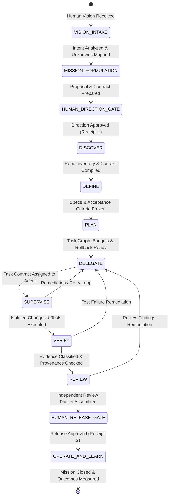

# Specification: SPEC-EOS-SDD-KERNEL-001 (EOS Governed SDD Orchestration Kernel)

* **Status:** DRAFT (LEVEL_0 / MCL-0 — Documentary Only)
* **Author:** Senior Architect & EOS Core Engine
* **Date:** 2026-08-20
* **Target Subsystem:** EOS Core / SDD Orchestration Kernel
* **Authority Level:** LEVEL_0 (No code mutation permitted)

---

## 1. Executive Summary & Product Definition

EOS is an **executive engineering orchestrator with Human-in-the-Loop (HITL) governance**.

The human director defines vision, priorities, constraints, acceptable risk, and decisive approvals. EOS translates that direction into a governed mission, proposes an execution strategy, decomposes the work, assigns specialized agents, supervises their execution, evaluates their outputs, enforces evidence requirements, coordinates remediation, and escalates blocking decisions for human sign-off.

The operating chain of command is:

```text
Human Director
    ↓ (Vision, priorities, risk tolerance, approval decisions)
EOS Orchestrator
    ↓ (Formulates mission, contract, plan, and work decomposition)
Specialized Agents
    ↓ (Investigate, design, implement, test, review, document)
EOS Orchestrator
    ↓ (Supervises, evaluates, corrects, blocks, or escalates)
Human Director
    ↓ (Approves exceptions, scope changes, and releases)
```

EOS is not an unrestricted autonomous coder, a prompt wrapper, or a collection of uncoordinated agents. Its core promise is:

> Every material change must be traceable from an approved human vision to a specification, from specification to plan, from plan to delegated agent contracts, from execution to independently reviewable evidence, and from evidence to an explicit human release gate.

---

## 2. Command and Responsibility Model

| Actor | Primary Authority | Responsibilities | Explicit Limits |
|---|---|---|---|
| **Human Director** | Vision, priorities, risk tolerance, business tradeoffs, authority grants | Set strategic goals, resolve ambiguity, approve material transitions, grant scoped write/release authority | Does not micromanage routine execution once a bounded contract is approved |
| **EOS Orchestrator** | Coordination authority within approved contract | Interpret intent, propose strategy, create mission package, assign tasks, supervise execution, evaluate evidence, escalate deviations | Cannot expand scope, grant itself authority, approve high-risk actions, or claim unverified outcomes |
| **Mission Architect** | Technical definition authority delegated by EOS | Translate intent into requirements, architecture, interfaces, and acceptance criteria | Cannot implement or release without relevant gate |
| **Planner** | Planning authority delegated by EOS | Decompose work into small, bounded tasks (< 15 min or < 50 LOC), dependencies, budgets, and rollback paths | Cannot silently modify requirements or omit risk |
| **Implementer** | Scoped change authority (`LEVEL_1`+) | Apply authorized changes inside isolated worktrees / bounded surfaces | Cannot touch protected roots, credentials, production, or unapproved surfaces |
| **Test & Verification Agent** | Verification authority | Design and execute tests, classify epistemic evidence, preserve raw execution logs | Cannot mark unrun, simulated, or ambiguous checks as verified |
| **Security & Quality Reviewer** | Adversarial review authority | Inspect diffs, policies, secrets, dependencies, evidence logs, and regressions | Cannot approve changes it authored |
| **Release Controller** | Release packaging authority | Verify technical gate satisfaction, prepare human decision packet | Cannot deploy or publish without an explicit human release receipt |

---

## 3. Orchestrator Core Responsibilities

EOS performs five active governance functions:

### 3.1 Interpretation
Converts human vision into a structured mission statement, desired outcomes, constraints, assumptions, unknown register, non-goals, and open decision points. Surfaces ambiguity explicitly instead of filling gaps with plausible text.

### 3.2 Proposal
Proposes at least one technically sound path. When material tradeoffs exist, presents alternatives with cost, risk, reversibility, and required authority. Advisory until approved by the human director.

### 3.3 Delegation
Assigns bounded tasks to specific roles with a typed task contract specifying objective, inputs, required outputs, acceptance criteria, allowed tools, protected surfaces, token/time budgets, and stop conditions.

### 3.4 Active Supervision
Monitors agent state, tool invocations, evidence production, budget burn, deviations, retries, and blocked states. Actively pauses, redirects, rejects, or escalates when an agent violates its contract or produces invalid evidence.

### 3.5 Evaluation & Closure
Evaluates deliverables against the task contract and evidence criteria, not the agent's narrative. Reports completion, conditional completion, blockage, or failure to the ledger.

---

## 4. Orchestration & SDD State Machine

The SDD Kernel enforces a deterministic finite state machine (FSM) spanning the full orchestration and delivery lifecycle. Out-of-order transitions trigger an immediate `BLOCKED(INVALID_TRANSITION)`.



### 4.1 State Invariants & Exit Criteria

| State | Required Input | Output Artifacts | Authority Level | Exit Verification Criteria |
|---|---|---|---|---|
| **`VISION_INTAKE`** | User prompt / strategic intent | `direction/human-vision.md`, `direction/decision-principles.md` | LEVEL_0 | Vision captured; non-goals and assumptions registered. |
| **`MISSION_FORMULATION`** | Vision & Principles | `mission.yaml`, `contract.yaml`, `orchestration/org-chart.yaml` | LEVEL_0 | Contract proposal complete; authority boundaries declared. |
| **`HUMAN_DIRECTION_GATE`**| Mission & Contract Proposal | Signed Direction Gate Receipt | Human Gatekeeper | Explicit human approval receipt recorded in ledger. |
| **`DISCOVER`** | Approved Mission Contract | `context/repository-inventory.md`, `context/architecture.md` | LEVEL_0 | AST/file inventory mapped; unknowns resolved or listed. |
| **`DEFINE`** | Context & Inventory | `specs/product-spec.md`, `specs/technical-spec.md`, `specs/acceptance-criteria.md` | LEVEL_0 | Spec completeness verified; ambiguity score = 0. |
| **`PLAN`** | Approved Specs | `plan/implementation-plan.md`, `orchestration/task-graph.json`, `plan/rollback-plan.md` | LEVEL_0 | Acyclic task graph; tasks bounded (< 15 min or < 50 LOC). |
| **`DELEGATE`** | Task Graph | Typed Task Contracts (`orchestration/tasks/TASK-*.yaml`) | LEVEL_0 | Every task assigned with explicit budget, tools, and roots. |
| **`SUPERVISE`** | Active Task Contract | Execution logs, intermediate diffs, tool receipts | LEVEL_1+ (Scoped) | Active supervision loop checks invariants at each step. |
| **`VERIFY`** | Diff & Test Matrix | Raw test execution logs, test output hashes | LEVEL_0 / Verifier | All tests executed; zero unverified assertions. |
| **`REVIEW`** | Diff & Evidence Logs | `review/review-receipt.md`, adversarial analysis | Independent Reviewer | Independent role checks contract compliance and security. |
| **`HUMAN_RELEASE_GATE`** | Review Packet & Evidence | Signed Release Gate Receipt | Human Gatekeeper | Explicit human release receipt recorded in ledger. |
| **`OPERATE_AND_LEARN`** | Release Record | `outcomes/outcome-record.md`, post-release telemetry | Business Role | Technical correctness separated from business ROI/metrics. |

---

## 5. Agent Task Contract Specification

Every delegated task must use a strictly typed contract (`TASK-<ID>.yaml`):

```yaml
task_id: "TASK-001-CORE-SCHEMA"
mission_id: "MSN-SDD-KERNEL-001"
parent_task_id: null
assigned_role: "implementer"
objective: "Implement mission-package.schema.json and hitl-receipt.schema.json"
inputs:
  - "docs/specs/eos_core/EOS-SDD-KERNEL-SPEC.md"
required_outputs:
  - "docs/schemas/mission-package.schema.json"
  - "docs/schemas/hitl-receipt.schema.json"
acceptance_criteria:
  - "Schemas validate valid packages without error"
  - "Schemas reject malformed packages with explicit error paths"
allowed_tools:
  - "write_to_file"
  - "replace_file_content"
  - "run_command"
allowed_read_roots:
  - "docs/specs/"
  - "docs/schemas/"
allowed_write_roots:
  - "docs/schemas/"
protected_surfaces:
  - "src/core/"
  - "CONSTITUTION.md"
  - ".git/"
authority_level: "LEVEL_0"
budget:
  max_tokens: 25000
  max_tool_calls: 15
  max_duration_seconds: 600
stop_conditions:
  - "All required schemas created and validated against JSON-Schema draft-07"
escalation_conditions:
  - "Requirement ambiguity discovered"
  - "Attempt to modify files outside allowed_write_roots"
  - "Budget exceeded"
rollback_plan:
  - "Delete created files in docs/schemas/"
status: "proposed"
```

---

## 6. Supervision & Evaluation Loops

### 6.1 Step-by-Step Supervision Loop

```text
ASSIGN
  ↓
PRECONDITION_CHECK (Verify inputs, tools, and budget)
  ↓
EXECUTE_STEP (Agent executes bounded action)
  ↓
CAPTURE_EVIDENCE (Collect tool receipt, command stdout/stderr, and file hashes)
  ↓
EVALUATE_STEP (Check scope, acceptance criteria, and invariant violations)
  ↓
[CONTINUE | RETRY | CORRECT | PAUSE | ESCALATE | STOP]
  ↓
FINAL_EVALUATION (Audit artifact presence, test results, and provenance)
  ↓
HANDOFF_OR_GATE (Pass to next task or trigger Human Gate)
```

At every step, EOS answers:
1. **Action fidelity**: Did the agent perform the assigned action? (Tool receipt / command log)
2. **Scope boundary**: Did it stay strictly within `allowed_write_roots`? (Policy check)
3. **Step criteria**: Did it satisfy the step acceptance criteria? (Executable test result)
4. **Reproducibility**: Are inputs, config, and stdout preserved with hashes?
5. **Risk delta**: Did the step introduce new security or architectural risks?
6. **Escalation**: Is human intervention required?

### 6.2 Agent Evaluation Model (8 Dimensions)

1. **Contract Fidelity**: Did the agent do exactly the assigned work and avoid unassigned scope?
2. **Technical Correctness**: Do tests and inspections support the claimed outcome?
3. **Evidence Quality**: Are claims backed by raw, reproducible logs with hashes?
4. **Risk Discipline**: Did the agent identify uncertainty and define rollback steps?
5. **Efficiency**: Did it remain within token, tool, time, and diff budgets?
6. **Communication**: Are outputs structured, concise, and machine-actionable?
7. **Reproducibility**: Can an independent verifier reproduce the result?
8. **Handoff Quality**: Is the next agent provided a complete, bounded context?

A failed evaluation automatically generates a **Remediation Task** or an **Escalation Event**.

---

## 7. Canonical Mission Package Directory Structure

```text
mission-package/
├── mission.yaml                      # Mission metadata, objective, ownership, and target scope
├── contract.yaml                     # Authority boundary, allowed tools, timeouts, and required gates
├── direction/
│   ├── human-vision.md               # Strategic intent, motivation, and expected outcomes
│   ├── decision-principles.md        # Architectural and business guidelines for tradeoffs
│   └── risk-tolerance.md             # Acceptable risk parameters and protected boundaries
├── orchestration/
│   ├── org-chart.yaml                # Assigned roles, agents, and hierarchy
│   ├── role-registry.yaml            # Role capability declarations and tool permissions
│   ├── task-graph.json               # DAG of tasks with dependencies and budgets
│   ├── supervision-policy.yaml       # Invariants, checkpoints, and evaluation thresholds
│   ├── escalation-policy.yaml        # Triggers requiring Human Director intervention
│   └── tasks/
│       └── TASK-*.yaml               # Individual typed task contracts
├── context/
│   ├── repository-inventory.md       # AST/file map, dependencies, and environment baselines
│   ├── architecture.md               # System components, interfaces, and invariants
│   ├── standards.md                  # Coding, typing, linting, and naming rules
│   ├── constraints.md                # Hard boundaries (e.g. read-only, no external network)
│   └── glossary.md                   # Ubiquitous domain terminology
├── specs/
│   ├── product-spec.md               # Problem statement, user stories, and acceptance criteria
│   ├── technical-spec.md             # Component design, API contracts, schemas, and data flow
│   └── acceptance-criteria.md        # Explicit Given-When-Then criteria
├── plan/
│   ├── implementation-plan.md        # Bounded, step-by-step task descriptions
│   └── rollback-plan.md              # Reversible mitigation steps if verification fails
├── verification/
│   ├── test-matrix.md                # Unit, integration, strict, and security test expectations
│   └── evidence-policy.md            # Minimum required evidence classification for each gate
├── governance/
│   ├── authority.md                  # Active authority tier (LEVEL_0 through LEVEL_4)
│   ├── gates.md                      # Human approval checkpoints and receipt schema
│   └── protected-surfaces.md         # Denied files, branches, and environments
└── ledger/
    └── mission-events.jsonl          # Append-only ledger of state transitions and tool outputs
```

---

## 8. Epistemic Evidence Model

EOS strictly forbids claiming success based on unexecuted code, assumptions, or simulation.

### 8.1 Status Classification Taxonomy

1. **`VERIFIED`**: The check was executed against actual code/environment, and the output confirmed expected behavior with zero failures. Requires log provenance and SHA-256 hash of execution artifacts.
2. **`NOT_VERIFIED`**: Code or artifacts exist, but automated checks have not yet been executed.
3. **`NOT_RUN`**: Test or check was scheduled or defined in the matrix but skipped or not reached.
4. **`UNKNOWN`**: Insufficient information or non-deterministic behavior observed.
5. **`BLOCKED`**: Execution could not proceed due to missing dependency, missing permission, or environment failure.
6. **`SIMULATION_ONLY`**: The tool output was generated by a mock, stub, or dry-run. Cannot satisfy production readiness criteria.

### 8.2 Evidence Separation Axioms
- **Axiom 1 (Simulation Boundary)**: A `SIMULATION_ONLY` result can never promote an epistemic state to `VERIFIED`.
- **Axiom 2 (Separation of Concerns)**: Passing 100% of unit tests confirms technical compliance (`TECHNICAL_VERIFIED`), not business outcome (`BUSINESS_VERIFIED`).
- **Axiom 3 (Provenance Guarantee)**: Every `VERIFIED` record in the Mission Ledger must reference command line string, execution duration, working directory hash, and stdout/stderr hash.

---

## 9. Human-in-the-Loop Policy & Gate Receipts

### 9.1 Decision Classification

| Category | EOS Behavior | Human Action |
|---|---|---|
| **Delegated Routine** | EOS proceeds within approved policy and records event | Review summary asynchronously |
| **Approval-Required** | EOS prepares alternatives and pauses execution | Explicitly approve, reject, or modify |
| **Human-Only** | EOS cannot decide (vision, legal, irreversible risk, release) | Human must decide explicitly |

### 9.2 Gate Receipt Schema

```json
{
  "$schema": "https://eos.local/schemas/hitl-receipt.v1.json",
  "receiptId": "rec_01HZ89XKV4M3QNP8",
  "timestamp": "2026-08-20T14:38:00Z",
  "expiresAt": "2026-08-20T15:38:00Z",
  "gate": "HUMAN_DIRECTION_GATE",
  "grantor": {
    "identity": "user:director",
    "role": "HUMAN_DIRECTOR",
    "channel": "CHAT_BLOCKING_PROMPT"
  },
  "scope": {
    "missionId": "MSN-SDD-KERNEL-001",
    "targetRepository": "C:/Users/valen/Documents/Eos system",
    "allowedEditRoots": [
      "docs/schemas/",
      "docs/specs/"
    ],
    "maxAuthorityLevel": "LEVEL_0",
    "allowedTools": [
      "replace_file_content",
      "write_to_file",
      "run_command"
    ]
  },
  "reason": "Approval of Mission Package and Task Graph for SDD Kernel P0",
  "stateSnapshotHash": "sha256:e3b0c44298fc1c149afbf4c8996fb92427ae41e4649b934ca495991b7852b855",
  "status": "GRANTED"
}
```

---

## 10. Kernel Acceptance Criteria

The EOS SDD Kernel is verified when a local test mission demonstrates:

- [ ] **AC-1 (Vision to Package)**: Human vision is converted into a canonical package with explicit unknowns and non-goals.
- [ ] **AC-2 (Proposals & Tradeoffs)**: EOS proposes a plan with alternatives rather than silently picking an irreversible path.
- [ ] **AC-3 (Direction Gate)**: The human approves or rejects the direction through a scoped gate receipt before discovery.
- [ ] **AC-4 (Bounded Task Delegation)**: EOS creates typed task contracts for at least two specialized roles.
- [ ] **AC-5 (Enforced Task Contracts)**: Each task has allowed tools, protected surfaces, budgets, stop conditions, and acceptance criteria.
- [ ] **AC-6 (Active Supervision)**: EOS records progress, evidence, deviations, and evaluations at each step.
- [ ] **AC-7 (Violation Detection & Escalation)**: EOS detects contract violations or simulated failures and creates remediation/escalation events.
- [ ] **AC-8 (Scope & Evidence Guard)**: EOS blocks any agent from expanding scope or claiming unrun verification.
- [ ] **AC-9 (Independent Review)**: EOS produces an independent review packet before the release gate.
- [ ] **AC-10 (Outcome Separation)**: EOS separates technical completion from business outcome measurement.
- [ ] **AC-11 (Ledger Auditability)**: Every state transition, receipt, and evidence log is recoverable from `mission-events.jsonl`.

---

## 11. Implementation Sequence & Milestones

```text
[P0: KERNEL FOUNDATION & SCHEMAS]
  ├── Milestone 1: Schemas (mission-package.schema.json, task-contract.schema.json, hitl-receipt.schema.json)
  ├── Milestone 2: SDD Orchestration FSM & Transition Enforcer
  ├── Milestone 3: Epistemic Evidence Engine & Ledger Integration
  └── Milestone 4: HITL Receipt Validator & Gatekeeper

[P1: ADAPTERS, SUPERVISION & ISOLATION]
  ├── Milestone 5: Skills & Role Registry (Agent Boundaries & Invocations)
  ├── Milestone 6: Multi-Provider Copilot Adapters (Cursor / Antigravity / Claude)
  ├── Milestone 7: JSONL Durability & Crash Recovery Experiment
  └── Milestone 8: Git Worktree Manager for Isolated Diff Generation

[P2: ADVANCED HARDENING] (Conditional on measured need)
  ├── Milestone 9: Real Tool Replacement for SIMULATION_ONLY stubs
  └── Milestone 10: Process-level / Containerized Sandbox (if untrusted execution authorized)
```
