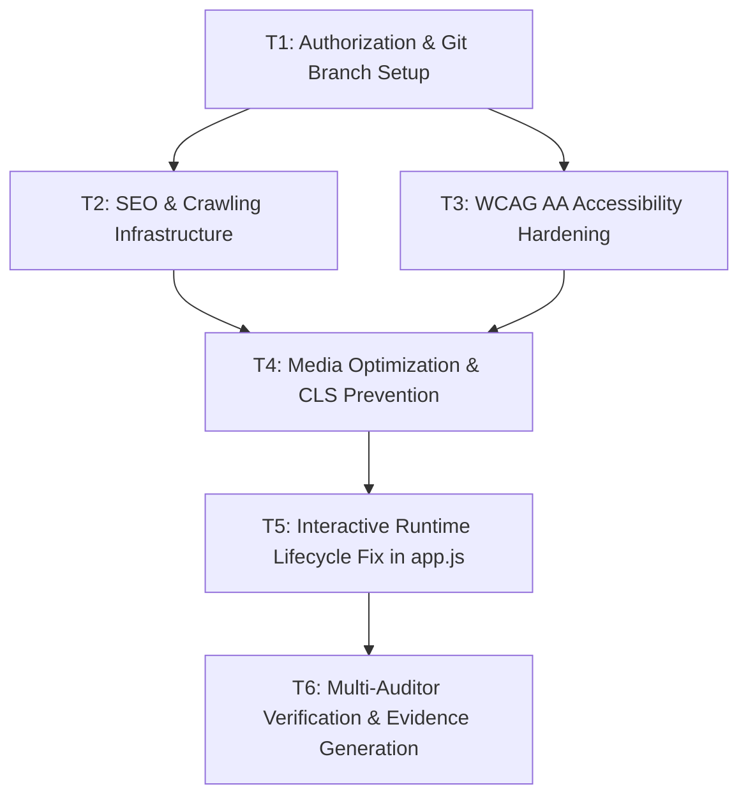

# [TASKS-JORGE-001]: Task DAG & Implementation Checklist

* **Target Spec:** `[SPEC-JORGE-001]`
* **Target Plan:** `[PLAN-JORGE-001]`
* **Status:** `COMPLETED` (Verified under EVD-0039)

---

## Task Execution DAG (Directed Acyclic Graph)

---

## Granular Task Breakdown

- [x] **T1. Authorization & Git Branch Setup**
  * **Scope**: Record formal LEVEL 2 Authorization in `IMPLEMENTATION_AUTHORIZATION.md` and create git branch `feat/eos-modernization` in target repository.
  * **RF Covered**: N/A (Governance & Write Barrier)
  * **Done Criteria**: Authorization document signed and working branch clean.

- [x] **T2. SEO & Crawling Infrastructure**
  * **Scope**: Create `robots.txt`, `sitemap.xml`, and add `<link rel="canonical">`, `<link rel="icon">`, absolute `og:image`, and Twitter Card tags in `index.html`.
  * **RF Covered**: `[NFR-SEO-01, NFR-SEO-02]`
  * **Done Criteria**: `robots.txt` and `sitemap.xml` exist and pass schema validation.

- [x] **T3. WCAG AA Accessibility Hardening**
  * **Scope**: Implement skip-to-content link, comprehensive `:focus-visible` styles in `styles.css` with 3:1+ contrast, and `@media (prefers-reduced-motion: reduce)`.
  * **RF Covered**: `[NFR-A11Y-01, NFR-A11Y-02, NFR-A11Y-03]`
  * **Done Criteria**: Keyboard navigation clearly highlights all elements; skip link jumps to `#main-content`.

- [x] **T4. Media Optimization & CLS Prevention**
  * **Scope**: Convert images to WebP, add explicit `width` and `height` dimensions, and apply `decoding="async"` across `index.html`.
  * **RF Covered**: `[NFR-PERF-01, NFR-PERF-02]`
  * **Done Criteria**: Total image payload reduced by >70% (<1.5 MB) and zero missing dimensions.

- [x] **T5. Interactive Runtime Lifecycle Fix in app.js**
  * **Scope**: Add `initParticles()` and `initMetricCounters()` to `DOMContentLoaded` in `app.js`; add `touch-action: pan-y` on split sliders.
  * **RF Covered**: `[FR-01, FR-02, FR-04, FR-05]`
  * **Done Criteria**: Canvas particles animate on desktop, counter numbers increment on scroll, and sliders respond smoothly.

- [x] **T6. Multi-Auditor Verification & Evidence Generation**
  * **Scope**: Run all 7 auditor skills, generate `docs/evidence/EVD-0039.json`, and verify zero console errors.
  * **RF Covered**: All FRs & NFRs.
  * **Done Criteria**: Formal evidence record created with `status: VERIFIED` and exit code 0.
