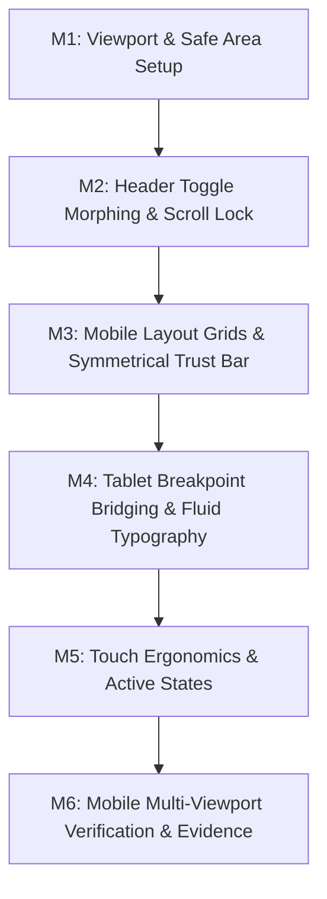

# [TASKS-JORGE-002]: Task DAG & Implementation Checklist — Mobile-First Ergonomics

* **Target Spec:** `[SPEC-JORGE-002]`
* **Target Plan:** `[PLAN-JORGE-002]`
* **Status:** `COMPLETED` (Verified under EVD-0040)

---

## Task Execution DAG

---

## Granular Task Breakdown

- [x] **M1. Viewport & Safe Area Setup**
  * Scope: Update viewport meta tag in `index.html` with `viewport-fit=cover` and verify safe-area CSS rules.
- [x] **M2. Header Toggle Morphing & Scroll Lock**
  * Scope: Implement CSS transforms on `.toggle-bar` for `aria-expanded="true"` and update `app.js` to manage `body.style.overflow`.
- [x] **M3. Mobile Layout Grids & Symmetrical Trust Bar**
  * Scope: Adjust `.trust-bar__grid` to 2x2 on mobile, eliminate width constraints on `.benefit-item` and `.packages__grid`.
- [x] **M4. Tablet Breakpoint Bridging & Fluid Typography**
  * Scope: Scale `.hero__title` with fluid clamp, add 3-col grid for `.packages__grid` at 768px.
- [x] **M5. Touch Ergonomics & Active States**
  * Scope: Enforce 44px+ touch targets on filter buttons, nav links, and add `:active` touch feedback.
- [x] **M6. Mobile Multi-Viewport Verification & Evidence**
  * Scope: Audit across 320px, 375px, 412px, 768px viewports in browser, record video, generate `EVD-0040.json`.
