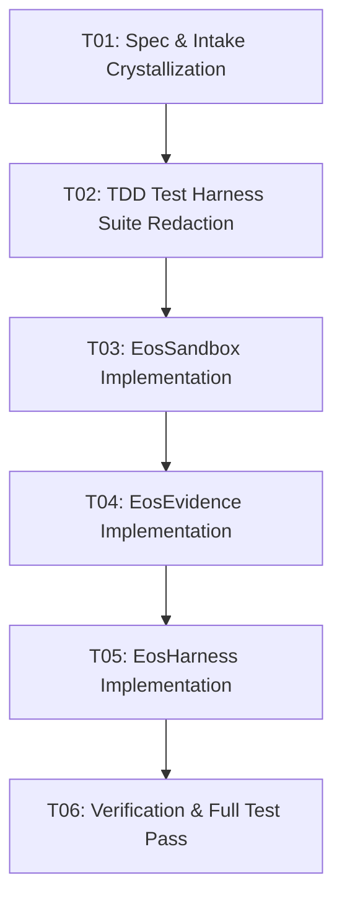

# TASK DAG: TASK-DAG-001 — KERNEL EXECUTION & SANDBOXING ENGINE

**DAG ID:** `TASK-DAG-001`  
**Mission:** `MIS-001-KERNEL-CORE`  
**Status:** `IN_PROGRESS`  
**Related Docs:** [`SPEC-001-KERNEL-HARNESS.md`](file:///c:/Users/valen/Documents/Eos%20system/docs/specs/SPEC-001-KERNEL-HARNESS.md), [`PLAN-001-KERNEL-EXECUTION.md`](file:///c:/Users/valen/Documents/Eos%20system/docs/plans/PLAN-001-KERNEL-EXECUTION.md)

---

## 1. Task Dependency Graph (DAG)

---

## 2. Atomic Task Breakdown

- [x] **`TASK-01`**: Crystallize `INTAKE-001-KERNEL-CORE.md`, `SPEC-001-KERNEL-HARNESS.md`, and `PLAN-001-KERNEL-EXECUTION.md`.
- [ ] **`TASK-02`**: Redact native TDD test suites (`tests/sandbox.test.js`, `tests/evidence.test.js`, `tests/harness.test.js`) verifying initial failure.
- [ ] **`TASK-03`**: Implement `src/core/sandbox.js` (`EosSandbox`) with workspace boundary enforcement and atomic cleanup.
- [ ] **`TASK-04`**: Implement `src/core/evidence.js` (`EosEvidence`) with deterministic SHA-256 calculation and epistemic states.
- [ ] **`TASK-05`**: Implement `src/core/harness.js` (`EosHarness`) with timeout supervisor and stream capture.
- [ ] **`TASK-06`**: Run test suite and confirm 100% green without regressions.
