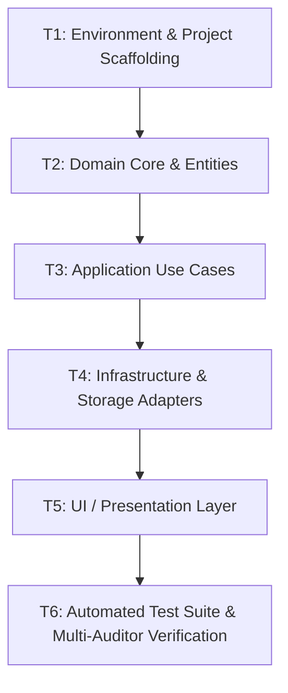

# [TASKS-XXXX]: Task DAG & Implementation Checklist — [Feature Name]

* **Target Spec**: `[SPEC-XXXX]`
* **Target Plan**: `[PLAN-XXXX]`
* **Status**: `[NOT_STARTED | IN_PROGRESS | COMPLETED]`

---

## Task Execution DAG (Directed Acyclic Graph)

---

## Granular Task Breakdown

- [ ] **T1. Scaffolding & Setup**
  * **Scope**: Project initialization, directory structure, linters, and test runner configuration.
  * **RF Covered**: N/A (Setup)
  * **Done Criteria**: `npm test` runs with zero failures and directory passes sanity checks.

- [ ] **T2. Domain Core Implementation**
  * **Scope**: Implement pure business logic in `src/domain/`. Zero external dependencies.
  * **RF Covered**: `[FR-01, FR-04]`
  * **Done Criteria**: Domain unit tests pass with 100% logic coverage.

- [ ] **T3. Use Cases & Application Services**
  * **Scope**: Implement command handlers and application orchestrators in `src/application/`.
  * **RF Covered**: `[FR-02, FR-03]`
  * **Done Criteria**: Application unit tests with mock adapters pass all acceptance criteria.

- [ ] **T4. Infrastructure & Adapters**
  * **Scope**: Implement persistence, external API clients, or file storage in `src/infrastructure/`.
  * **RF Covered**: `[FR-04, NFR-SEC-01]`
  * **Done Criteria**: Integration tests pass against local fixtures.

- [ ] **T5. Presentation & UI Components**
  * **Scope**: Build accessible UI components with vanilla CSS / framework tokens.
  * **RF Covered**: `[NFR-A11Y-01, NFR-PERF-01, NFR-SEO-01]`
  * **Done Criteria**: UI renders properly in browser, keyboard navigation functional.

- [ ] **T6. Verification & Evidence Recording**
  * **Scope**: Execute full verification suite and record cryptographic JSON evidence artifact.
  * **RF Covered**: All FRs & NFRs.
  * **Done Criteria**: Evidence record `EVD-XXXX.json` generated and `npm run verify:strict` passes cleanly.
