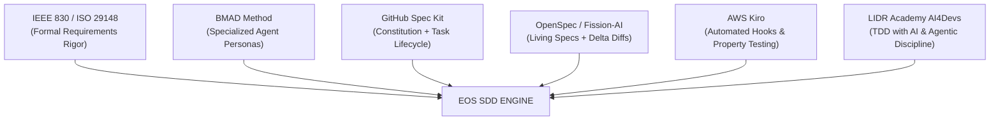

# EOS Master Standard: Spec-Driven Development (SDD) & Requirements Engineering

## 1. Executive Summary & Philosophy

**Spec-Driven Development (SDD)** is the engineering discipline that establishes the **specification as the sole executable source of truth** in AI-assisted and agentic software development. 

In SDD, code is never written directly from open-ended, improvised prompts (*"vibe coding"*). Code is treated as a **derived, transient artifact** generated against formal, version-controlled specifications.

```text
┌─────────────────────────────────────────────────────────────────────────┐
│                          HUMAN ARCHITECT                                │
│          Defines Context, Constitution, and Business Intent             │
└────────────────────────────────────┬────────────────────────────────────┘
                                     │ (EARS / GIVEN-WHEN-THEN)
                                     ▼
┌─────────────────────────────────────────────────────────────────────────┐
│                     LIVING SPECIFICATION (SOURCE OF TRUTH)              │
│       Non-Ambiguous, Complete, Consistent, Verifiable, Traceable        │
└────────────────────────────────────┬────────────────────────────────────┘
                                     │ (Strict Scope Execution)
                                     ▼
┌─────────────────────────────────────────────────────────────────────────┐
│                         AI CODING AGENTS                                │
│       Translates Approved Tasks to Implementation & Automated Tests     │
└────────────────────────────────────┬────────────────────────────────────┘
                                     │ (Evidence Gathering)
                                     ▼
┌─────────────────────────────────────────────────────────────────────────┐
│                    EVIDENCE & AUDITOR VERIFICATION                      │
│     Deterministic Proof (Tests, Lint, Security, A11y, Performance)      │
└─────────────────────────────────────────────────────────────────────────┘
```

---

## 2. Foundations: From IEEE 830 / ISO 29148 to Modern SDD

Modern SDD is the direct digital evolution of classical Requirements Engineering:

| Dimension | Classical SRS (IEEE 830 / ISO 29148) | Modern SDD (EOS / OpenSpec / Spec Kit) |
|---|---|---|
| **Medium** | 80-page monolithic Word/PDF documents | Modular, version-controlled Markdown in Git (`specs/`) |
| **Consumer** | Human development teams & project managers | LLMs, Agentic Pairs, and Human Architects |
| **Requirements Syntax** | Natural language paragraphs | **EARS** (`WHEN/IF/WHILE/THE SYSTEM`) & GIVEN-WHEN-THEN |
| **Lifecycle** | Waterfall / Monolithic ALM tools | Fast-feedback agent loops, living docs & Delta Specs |
| **Verification Gate** | Manual QA sign-off & spreadsheet RTMs | Automated test suites, strict auditors, and cryptographic evidence |

### The 6 Mandatory Properties of a Quality Requirement (IEEE / SWEBOK)
1. **Unambiguous**: Admits exactly ONE interpretation by human and AI alike.
2. **Complete**: Defines happy path, all edge cases, negative scenarios, and error states.
3. **Verifiable / Testable**: Has a clear pass/fail automated condition.
4. **Consistent**: Does not contradict the project Constitution or existing specifications.
5. **Modifiable**: Accommodates delta changes cleanly without breaking historical record.
6. **Traceable**: Linked to business intent upstream and test evidence downstream.

---

## 3. Requirements Syntax Standards: EARS & BDD

### EARS (Easy Approach to Requirements Syntax)
Used for functional requirements (FR) to eliminate structural ambiguity:

*   **Event-Driven**: `CUANDO <evento>, EL SISTEMA <respuesta>`
    *   *Example*: `CUANDO el usuario pulse "Enviar", EL SISTEMA validará el formulario y enviará el correo.`
*   **State-Driven**: `MIENTRAS <estado>, EL SISTEMA <respuesta>`
    *   *Example*: `MIENTRAS la conexión de red esté caída, EL SISTEMA almacenará los eventos localmente en IndexedDB.`
*   **Unwanted Behavior / Error Handling**: `SI <condición de error>, ENTONCES EL SISTEMA <respuesta>`
    *   *Example*: `SI el correo no tiene formato válido, ENTONCES EL SISTEMA mostrará un mensaje de error accesible (salida 1).`
*   **Ubiquitous / Permanent**: `EL SISTEMA <comportamiento continuo>`
    *   *Example*: `EL SISTEMA registrará todas las mutaciones en el log de auditoría con timestamp UTC.`

### BDD (GIVEN-WHEN-THEN)
Used for acceptance criteria and automated test specifications:
```gherkin
ESCENARIO: Recuperación de contraseña con token expirado
  DADO que el usuario tiene un token de recuperación con más de 24 horas de antigüedad
  CUANDO el usuario envíe la nueva contraseña
  ENTONCES EL SISTEMA rechazará la solicitud
  Y EL SISTEMA mostrará "El enlace ha expirado. Solicite uno nuevo."
```

---

## 4. Modern SDD Frameworks Synthesis (The 2026 Landscape)

EOS integrates the architectural strengths of the major industry frameworks:



| Framework | Core Contribution Adopted by EOS |
|---|---|
| **GitHub Spec Kit** | **Constitution Model**: Inviolable project principles that govern every spec and prevent agent scope-creep. |
| **OpenSpec** | **Delta Specs (`changes/` vs `specs/`)**: Storing living truth in `specs/` while proposing incremental additions/removals in `changes/`. |
| **BMAD Method** | **Multi-Agent Personas**: Dividing tasks across distinct roles (Architect, Quality Auditor, Security Auditor, Developer). |
| **AWS Kiro** | **Automated Validation Hooks**: Triggering automated checks, lints, and compliance verification on task completion. |
| **LIDR Academy** | **AI-Native TDD**: Forcing tests to be specified and written *before* feature code to guarantee verifiable boundaries. |
| **MoureDev hello-sdd** | **EARS Didactic Standard**: Clean, minimal 8-phase workflow and human-in-the-loop interview phases. |

---

## 5. The EOS SDD Operational Standard

### The 10-Link End-to-End Traceability Chain
```text
1. SOURCE        → Client intake asset, meeting note, or stakeholder goal.
2. OBSERVATION   → Fact documented in intake records.
3. REQUIREMENT   → Business / Functional (EARS) / Non-Functional requirement.
4. SPECIFICATION → Versioned SPEC artifact with GIVEN-WHEN-THEN scenarios.
5. PLAN & TASKS  → Architectural decisions & atomic task breakdown.
6. IMPLEMENTATION→ Source code files strictly scoped to the tasks.
7. TEST RUN      → Automated unit / integration / E2E test execution.
8. EVIDENCE      → Cryptographic/JSON record (EVD-XXXX) with raw logs and exit code 0.
9. AUDIT         → 7-auditor multi-layer verification (Arch, Sec, Quality, A11y, Perf, SEO, QA).
10. RELEASE      → Production readiness authorization and post-deploy audit.
```

### Epistemic Validation States (Mandatory Evidence Standard)
No feature, bugfix, or refactor in EOS may claim completion without referencing active evidence states:
*   `NOT_VERIFIED`: Code generated or modified without automated execution.
*   `AUDIT_EXECUTED`: Tests, builds, or scripts executed; raw logs recorded.
*   `FINDINGS_IDENTIFIED`: Deviations, lint errors, or regressions detected.
*   `REMEDIATION_IN_PROGRESS`: Targeted fixes applied to address findings.
*   `VERIFIED`: Executable evidence confirms zero errors and strict specification adherence.
*   `PRODUCTION_READY_WITHIN_TESTED_SCOPE`: All required dimensions verified with recorded proof.
