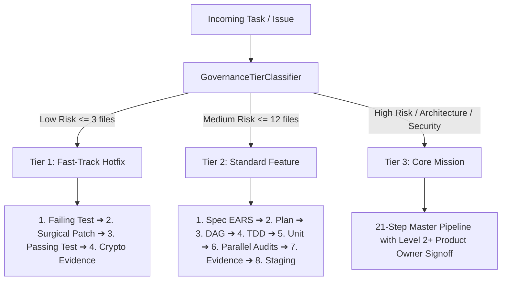

# EOS Tiered Adaptive Governance Standard

## 1. Overview
To achieve maximum engineering velocity without sacrificing architectural integrity or epistemic honesty, EOS provides **3 Adaptive Governance Tiers**.

Instead of forcing every single micro-change through a rigid 21-step bureaucracy, the system dynamically selects the governance tier based on the **Blast Radius**, modified file paths, security boundaries, and dependency changes.

---

## 2. The 3 Canonical Governance Tiers

### Tier 1: Fast-Track Hotfix (4 Steps)
* **Target:** Micro-patches, typos, localized bugfixes touching $\le 3$ files.
* **Requirements:**
  1. `1_FAILING_TEST`: Reproduce bug with a failing test ($F \to P$).
  2. `2_SURGICAL_PATCH`: Minimal surgical code edit.
  3. `3_PASSING_TEST`: Verify test passes cleanly with 0 regressions.
  4. `4_CRYPTO_EVIDENCE_RECORD`: Generate lightweight cryptographic receipt.
* **Human Gate Required:** No.

### Tier 2: Standard Feature / Component (8 Steps)
* **Target:** New features, domain use cases, UI components, non-core refactoring ($\le 12$ files).
* **Requirements:**
  1. `1_SPEC_EARS`: Living spec in EARS syntax (`CUANDO / MIENTRAS / SI / EL SISTEMA`).
  2. `2_PLAN_HEXAGONAL`: Modular Hexagonal Architecture plan.
  3. `3_TASKS_DAG`: Decomposed task DAG.
  4. `4_TDD_CYCLE`: Red-Green-Refactor test cycle.
  5. `5_UNIT_LOGIC_TESTS`: 100% logic rule coverage.
  6. `6_CORE_AUDITS_PARALLEL`: Concurrent execution of 7 Audit Subagents via DAG.
  7. `7_EVIDENCE_GENERATION`: Cryptographic evidence package (`EVD-XXXX.json`).
  8. `8_STAGING_VERIFY`: Staging smoke test verification.
* **Human Gate Required:** No (Automated Gatekeeper).

### Tier 3: Core Mission / Architecture Mutation (21 Steps)
* **Target:** New projects, architectural shifts, security permission models, Constitution edits.
* **Requirements:** Full 21-step pipeline with formal Product Owner signoff (`IMPLEMENTATION_AUTHORIZATION.md`).
* **Human Gate Required:** Yes (`LEVEL 2+` Authorization mandatory).

---

## 3. Epistemic Rule
No tier may bypass the **Law of Evidence Over Claims**. Every completed tier must output a verifiable SHA-256 evidence record.
